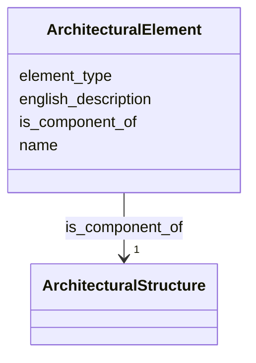

# Class: ArchitecturalElement 


_Carved or constructed component of a temple (e.g., Gajur, Torana, Tundal)_


URI: [crm:E25_Physical_Feature](http://www.cidoc-crm.org/cidoc-crm/E25_Physical_Feature)





<!-- no inheritance hierarchy -->


## Slots

| Name | Cardinality and Range | Description | Inheritance |
| ---  | --- | --- | --- |
| [name](name.md) | 1 <br/> [String](String.md) | Primary name or label | direct |
| [english_description](english_description.md) | 0..1 <br/> [String](String.md) | Descriptive text in English | direct |
| [element_type](element_type.md) | 0..1 <br/> [String](String.md) | Type of architectural element (Gajur, Torana, Tundal) | direct |
| [is_component_of](is_component_of.md) | 1 <br/> [ArchitecturalStructure](ArchitecturalStructure.md) | Larger structure that this element is part of | direct |


## Usages

| used by | used in | type | used |
| ---  | --- | --- | --- |
| [ArchitecturalStructure](ArchitecturalStructure.md) | [has_component](has_component.md) | range | [ArchitecturalElement](ArchitecturalElement.md) |
| [Temple](Temple.md) | [has_component](has_component.md) | range | [ArchitecturalElement](ArchitecturalElement.md) |
| [BuddhistMonument](BuddhistMonument.md) | [has_component](has_component.md) | range | [ArchitecturalElement](ArchitecturalElement.md) |
| [Stupa](Stupa.md) | [has_component](has_component.md) | range | [ArchitecturalElement](ArchitecturalElement.md) |
| [Chaitya](Chaitya.md) | [has_component](has_component.md) | range | [ArchitecturalElement](ArchitecturalElement.md) |
| [RestHouse](RestHouse.md) | [has_component](has_component.md) | range | [ArchitecturalElement](ArchitecturalElement.md) |
| [Pati](Pati.md) | [has_component](has_component.md) | range | [ArchitecturalElement](ArchitecturalElement.md) |
| [Sattal](Sattal.md) | [has_component](has_component.md) | range | [ArchitecturalElement](ArchitecturalElement.md) |
| [Dharmashala](Dharmashala.md) | [has_component](has_component.md) | range | [ArchitecturalElement](ArchitecturalElement.md) |
| [WaterStructure](WaterStructure.md) | [has_component](has_component.md) | range | [ArchitecturalElement](ArchitecturalElement.md) |
| [DhungeDhara](DhungeDhara.md) | [has_component](has_component.md) | range | [ArchitecturalElement](ArchitecturalElement.md) |
| [Pokhari](Pokhari.md) | [has_component](has_component.md) | range | [ArchitecturalElement](ArchitecturalElement.md) |
| [Container](Container.md) | [architectural_elements](architectural_elements.md) | range | [ArchitecturalElement](ArchitecturalElement.md) |


## Identifier and Mapping Information


### Schema Source


* from schema: CulturalHeritageOntology


## Mappings

| Mapping Type | Mapped Value |
| ---  | ---  |
| self | crm:E25_Physical_Feature |
| native | heritageGraph:ArchitecturalElement |


## LinkML Source

<!-- TODO: investigate https://stackoverflow.com/questions/37606292/how-to-create-tabbed-code-blocks-in-mkdocs-or-sphinx -->

### Direct

<details>
```yaml
name: ArchitecturalElement
description: Carved or constructed component of a temple (e.g., Gajur, Torana, Tundal)
from_schema: CulturalHeritageOntology
slots:
- name
- english_description
- element_type
- is_component_of
slot_usage:
  name:
    name: name
    required: true
  is_component_of:
    name: is_component_of
    required: true
class_uri: crm:E25_Physical_Feature

```
</details>

### Induced

<details>
```yaml
name: ArchitecturalElement
description: Carved or constructed component of a temple (e.g., Gajur, Torana, Tundal)
from_schema: CulturalHeritageOntology
slot_usage:
  name:
    name: name
    required: true
  is_component_of:
    name: is_component_of
    required: true
attributes:
  name:
    name: name
    description: Primary name or label
    from_schema: CulturalHeritageOntology
    rank: 1000
    slot_uri: crm:P1_is_identified_by
    alias: name
    owner: ArchitecturalElement
    domain_of:
    - ArchitecturalStructure
    - IconographicObject
    - ArchitecturalElement
    - Deity
    - ReligiousTradition
    - TraditionOrPractice
    - ArchitecturalStyle
    - CalendarSystem
    - Production
    - RitualEvent
    - Consecration
    - Enshrinement
    - TransferOfCustody
    - ConditionAssessment
    - Guthi
    - CasteGroup
    - Person
    - Actor
    - Place
    - DataSource
    - DocumentationActivity
    - DataCustodian
    - Technique
    - Material
    range: string
    required: true
  english_description:
    name: english_description
    description: Descriptive text in English
    from_schema: CulturalHeritageOntology
    rank: 1000
    slot_uri: crm:P3_has_note
    alias: english_description
    owner: ArchitecturalElement
    domain_of:
    - ArchitecturalStructure
    - IconographicObject
    - ArchitecturalElement
    - Deity
    - ReligiousTradition
    - TraditionOrPractice
    - ArchitecturalStyle
    - RitualEvent
    - Guthi
    - CasteGroup
    - Person
    - Actor
    - DataSource
    - DataCustodian
    - Technique
    - Material
    range: string
  element_type:
    name: element_type
    description: Type of architectural element (Gajur, Torana, Tundal)
    from_schema: CulturalHeritageOntology
    rank: 1000
    slot_uri: crm:P2_has_type
    alias: element_type
    owner: ArchitecturalElement
    domain_of:
    - ArchitecturalElement
    range: string
  is_component_of:
    name: is_component_of
    description: Larger structure that this element is part of
    from_schema: CulturalHeritageOntology
    rank: 1000
    slot_uri: crm:P46i_forms_part_of
    alias: is_component_of
    owner: ArchitecturalElement
    domain_of:
    - ArchitecturalElement
    range: ArchitecturalStructure
    required: true
class_uri: crm:E25_Physical_Feature

```
</details>