# Class: ArchitecturalStructure 


_Physical structures built for religious, social, or civic purposes. Links to events of production, use, custody, and documentation._


URI: [crm:E22_Human-Made_Object](http://www.cidoc-crm.org/cidoc-crm/E22_Human-Made_Object)

```mermaid
 classDiagram
    class ArchitecturalStructure
    click ArchitecturalStructure href "../ArchitecturalStructure/"
      ArchitecturalStructure <|-- Temple
        click Temple href "../Temple/"
      ArchitecturalStructure <|-- BuddhistMonument
        click BuddhistMonument href "../BuddhistMonument/"
      ArchitecturalStructure <|-- RestHouse
        click RestHouse href "../RestHouse/"
      ArchitecturalStructure <|-- WaterStructure
        click WaterStructure href "../WaterStructure/"
      
      ArchitecturalStructure : english_description
        
      ArchitecturalStructure : has_component
        
          
    
        
        
        ArchitecturalStructure --> "*" ArchitecturalElement : has_component
        click ArchitecturalElement href "../ArchitecturalElement/"
    

        
      ArchitecturalStructure : has_condition_assessment
        
          
    
        
        
        ArchitecturalStructure --> "*" ConditionAssessment : has_condition_assessment
        click ConditionAssessment href "../ConditionAssessment/"
    

        
      ArchitecturalStructure : has_current_location
        
          
    
        
        
        ArchitecturalStructure --> "1" Place : has_current_location
        click Place href "../Place/"
    

        
      ArchitecturalStructure : has_custody_event
        
          
    
        
        
        ArchitecturalStructure --> "*" TransferOfCustody : has_custody_event
        click TransferOfCustody href "../TransferOfCustody/"
    

        
      ArchitecturalStructure : name
        
      ArchitecturalStructure : participates_in_ritual
        
          
    
        
        
        ArchitecturalStructure --> "*" RitualEvent : participates_in_ritual
        click RitualEvent href "../RitualEvent/"
    

        
      ArchitecturalStructure : was_documented_by
        
          
    
        
        
        ArchitecturalStructure --> "*" DocumentationActivity : was_documented_by
        click DocumentationActivity href "../DocumentationActivity/"
    

        
      ArchitecturalStructure : was_produced_by_event
        
          
    
        
        
        ArchitecturalStructure --> "0..1" Production : was_produced_by_event
        click Production href "../Production/"
    

        
      
```





## Inheritance
* **ArchitecturalStructure**
    * [Temple](Temple.md)
    * [BuddhistMonument](BuddhistMonument.md)
    * [RestHouse](RestHouse.md)
    * [WaterStructure](WaterStructure.md)


## Slots

| Name | Cardinality and Range | Description | Inheritance |
| ---  | --- | --- | --- |
| [name](name.md) | 1 <br/> [String](String.md) | Primary name or label | direct |
| [english_description](english_description.md) | 0..1 <br/> [String](String.md) | Descriptive text in English | direct |
| [was_produced_by_event](was_produced_by_event.md) | 0..1 <br/> [Production](Production.md) | Event that created this object or structure | direct |
| [has_current_location](has_current_location.md) | 1 <br/> [Place](Place.md) | Current location of object or structure | direct |
| [participates_in_ritual](participates_in_ritual.md) | * <br/> [RitualEvent](RitualEvent.md) | Rituals in which this structure participates | direct |
| [has_custody_event](has_custody_event.md) | * <br/> [TransferOfCustody](TransferOfCustody.md) | Custody transfer events for this structure | direct |
| [was_documented_by](was_documented_by.md) | * <br/> [DocumentationActivity](DocumentationActivity.md) | Documentation event that recorded this entity or event | direct |
| [has_condition_assessment](has_condition_assessment.md) | * <br/> [ConditionAssessment](ConditionAssessment.md) | Condition assessment events for this structure | direct |
| [has_component](has_component.md) | * <br/> [ArchitecturalElement](ArchitecturalElement.md) | Architectural elements composing structure | direct |


## Usages

| used by | used in | type | used |
| ---  | --- | --- | --- |
| [ArchitecturalElement](ArchitecturalElement.md) | [is_component_of](is_component_of.md) | range | [ArchitecturalStructure](ArchitecturalStructure.md) |
| [RitualEvent](RitualEvent.md) | [ritual_on_structure](ritual_on_structure.md) | range | [ArchitecturalStructure](ArchitecturalStructure.md) |
| [Puja](Puja.md) | [ritual_on_structure](ritual_on_structure.md) | range | [ArchitecturalStructure](ArchitecturalStructure.md) |
| [NityaPuja](NityaPuja.md) | [ritual_on_structure](ritual_on_structure.md) | range | [ArchitecturalStructure](ArchitecturalStructure.md) |
| [NaimittikaPuja](NaimittikaPuja.md) | [ritual_on_structure](ritual_on_structure.md) | range | [ArchitecturalStructure](ArchitecturalStructure.md) |
| [Festival](Festival.md) | [ritual_on_structure](ritual_on_structure.md) | range | [ArchitecturalStructure](ArchitecturalStructure.md) |
| [ChariotFestival](ChariotFestival.md) | [ritual_on_structure](ritual_on_structure.md) | range | [ArchitecturalStructure](ArchitecturalStructure.md) |
| [MaskedDance](MaskedDance.md) | [ritual_on_structure](ritual_on_structure.md) | range | [ArchitecturalStructure](ArchitecturalStructure.md) |
| [TransferOfCustody](TransferOfCustody.md) | [transferred_object](transferred_object.md) | range | [ArchitecturalStructure](ArchitecturalStructure.md) |
| [ConditionAssessment](ConditionAssessment.md) | [assessed_object](assessed_object.md) | range | [ArchitecturalStructure](ArchitecturalStructure.md) |
| [Guthi](Guthi.md) | [manages_structure](manages_structure.md) | range | [ArchitecturalStructure](ArchitecturalStructure.md) |
| [Guthi](Guthi.md) | [holds_custody_of](holds_custody_of.md) | range | [ArchitecturalStructure](ArchitecturalStructure.md) |
| [SiGuthi](SiGuthi.md) | [manages_structure](manages_structure.md) | range | [ArchitecturalStructure](ArchitecturalStructure.md) |
| [SiGuthi](SiGuthi.md) | [holds_custody_of](holds_custody_of.md) | range | [ArchitecturalStructure](ArchitecturalStructure.md) |
| [JatraGuthi](JatraGuthi.md) | [manages_structure](manages_structure.md) | range | [ArchitecturalStructure](ArchitecturalStructure.md) |
| [JatraGuthi](JatraGuthi.md) | [holds_custody_of](holds_custody_of.md) | range | [ArchitecturalStructure](ArchitecturalStructure.md) |
| [PujaGuthi](PujaGuthi.md) | [manages_structure](manages_structure.md) | range | [ArchitecturalStructure](ArchitecturalStructure.md) |
| [PujaGuthi](PujaGuthi.md) | [holds_custody_of](holds_custody_of.md) | range | [ArchitecturalStructure](ArchitecturalStructure.md) |
| [TempleGuthi](TempleGuthi.md) | [manages_structure](manages_structure.md) | range | [ArchitecturalStructure](ArchitecturalStructure.md) |
| [TempleGuthi](TempleGuthi.md) | [holds_custody_of](holds_custody_of.md) | range | [ArchitecturalStructure](ArchitecturalStructure.md) |
| [NashaGuthi](NashaGuthi.md) | [manages_structure](manages_structure.md) | range | [ArchitecturalStructure](ArchitecturalStructure.md) |
| [NashaGuthi](NashaGuthi.md) | [holds_custody_of](holds_custody_of.md) | range | [ArchitecturalStructure](ArchitecturalStructure.md) |
| [SanaGuthi](SanaGuthi.md) | [manages_structure](manages_structure.md) | range | [ArchitecturalStructure](ArchitecturalStructure.md) |
| [SanaGuthi](SanaGuthi.md) | [holds_custody_of](holds_custody_of.md) | range | [ArchitecturalStructure](ArchitecturalStructure.md) |
| [SanGuthi](SanGuthi.md) | [manages_structure](manages_structure.md) | range | [ArchitecturalStructure](ArchitecturalStructure.md) |
| [SanGuthi](SanGuthi.md) | [holds_custody_of](holds_custody_of.md) | range | [ArchitecturalStructure](ArchitecturalStructure.md) |
| [RajGuthi](RajGuthi.md) | [manages_structure](manages_structure.md) | range | [ArchitecturalStructure](ArchitecturalStructure.md) |
| [RajGuthi](RajGuthi.md) | [holds_custody_of](holds_custody_of.md) | range | [ArchitecturalStructure](ArchitecturalStructure.md) |
| [Place](Place.md) | [contains_structure](contains_structure.md) | range | [ArchitecturalStructure](ArchitecturalStructure.md) |
| [ProvenanceAssertion](ProvenanceAssertion.md) | [asserts_about_entity](asserts_about_entity.md) | range | [ArchitecturalStructure](ArchitecturalStructure.md) |
| [FieldSurveyActivity](FieldSurveyActivity.md) | [documented_entity](documented_entity.md) | range | [ArchitecturalStructure](ArchitecturalStructure.md) |
| [OralHistoryInterview](OralHistoryInterview.md) | [documented_entity](documented_entity.md) | range | [ArchitecturalStructure](ArchitecturalStructure.md) |
| [DocumentationActivity](DocumentationActivity.md) | [documented_entity](documented_entity.md) | range | [ArchitecturalStructure](ArchitecturalStructure.md) |
| [Verification](Verification.md) | [documented_entity](documented_entity.md) | range | [ArchitecturalStructure](ArchitecturalStructure.md) |
| [Container](Container.md) | [architectural_structures](architectural_structures.md) | range | [ArchitecturalStructure](ArchitecturalStructure.md) |


## Identifier and Mapping Information


### Schema Source


* from schema: CulturalHeritageOntology


## Mappings

| Mapping Type | Mapped Value |
| ---  | ---  |
| self | crm:E22_Human-Made_Object |
| native | heritageGraph:ArchitecturalStructure |


## LinkML Source

<!-- TODO: investigate https://stackoverflow.com/questions/37606292/how-to-create-tabbed-code-blocks-in-mkdocs-or-sphinx -->

### Direct

<details>
```yaml
name: ArchitecturalStructure
description: Physical structures built for religious, social, or civic purposes. Links
  to events of production, use, custody, and documentation.
from_schema: CulturalHeritageOntology
slots:
- name
- english_description
- was_produced_by_event
- has_current_location
- participates_in_ritual
- has_custody_event
- was_documented_by
- has_condition_assessment
- has_component
slot_usage:
  name:
    name: name
    required: true
  has_current_location:
    name: has_current_location
    required: true
    minimum_cardinality: 1
    maximum_cardinality: 1
class_uri: crm:E22_Human-Made_Object

```
</details>

### Induced

<details>
```yaml
name: ArchitecturalStructure
description: Physical structures built for religious, social, or civic purposes. Links
  to events of production, use, custody, and documentation.
from_schema: CulturalHeritageOntology
slot_usage:
  name:
    name: name
    required: true
  has_current_location:
    name: has_current_location
    required: true
    minimum_cardinality: 1
    maximum_cardinality: 1
attributes:
  name:
    name: name
    description: Primary name or label
    from_schema: CulturalHeritageOntology
    rank: 1000
    slot_uri: crm:P1_is_identified_by
    alias: name
    owner: ArchitecturalStructure
    domain_of:
    - ArchitecturalStructure
    - IconographicObject
    - ArchitecturalElement
    - Deity
    - ReligiousTradition
    - TraditionOrPractice
    - ArchitecturalStyle
    - CalendarSystem
    - Production
    - RitualEvent
    - Consecration
    - Enshrinement
    - TransferOfCustody
    - ConditionAssessment
    - Guthi
    - CasteGroup
    - Person
    - Actor
    - Place
    - DataSource
    - DocumentationActivity
    - DataCustodian
    - Technique
    - Material
    range: string
    required: true
  english_description:
    name: english_description
    description: Descriptive text in English
    from_schema: CulturalHeritageOntology
    rank: 1000
    slot_uri: crm:P3_has_note
    alias: english_description
    owner: ArchitecturalStructure
    domain_of:
    - ArchitecturalStructure
    - IconographicObject
    - ArchitecturalElement
    - Deity
    - ReligiousTradition
    - TraditionOrPractice
    - ArchitecturalStyle
    - RitualEvent
    - Guthi
    - CasteGroup
    - Person
    - Actor
    - DataSource
    - DataCustodian
    - Technique
    - Material
    range: string
  was_produced_by_event:
    name: was_produced_by_event
    description: Event that created this object or structure
    from_schema: CulturalHeritageOntology
    rank: 1000
    slot_uri: crm:P108i_was_produced_by
    alias: was_produced_by_event
    owner: ArchitecturalStructure
    domain_of:
    - ArchitecturalStructure
    - IconographicObject
    range: Production
  has_current_location:
    name: has_current_location
    description: Current location of object or structure
    from_schema: CulturalHeritageOntology
    rank: 1000
    slot_uri: crm:P55_has_current_location
    alias: has_current_location
    owner: ArchitecturalStructure
    domain_of:
    - ArchitecturalStructure
    range: Place
    required: true
    minimum_cardinality: 1
    maximum_cardinality: 1
  participates_in_ritual:
    name: participates_in_ritual
    description: Rituals in which this structure participates
    from_schema: CulturalHeritageOntology
    rank: 1000
    slot_uri: crm:P12i_was_present_at
    alias: participates_in_ritual
    owner: ArchitecturalStructure
    domain_of:
    - ArchitecturalStructure
    - IconographicObject
    range: RitualEvent
    multivalued: true
  has_custody_event:
    name: has_custody_event
    description: Custody transfer events for this structure
    from_schema: CulturalHeritageOntology
    rank: 1000
    slot_uri: crm:E10_Transfer_of_Custody
    alias: has_custody_event
    owner: ArchitecturalStructure
    domain_of:
    - ArchitecturalStructure
    range: TransferOfCustody
    multivalued: true
  was_documented_by:
    name: was_documented_by
    description: Documentation event that recorded this entity or event
    from_schema: CulturalHeritageOntology
    rank: 1000
    slot_uri: prov:wasGeneratedBy
    alias: was_documented_by
    owner: ArchitecturalStructure
    domain_of:
    - ArchitecturalStructure
    - Production
    - RitualEvent
    range: DocumentationActivity
    multivalued: true
  has_condition_assessment:
    name: has_condition_assessment
    description: Condition assessment events for this structure
    from_schema: CulturalHeritageOntology
    rank: 1000
    slot_uri: crm:P44_has_condition
    alias: has_condition_assessment
    owner: ArchitecturalStructure
    domain_of:
    - ArchitecturalStructure
    range: ConditionAssessment
    multivalued: true
  has_component:
    name: has_component
    description: Architectural elements composing structure
    from_schema: CulturalHeritageOntology
    rank: 1000
    slot_uri: crm:P46_is_composed_of
    alias: has_component
    owner: ArchitecturalStructure
    domain_of:
    - ArchitecturalStructure
    range: ArchitecturalElement
    multivalued: true
class_uri: crm:E22_Human-Made_Object

```
</details>