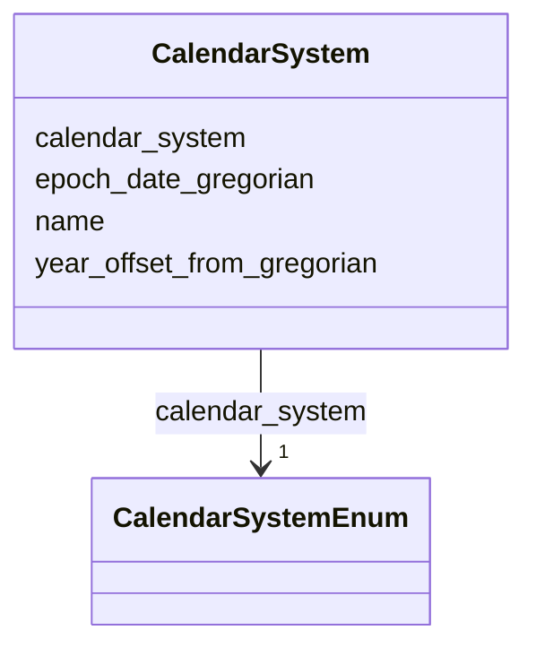

# Class: CalendarSystem 


_Calendar reckoning system with conversion rules for multi-calendar temporal reasoning_


URI: [heritageGraph:CalendarSystem](https://cair-nepal.org/heritageGraph/CalendarSystem)





<!-- no inheritance hierarchy -->


## Slots

| Name | Cardinality and Range | Description | Inheritance |
| ---  | --- | --- | --- |
| [name](name.md) | 1 <br/> [String](String.md) | Primary name or label | direct |
| [calendar_system](calendar_system.md) | 1 <br/> [CalendarSystemEnum](CalendarSystemEnum.md) | Calendar system used for date representation | direct |
| [epoch_date_gregorian](epoch_date_gregorian.md) | 0..1 <br/> [String](String.md) | The start date of this calendar era in Gregorian ISO format | direct |
| [year_offset_from_gregorian](year_offset_from_gregorian.md) | 0..1 <br/> [Integer](Integer.md) | Mathematical offset to convert to Common Era (e | direct |


## Usages

| used by | used in | type | used |
| ---  | --- | --- | --- |
| [Container](Container.md) | [calendar_systems](calendar_systems.md) | range | [CalendarSystem](CalendarSystem.md) |


## Identifier and Mapping Information


### Schema Source


* from schema: CulturalHeritageOntology


## Mappings

| Mapping Type | Mapped Value |
| ---  | ---  |
| self | heritageGraph:CalendarSystem |
| native | heritageGraph:CalendarSystem |


## LinkML Source

<!-- TODO: investigate https://stackoverflow.com/questions/37606292/how-to-create-tabbed-code-blocks-in-mkdocs-or-sphinx -->

### Direct

<details>
```yaml
name: CalendarSystem
description: Calendar reckoning system with conversion rules for multi-calendar temporal
  reasoning
from_schema: CulturalHeritageOntology
slots:
- name
- calendar_system
- epoch_date_gregorian
- year_offset_from_gregorian
slot_usage:
  name:
    name: name
    required: true
  calendar_system:
    name: calendar_system
    range: CalendarSystemEnum
    required: true
class_uri: heritageGraph:CalendarSystem

```
</details>

### Induced

<details>
```yaml
name: CalendarSystem
description: Calendar reckoning system with conversion rules for multi-calendar temporal
  reasoning
from_schema: CulturalHeritageOntology
slot_usage:
  name:
    name: name
    required: true
  calendar_system:
    name: calendar_system
    range: CalendarSystemEnum
    required: true
attributes:
  name:
    name: name
    description: Primary name or label
    from_schema: CulturalHeritageOntology
    rank: 1000
    slot_uri: crm:P1_is_identified_by
    alias: name
    owner: CalendarSystem
    domain_of:
    - ArchitecturalStructure
    - IconographicObject
    - ArchitecturalElement
    - Deity
    - ReligiousTradition
    - TraditionOrPractice
    - ArchitecturalStyle
    - CalendarSystem
    - Production
    - RitualEvent
    - Consecration
    - Enshrinement
    - TransferOfCustody
    - ConditionAssessment
    - Guthi
    - CasteGroup
    - Person
    - Actor
    - Place
    - DataSource
    - DocumentationActivity
    - DataCustodian
    - Technique
    - Material
    range: string
    required: true
  calendar_system:
    name: calendar_system
    description: Calendar system used for date representation
    from_schema: CulturalHeritageOntology
    rank: 1000
    slot_uri: heritageGraph:calendar_system
    alias: calendar_system
    owner: CalendarSystem
    domain_of:
    - CalendarSystem
    - TimeSpan
    range: CalendarSystemEnum
    required: true
  epoch_date_gregorian:
    name: epoch_date_gregorian
    description: The start date of this calendar era in Gregorian ISO format.
    from_schema: CulturalHeritageOntology
    rank: 1000
    slot_uri: heritageGraph:epoch_date_gregorian
    alias: epoch_date_gregorian
    owner: CalendarSystem
    domain_of:
    - CalendarSystem
    range: string
  year_offset_from_gregorian:
    name: year_offset_from_gregorian
    description: Mathematical offset to convert to Common Era (e.g., +57 for BS).
    from_schema: CulturalHeritageOntology
    rank: 1000
    slot_uri: heritageGraph:year_offset_from_gregorian
    alias: year_offset_from_gregorian
    owner: CalendarSystem
    domain_of:
    - CalendarSystem
    range: integer
class_uri: heritageGraph:CalendarSystem

```
</details>