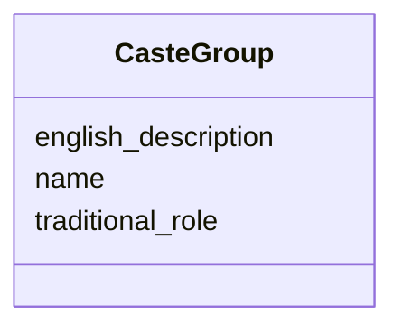

# Class: CasteGroup 


_Hereditary social group (Jati) with specific ritual roles and occupational duties_


URI: [crm:E74_Group](http://www.cidoc-crm.org/cidoc-crm/E74_Group)





<!-- no inheritance hierarchy -->


## Slots

| Name | Cardinality and Range | Description | Inheritance |
| ---  | --- | --- | --- |
| [name](name.md) | 0..1 <br/> [String](String.md) | Primary name or label | direct |
| [english_description](english_description.md) | 0..1 <br/> [String](String.md) | Descriptive text in English | direct |
| [traditional_role](traditional_role.md) | 0..1 <br/> [String](String.md) | Hereditary occupation or ritual duty | direct |


## Usages

| used by | used in | type | used |
| ---  | --- | --- | --- |
| [Container](Container.md) | [caste_groups](caste_groups.md) | range | [CasteGroup](CasteGroup.md) |


## Identifier and Mapping Information


### Schema Source


* from schema: CulturalHeritageOntology


## Mappings

| Mapping Type | Mapped Value |
| ---  | ---  |
| self | crm:E74_Group |
| native | heritageGraph:CasteGroup |


## LinkML Source

<!-- TODO: investigate https://stackoverflow.com/questions/37606292/how-to-create-tabbed-code-blocks-in-mkdocs-or-sphinx -->

### Direct

<details>
```yaml
name: CasteGroup
description: Hereditary social group (Jati) with specific ritual roles and occupational
  duties
from_schema: CulturalHeritageOntology
slots:
- name
- english_description
- traditional_role
class_uri: crm:E74_Group

```
</details>

### Induced

<details>
```yaml
name: CasteGroup
description: Hereditary social group (Jati) with specific ritual roles and occupational
  duties
from_schema: CulturalHeritageOntology
attributes:
  name:
    name: name
    description: Primary name or label
    from_schema: CulturalHeritageOntology
    rank: 1000
    slot_uri: crm:P1_is_identified_by
    alias: name
    owner: CasteGroup
    domain_of:
    - ArchitecturalStructure
    - IconographicObject
    - ArchitecturalElement
    - Deity
    - ReligiousTradition
    - TraditionOrPractice
    - ArchitecturalStyle
    - CalendarSystem
    - Production
    - RitualEvent
    - Consecration
    - Enshrinement
    - TransferOfCustody
    - ConditionAssessment
    - Guthi
    - CasteGroup
    - Person
    - Actor
    - Place
    - DataSource
    - DocumentationActivity
    - DataCustodian
    - Technique
    - Material
    range: string
  english_description:
    name: english_description
    description: Descriptive text in English
    from_schema: CulturalHeritageOntology
    rank: 1000
    slot_uri: crm:P3_has_note
    alias: english_description
    owner: CasteGroup
    domain_of:
    - ArchitecturalStructure
    - IconographicObject
    - ArchitecturalElement
    - Deity
    - ReligiousTradition
    - TraditionOrPractice
    - ArchitecturalStyle
    - RitualEvent
    - Guthi
    - CasteGroup
    - Person
    - Actor
    - DataSource
    - DataCustodian
    - Technique
    - Material
    range: string
  traditional_role:
    name: traditional_role
    description: Hereditary occupation or ritual duty
    from_schema: CulturalHeritageOntology
    rank: 1000
    slot_uri: heritageGraph:traditional_role
    alias: traditional_role
    owner: CasteGroup
    domain_of:
    - CasteGroup
    range: string
class_uri: crm:E74_Group

```
</details>