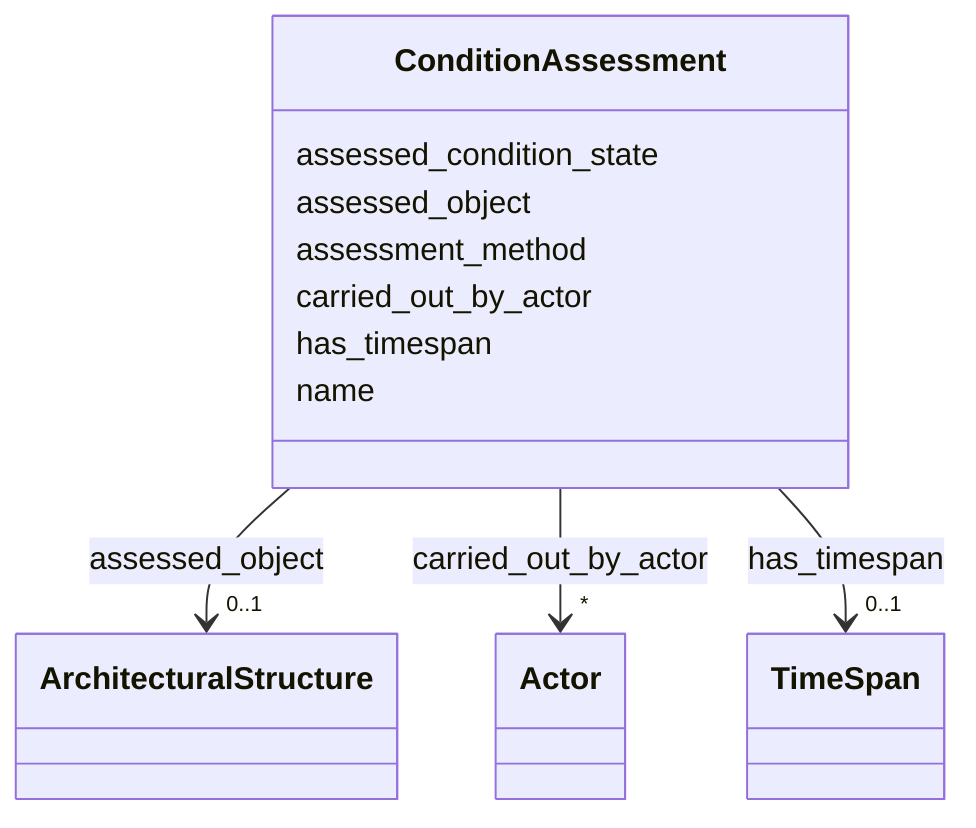

# Class: ConditionAssessment 


_Event of evaluating the physical state of a heritage object or structure_


URI: [crm:E14_Condition_Assessment](http://www.cidoc-crm.org/cidoc-crm/E14_Condition_Assessment)





<!-- no inheritance hierarchy -->


## Slots

| Name | Cardinality and Range | Description | Inheritance |
| ---  | --- | --- | --- |
| [name](name.md) | 0..1 <br/> [String](String.md) | Primary name or label | direct |
| [assessed_object](assessed_object.md) | 0..1 <br/> [ArchitecturalStructure](ArchitecturalStructure.md) | Object assessed for condition | direct |
| [assessed_condition_state](assessed_condition_state.md) | 0..1 <br/> [String](String.md) | Identified condition state (good, damaged, ruined) | direct |
| [carried_out_by_actor](carried_out_by_actor.md) | * <br/> [Actor](Actor.md) | Actor(s) who performed this event | direct |
| [has_timespan](has_timespan.md) | 0..1 <br/> [TimeSpan](TimeSpan.md) | Links event to its temporal extent | direct |
| [assessment_method](assessment_method.md) | 0..1 <br/> [String](String.md) | Method used for condition assessment | direct |


## Usages

| used by | used in | type | used |
| ---  | --- | --- | --- |
| [ArchitecturalStructure](ArchitecturalStructure.md) | [has_condition_assessment](has_condition_assessment.md) | range | [ConditionAssessment](ConditionAssessment.md) |
| [Temple](Temple.md) | [has_condition_assessment](has_condition_assessment.md) | range | [ConditionAssessment](ConditionAssessment.md) |
| [BuddhistMonument](BuddhistMonument.md) | [has_condition_assessment](has_condition_assessment.md) | range | [ConditionAssessment](ConditionAssessment.md) |
| [Stupa](Stupa.md) | [has_condition_assessment](has_condition_assessment.md) | range | [ConditionAssessment](ConditionAssessment.md) |
| [Chaitya](Chaitya.md) | [has_condition_assessment](has_condition_assessment.md) | range | [ConditionAssessment](ConditionAssessment.md) |
| [RestHouse](RestHouse.md) | [has_condition_assessment](has_condition_assessment.md) | range | [ConditionAssessment](ConditionAssessment.md) |
| [Pati](Pati.md) | [has_condition_assessment](has_condition_assessment.md) | range | [ConditionAssessment](ConditionAssessment.md) |
| [Sattal](Sattal.md) | [has_condition_assessment](has_condition_assessment.md) | range | [ConditionAssessment](ConditionAssessment.md) |
| [Dharmashala](Dharmashala.md) | [has_condition_assessment](has_condition_assessment.md) | range | [ConditionAssessment](ConditionAssessment.md) |
| [WaterStructure](WaterStructure.md) | [has_condition_assessment](has_condition_assessment.md) | range | [ConditionAssessment](ConditionAssessment.md) |
| [DhungeDhara](DhungeDhara.md) | [has_condition_assessment](has_condition_assessment.md) | range | [ConditionAssessment](ConditionAssessment.md) |
| [Pokhari](Pokhari.md) | [has_condition_assessment](has_condition_assessment.md) | range | [ConditionAssessment](ConditionAssessment.md) |


## Identifier and Mapping Information


### Schema Source


* from schema: CulturalHeritageOntology


## Mappings

| Mapping Type | Mapped Value |
| ---  | ---  |
| self | crm:E14_Condition_Assessment |
| native | heritageGraph:ConditionAssessment |


## LinkML Source

<!-- TODO: investigate https://stackoverflow.com/questions/37606292/how-to-create-tabbed-code-blocks-in-mkdocs-or-sphinx -->

### Direct

<details>
```yaml
name: ConditionAssessment
description: Event of evaluating the physical state of a heritage object or structure
from_schema: CulturalHeritageOntology
slots:
- name
- assessed_object
- assessed_condition_state
- carried_out_by_actor
- has_timespan
- assessment_method
class_uri: crm:E14_Condition_Assessment

```
</details>

### Induced

<details>
```yaml
name: ConditionAssessment
description: Event of evaluating the physical state of a heritage object or structure
from_schema: CulturalHeritageOntology
attributes:
  name:
    name: name
    description: Primary name or label
    from_schema: CulturalHeritageOntology
    rank: 1000
    slot_uri: crm:P1_is_identified_by
    alias: name
    owner: ConditionAssessment
    domain_of:
    - ArchitecturalStructure
    - IconographicObject
    - ArchitecturalElement
    - Deity
    - ReligiousTradition
    - TraditionOrPractice
    - ArchitecturalStyle
    - CalendarSystem
    - Production
    - RitualEvent
    - Consecration
    - Enshrinement
    - TransferOfCustody
    - ConditionAssessment
    - Guthi
    - CasteGroup
    - Person
    - Actor
    - Place
    - DataSource
    - DocumentationActivity
    - DataCustodian
    - Technique
    - Material
    range: string
  assessed_object:
    name: assessed_object
    description: Object assessed for condition
    from_schema: CulturalHeritageOntology
    rank: 1000
    slot_uri: crm:P34_concerned
    alias: assessed_object
    owner: ConditionAssessment
    domain_of:
    - ConditionAssessment
    range: ArchitecturalStructure
  assessed_condition_state:
    name: assessed_condition_state
    description: Identified condition state (good, damaged, ruined)
    from_schema: CulturalHeritageOntology
    rank: 1000
    slot_uri: crm:P35_has_identified
    alias: assessed_condition_state
    owner: ConditionAssessment
    domain_of:
    - ConditionAssessment
    range: string
  carried_out_by_actor:
    name: carried_out_by_actor
    description: Actor(s) who performed this event
    from_schema: CulturalHeritageOntology
    rank: 1000
    slot_uri: crm:P14_carried_out_by
    alias: carried_out_by_actor
    owner: ConditionAssessment
    domain_of:
    - Production
    - ConditionAssessment
    range: Actor
    multivalued: true
  has_timespan:
    name: has_timespan
    description: Links event to its temporal extent
    from_schema: CulturalHeritageOntology
    rank: 1000
    slot_uri: crm:P4_has_time-span
    alias: has_timespan
    owner: ConditionAssessment
    domain_of:
    - Production
    - RitualEvent
    - Consecration
    - Enshrinement
    - TransferOfCustody
    - ConditionAssessment
    - DocumentationActivity
    range: TimeSpan
  assessment_method:
    name: assessment_method
    description: Method used for condition assessment
    from_schema: CulturalHeritageOntology
    rank: 1000
    slot_uri: crm:P33_used_specific_technique
    alias: assessment_method
    owner: ConditionAssessment
    domain_of:
    - ConditionAssessment
    range: string
class_uri: crm:E14_Condition_Assessment

```
</details>