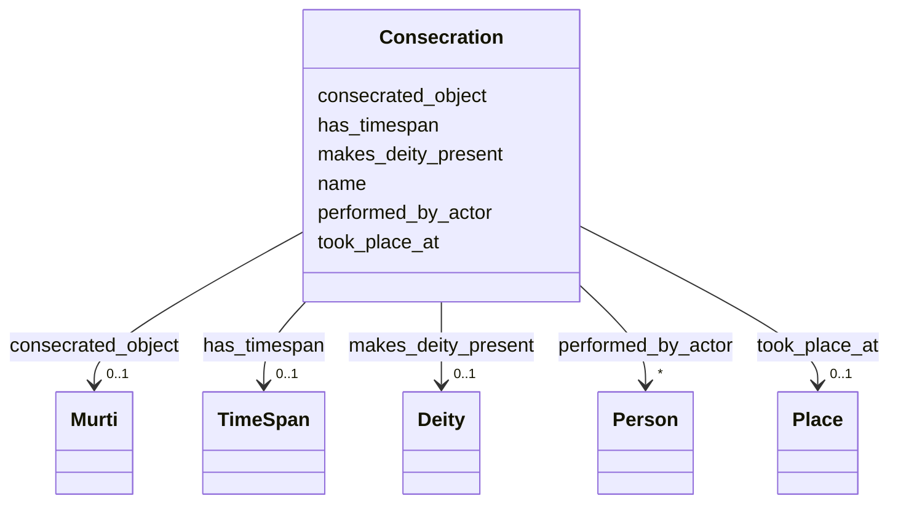

# Class: Consecration 


_Ritual event that transforms an object into a sacred vessel (e.g., Prana Pratistha for Murti)_


URI: [crm:E7_Activity](http://www.cidoc-crm.org/cidoc-crm/E7_Activity)





<!-- no inheritance hierarchy -->


## Slots

| Name | Cardinality and Range | Description | Inheritance |
| ---  | --- | --- | --- |
| [name](name.md) | 0..1 <br/> [String](String.md) | Primary name or label | direct |
| [consecrated_object](consecrated_object.md) | 0..1 <br/> [Murti](Murti.md) | Murti transformed by consecration | direct |
| [performed_by_actor](performed_by_actor.md) | * <br/> [Person](Person.md) | Individual who performed ritual | direct |
| [took_place_at](took_place_at.md) | 0..1 <br/> [Place](Place.md) | Place Where event occurred | direct |
| [has_timespan](has_timespan.md) | 0..1 <br/> [TimeSpan](TimeSpan.md) | Links event to its temporal extent | direct |
| [makes_deity_present](makes_deity_present.md) | 0..1 <br/> [Deity](Deity.md) | Deity made present through consecration | direct |


## Usages

| used by | used in | type | used |
| ---  | --- | --- | --- |
| [Murti](Murti.md) | [consecrated_by_event](consecrated_by_event.md) | range | [Consecration](Consecration.md) |
| [Container](Container.md) | [consecration_events](consecration_events.md) | range | [Consecration](Consecration.md) |


## Identifier and Mapping Information


### Schema Source


* from schema: CulturalHeritageOntology


## Mappings

| Mapping Type | Mapped Value |
| ---  | ---  |
| self | crm:E7_Activity |
| native | heritageGraph:Consecration |


## LinkML Source

<!-- TODO: investigate https://stackoverflow.com/questions/37606292/how-to-create-tabbed-code-blocks-in-mkdocs-or-sphinx -->

### Direct

<details>
```yaml
name: Consecration
description: Ritual event that transforms an object into a sacred vessel (e.g., Prana
  Pratistha for Murti)
from_schema: CulturalHeritageOntology
slots:
- name
- consecrated_object
- performed_by_actor
- took_place_at
- has_timespan
- makes_deity_present
class_uri: crm:E7_Activity

```
</details>

### Induced

<details>
```yaml
name: Consecration
description: Ritual event that transforms an object into a sacred vessel (e.g., Prana
  Pratistha for Murti)
from_schema: CulturalHeritageOntology
attributes:
  name:
    name: name
    description: Primary name or label
    from_schema: CulturalHeritageOntology
    rank: 1000
    slot_uri: crm:P1_is_identified_by
    alias: name
    owner: Consecration
    domain_of:
    - ArchitecturalStructure
    - IconographicObject
    - ArchitecturalElement
    - Deity
    - ReligiousTradition
    - TraditionOrPractice
    - ArchitecturalStyle
    - CalendarSystem
    - Production
    - RitualEvent
    - Consecration
    - Enshrinement
    - TransferOfCustody
    - ConditionAssessment
    - Guthi
    - CasteGroup
    - Person
    - Actor
    - Place
    - DataSource
    - DocumentationActivity
    - DataCustodian
    - Technique
    - Material
    range: string
  consecrated_object:
    name: consecrated_object
    description: Murti transformed by consecration
    from_schema: CulturalHeritageOntology
    rank: 1000
    slot_uri: crm:P31_has_modified
    alias: consecrated_object
    owner: Consecration
    domain_of:
    - Consecration
    range: Murti
  performed_by_actor:
    name: performed_by_actor
    description: Individual who performed ritual
    from_schema: CulturalHeritageOntology
    rank: 1000
    slot_uri: crm:P14_carried_out_by
    alias: performed_by_actor
    owner: Consecration
    domain_of:
    - RitualEvent
    - Consecration
    - Enshrinement
    range: Person
    multivalued: true
  took_place_at:
    name: took_place_at
    description: Place Where event occurred
    from_schema: CulturalHeritageOntology
    rank: 1000
    slot_uri: crm:P7_took_place_at
    alias: took_place_at
    owner: Consecration
    domain_of:
    - Production
    - Consecration
    - TransferOfCustody
    range: Place
  has_timespan:
    name: has_timespan
    description: Links event to its temporal extent
    from_schema: CulturalHeritageOntology
    rank: 1000
    slot_uri: crm:P4_has_time-span
    alias: has_timespan
    owner: Consecration
    domain_of:
    - Production
    - RitualEvent
    - Consecration
    - Enshrinement
    - TransferOfCustody
    - ConditionAssessment
    - DocumentationActivity
    range: TimeSpan
  makes_deity_present:
    name: makes_deity_present
    description: Deity made present through consecration
    from_schema: CulturalHeritageOntology
    rank: 1000
    slot_uri: heritageGraph:makes_deity_present
    alias: makes_deity_present
    owner: Consecration
    domain_of:
    - Consecration
    range: Deity
class_uri: crm:E7_Activity

```
</details>