# Class: Container 


_Root container for cultural heritage data instances_


URI: [heritageGraph:Container](https://cair-nepal.org/heritageGraph/Container)

```mermaid
 classDiagram
    class Container
    click Container href "../Container/"
      Container : architectural_elements
        
          
    
        
        
        Container --> "*" ArchitecturalElement : architectural_elements
        click ArchitecturalElement href "../ArchitecturalElement/"
    

        
      Container : architectural_structures
        
          
    
        
        
        Container --> "*" ArchitecturalStructure : architectural_structures
        click ArchitecturalStructure href "../ArchitecturalStructure/"
    

        
      Container : architectural_styles
        
          
    
        
        
        Container --> "*" ArchitecturalStyle : architectural_styles
        click ArchitecturalStyle href "../ArchitecturalStyle/"
    

        
      Container : calendar_systems
        
          
    
        
        
        Container --> "*" CalendarSystem : calendar_systems
        click CalendarSystem href "../CalendarSystem/"
    

        
      Container : caste_groups
        
          
    
        
        
        Container --> "*" CasteGroup : caste_groups
        click CasteGroup href "../CasteGroup/"
    

        
      Container : consecration_events
        
          
    
        
        
        Container --> "*" Consecration : consecration_events
        click Consecration href "../Consecration/"
    

        
      Container : custody_events
        
          
    
        
        
        Container --> "*" TransferOfCustody : custody_events
        click TransferOfCustody href "../TransferOfCustody/"
    

        
      Container : data_custodians
        
          
    
        
        
        Container --> "*" DataCustodian : data_custodians
        click DataCustodian href "../DataCustodian/"
    

        
      Container : data_sources
        
          
    
        
        
        Container --> "*" DataSource : data_sources
        click DataSource href "../DataSource/"
    

        
      Container : deities
        
          
    
        
        
        Container --> "*" Deity : deities
        click Deity href "../Deity/"
    

        
      Container : documentation_activities
        
          
    
        
        
        Container --> "*" DocumentationActivity : documentation_activities
        click DocumentationActivity href "../DocumentationActivity/"
    

        
      Container : enshrinement_events
        
          
    
        
        
        Container --> "*" Enshrinement : enshrinement_events
        click Enshrinement href "../Enshrinement/"
    

        
      Container : festivals
        
          
    
        
        
        Container --> "*" Festival : festivals
        click Festival href "../Festival/"
    

        
      Container : guthis
        
          
    
        
        
        Container --> "*" Guthi : guthis
        click Guthi href "../Guthi/"
    

        
      Container : materials
        
          
    
        
        
        Container --> "*" Material : materials
        click Material href "../Material/"
    

        
      Container : metadata
        
          
    
        
        
        Container --> "0..1" Metadata : metadata
        click Metadata href "../Metadata/"
    

        
      Container : persons
        
          
    
        
        
        Container --> "*" Person : persons
        click Person href "../Person/"
    

        
      Container : places
        
          
    
        
        
        Container --> "*" Place : places
        click Place href "../Place/"
    

        
      Container : production_events
        
          
    
        
        
        Container --> "*" Production : production_events
        click Production href "../Production/"
    

        
      Container : provenance_assertions
        
          
    
        
        
        Container --> "*" ProvenanceAssertion : provenance_assertions
        click ProvenanceAssertion href "../ProvenanceAssertion/"
    

        
      Container : religious_traditions
        
          
    
        
        
        Container --> "*" ReligiousTradition : religious_traditions
        click ReligiousTradition href "../ReligiousTradition/"
    

        
      Container : ritual_events
        
          
    
        
        
        Container --> "*" RitualEvent : ritual_events
        click RitualEvent href "../RitualEvent/"
    

        
      
```





<!-- no inheritance hierarchy -->


## Slots

| Name | Cardinality and Range | Description | Inheritance |
| ---  | --- | --- | --- |
| [places](places.md) | * <br/> [Place](Place.md) | Collection of Place instances | direct |
| [calendar_systems](calendar_systems.md) | * <br/> [CalendarSystem](CalendarSystem.md) | Collection of CalendarSystem instances | direct |
| [religious_traditions](religious_traditions.md) | * <br/> [ReligiousTradition](ReligiousTradition.md) | Collection of ReligiousTradition instances | direct |
| [deities](deities.md) | * <br/> [Deity](Deity.md) | Collection of Deity instances | direct |
| [architectural_styles](architectural_styles.md) | * <br/> [ArchitecturalStyle](ArchitecturalStyle.md) | Collection of ArchitecturalStyle instances | direct |
| [architectural_structures](architectural_structures.md) | * <br/> [ArchitecturalStructure](ArchitecturalStructure.md) | Collection of ArchitecturalStructure instances | direct |
| [architectural_elements](architectural_elements.md) | * <br/> [ArchitecturalElement](ArchitecturalElement.md) | Collection of ArchitecturalElement instances | direct |
| [persons](persons.md) | * <br/> [Person](Person.md) | Collection of Person instances | direct |
| [caste_groups](caste_groups.md) | * <br/> [CasteGroup](CasteGroup.md) | Collection of CasteGroup instances | direct |
| [guthis](guthis.md) | * <br/> [Guthi](Guthi.md) | Collection of Guthi instances | direct |
| [production_events](production_events.md) | * <br/> [Production](Production.md) | Collection of Production event instances | direct |
| [enshrinement_events](enshrinement_events.md) | * <br/> [Enshrinement](Enshrinement.md) | Collection of Enshrinement event instances | direct |
| [consecration_events](consecration_events.md) | * <br/> [Consecration](Consecration.md) | Collection of Consecration event instances | direct |
| [ritual_events](ritual_events.md) | * <br/> [RitualEvent](RitualEvent.md) | Collection of RitualEvent instances | direct |
| [festivals](festivals.md) | * <br/> [Festival](Festival.md) | Collection of Festival instances | direct |
| [custody_events](custody_events.md) | * <br/> [TransferOfCustody](TransferOfCustody.md) | Collection of TransferOfCustody event instances | direct |
| [data_sources](data_sources.md) | * <br/> [DataSource](DataSource.md) | Collection of DataSource instances | direct |
| [data_custodians](data_custodians.md) | * <br/> [DataCustodian](DataCustodian.md) | Collection of DataCustodian instances | direct |
| [provenance_assertions](provenance_assertions.md) | * <br/> [ProvenanceAssertion](ProvenanceAssertion.md) | Collection of ProvenanceAssertion instances | direct |
| [documentation_activities](documentation_activities.md) | * <br/> [DocumentationActivity](DocumentationActivity.md) | Collection of DocumentationActivity instances | direct |
| [materials](materials.md) | * <br/> [Material](Material.md) | Collection of Material instances | direct |
| [metadata](metadata.md) | 0..1 <br/> [Metadata](Metadata.md) | Dataset metadata | direct |


## Identifier and Mapping Information


### Schema Source


* from schema: CulturalHeritageOntology


## Mappings

| Mapping Type | Mapped Value |
| ---  | ---  |
| self | heritageGraph:Container |
| native | heritageGraph:Container |


## LinkML Source

<!-- TODO: investigate https://stackoverflow.com/questions/37606292/how-to-create-tabbed-code-blocks-in-mkdocs-or-sphinx -->

### Direct

<details>
```yaml
name: Container
description: Root container for cultural heritage data instances
from_schema: CulturalHeritageOntology
attributes:
  places:
    name: places
    description: Collection of Place instances
    from_schema: CulturalHeritageOntology
    rank: 1000
    domain_of:
    - Container
    range: Place
    multivalued: true
    inlined: true
    inlined_as_list: true
  calendar_systems:
    name: calendar_systems
    description: Collection of CalendarSystem instances
    from_schema: CulturalHeritageOntology
    rank: 1000
    domain_of:
    - Container
    range: CalendarSystem
    multivalued: true
    inlined: true
    inlined_as_list: true
  religious_traditions:
    name: religious_traditions
    description: Collection of ReligiousTradition instances
    from_schema: CulturalHeritageOntology
    rank: 1000
    domain_of:
    - Container
    range: ReligiousTradition
    multivalued: true
    inlined: true
    inlined_as_list: true
  deities:
    name: deities
    description: Collection of Deity instances
    from_schema: CulturalHeritageOntology
    rank: 1000
    domain_of:
    - Container
    range: Deity
    multivalued: true
    inlined: true
    inlined_as_list: true
  architectural_styles:
    name: architectural_styles
    description: Collection of ArchitecturalStyle instances
    from_schema: CulturalHeritageOntology
    rank: 1000
    domain_of:
    - Container
    range: ArchitecturalStyle
    multivalued: true
    inlined: true
    inlined_as_list: true
  architectural_structures:
    name: architectural_structures
    description: Collection of ArchitecturalStructure instances
    from_schema: CulturalHeritageOntology
    rank: 1000
    domain_of:
    - Container
    range: ArchitecturalStructure
    multivalued: true
    inlined: true
    inlined_as_list: true
  architectural_elements:
    name: architectural_elements
    description: Collection of ArchitecturalElement instances
    from_schema: CulturalHeritageOntology
    rank: 1000
    domain_of:
    - Container
    range: ArchitecturalElement
    multivalued: true
    inlined: true
    inlined_as_list: true
  persons:
    name: persons
    description: Collection of Person instances
    from_schema: CulturalHeritageOntology
    rank: 1000
    domain_of:
    - Container
    range: Person
    multivalued: true
    inlined: true
    inlined_as_list: true
  caste_groups:
    name: caste_groups
    description: Collection of CasteGroup instances
    from_schema: CulturalHeritageOntology
    rank: 1000
    domain_of:
    - Container
    range: CasteGroup
    multivalued: true
    inlined: true
    inlined_as_list: true
  guthis:
    name: guthis
    description: Collection of Guthi instances
    from_schema: CulturalHeritageOntology
    rank: 1000
    domain_of:
    - Container
    range: Guthi
    multivalued: true
    inlined: true
    inlined_as_list: true
  production_events:
    name: production_events
    description: Collection of Production event instances
    from_schema: CulturalHeritageOntology
    rank: 1000
    domain_of:
    - Container
    range: Production
    multivalued: true
    inlined: true
    inlined_as_list: true
  enshrinement_events:
    name: enshrinement_events
    description: Collection of Enshrinement event instances
    from_schema: CulturalHeritageOntology
    rank: 1000
    domain_of:
    - Container
    range: Enshrinement
    multivalued: true
    inlined: true
    inlined_as_list: true
  consecration_events:
    name: consecration_events
    description: Collection of Consecration event instances
    from_schema: CulturalHeritageOntology
    rank: 1000
    domain_of:
    - Container
    range: Consecration
    multivalued: true
    inlined: true
    inlined_as_list: true
  ritual_events:
    name: ritual_events
    description: Collection of RitualEvent instances
    from_schema: CulturalHeritageOntology
    rank: 1000
    domain_of:
    - Container
    range: RitualEvent
    multivalued: true
    inlined: true
    inlined_as_list: true
  festivals:
    name: festivals
    description: Collection of Festival instances
    from_schema: CulturalHeritageOntology
    rank: 1000
    domain_of:
    - Container
    range: Festival
    multivalued: true
    inlined: true
    inlined_as_list: true
  custody_events:
    name: custody_events
    description: Collection of TransferOfCustody event instances
    from_schema: CulturalHeritageOntology
    rank: 1000
    domain_of:
    - Container
    range: TransferOfCustody
    multivalued: true
    inlined: true
    inlined_as_list: true
  data_sources:
    name: data_sources
    description: Collection of DataSource instances
    from_schema: CulturalHeritageOntology
    rank: 1000
    domain_of:
    - Container
    range: DataSource
    multivalued: true
    inlined: true
    inlined_as_list: true
  data_custodians:
    name: data_custodians
    description: Collection of DataCustodian instances
    from_schema: CulturalHeritageOntology
    rank: 1000
    domain_of:
    - Container
    range: DataCustodian
    multivalued: true
    inlined: true
    inlined_as_list: true
  provenance_assertions:
    name: provenance_assertions
    description: Collection of ProvenanceAssertion instances
    from_schema: CulturalHeritageOntology
    rank: 1000
    domain_of:
    - Container
    range: ProvenanceAssertion
    multivalued: true
    inlined: true
    inlined_as_list: true
  documentation_activities:
    name: documentation_activities
    description: Collection of DocumentationActivity instances
    from_schema: CulturalHeritageOntology
    rank: 1000
    domain_of:
    - Container
    range: DocumentationActivity
    multivalued: true
    inlined: true
    inlined_as_list: true
  materials:
    name: materials
    description: Collection of Material instances
    from_schema: CulturalHeritageOntology
    rank: 1000
    domain_of:
    - Container
    range: Material
    multivalued: true
    inlined: true
    inlined_as_list: true
  metadata:
    name: metadata
    description: Dataset metadata
    from_schema: CulturalHeritageOntology
    rank: 1000
    domain_of:
    - Container
    range: Metadata
tree_root: true

```
</details>

### Induced

<details>
```yaml
name: Container
description: Root container for cultural heritage data instances
from_schema: CulturalHeritageOntology
attributes:
  places:
    name: places
    description: Collection of Place instances
    from_schema: CulturalHeritageOntology
    rank: 1000
    alias: places
    owner: Container
    domain_of:
    - Container
    range: Place
    multivalued: true
    inlined: true
    inlined_as_list: true
  calendar_systems:
    name: calendar_systems
    description: Collection of CalendarSystem instances
    from_schema: CulturalHeritageOntology
    rank: 1000
    alias: calendar_systems
    owner: Container
    domain_of:
    - Container
    range: CalendarSystem
    multivalued: true
    inlined: true
    inlined_as_list: true
  religious_traditions:
    name: religious_traditions
    description: Collection of ReligiousTradition instances
    from_schema: CulturalHeritageOntology
    rank: 1000
    alias: religious_traditions
    owner: Container
    domain_of:
    - Container
    range: ReligiousTradition
    multivalued: true
    inlined: true
    inlined_as_list: true
  deities:
    name: deities
    description: Collection of Deity instances
    from_schema: CulturalHeritageOntology
    rank: 1000
    alias: deities
    owner: Container
    domain_of:
    - Container
    range: Deity
    multivalued: true
    inlined: true
    inlined_as_list: true
  architectural_styles:
    name: architectural_styles
    description: Collection of ArchitecturalStyle instances
    from_schema: CulturalHeritageOntology
    rank: 1000
    alias: architectural_styles
    owner: Container
    domain_of:
    - Container
    range: ArchitecturalStyle
    multivalued: true
    inlined: true
    inlined_as_list: true
  architectural_structures:
    name: architectural_structures
    description: Collection of ArchitecturalStructure instances
    from_schema: CulturalHeritageOntology
    rank: 1000
    alias: architectural_structures
    owner: Container
    domain_of:
    - Container
    range: ArchitecturalStructure
    multivalued: true
    inlined: true
    inlined_as_list: true
  architectural_elements:
    name: architectural_elements
    description: Collection of ArchitecturalElement instances
    from_schema: CulturalHeritageOntology
    rank: 1000
    alias: architectural_elements
    owner: Container
    domain_of:
    - Container
    range: ArchitecturalElement
    multivalued: true
    inlined: true
    inlined_as_list: true
  persons:
    name: persons
    description: Collection of Person instances
    from_schema: CulturalHeritageOntology
    rank: 1000
    alias: persons
    owner: Container
    domain_of:
    - Container
    range: Person
    multivalued: true
    inlined: true
    inlined_as_list: true
  caste_groups:
    name: caste_groups
    description: Collection of CasteGroup instances
    from_schema: CulturalHeritageOntology
    rank: 1000
    alias: caste_groups
    owner: Container
    domain_of:
    - Container
    range: CasteGroup
    multivalued: true
    inlined: true
    inlined_as_list: true
  guthis:
    name: guthis
    description: Collection of Guthi instances
    from_schema: CulturalHeritageOntology
    rank: 1000
    alias: guthis
    owner: Container
    domain_of:
    - Container
    range: Guthi
    multivalued: true
    inlined: true
    inlined_as_list: true
  production_events:
    name: production_events
    description: Collection of Production event instances
    from_schema: CulturalHeritageOntology
    rank: 1000
    alias: production_events
    owner: Container
    domain_of:
    - Container
    range: Production
    multivalued: true
    inlined: true
    inlined_as_list: true
  enshrinement_events:
    name: enshrinement_events
    description: Collection of Enshrinement event instances
    from_schema: CulturalHeritageOntology
    rank: 1000
    alias: enshrinement_events
    owner: Container
    domain_of:
    - Container
    range: Enshrinement
    multivalued: true
    inlined: true
    inlined_as_list: true
  consecration_events:
    name: consecration_events
    description: Collection of Consecration event instances
    from_schema: CulturalHeritageOntology
    rank: 1000
    alias: consecration_events
    owner: Container
    domain_of:
    - Container
    range: Consecration
    multivalued: true
    inlined: true
    inlined_as_list: true
  ritual_events:
    name: ritual_events
    description: Collection of RitualEvent instances
    from_schema: CulturalHeritageOntology
    rank: 1000
    alias: ritual_events
    owner: Container
    domain_of:
    - Container
    range: RitualEvent
    multivalued: true
    inlined: true
    inlined_as_list: true
  festivals:
    name: festivals
    description: Collection of Festival instances
    from_schema: CulturalHeritageOntology
    rank: 1000
    alias: festivals
    owner: Container
    domain_of:
    - Container
    range: Festival
    multivalued: true
    inlined: true
    inlined_as_list: true
  custody_events:
    name: custody_events
    description: Collection of TransferOfCustody event instances
    from_schema: CulturalHeritageOntology
    rank: 1000
    alias: custody_events
    owner: Container
    domain_of:
    - Container
    range: TransferOfCustody
    multivalued: true
    inlined: true
    inlined_as_list: true
  data_sources:
    name: data_sources
    description: Collection of DataSource instances
    from_schema: CulturalHeritageOntology
    rank: 1000
    alias: data_sources
    owner: Container
    domain_of:
    - Container
    range: DataSource
    multivalued: true
    inlined: true
    inlined_as_list: true
  data_custodians:
    name: data_custodians
    description: Collection of DataCustodian instances
    from_schema: CulturalHeritageOntology
    rank: 1000
    alias: data_custodians
    owner: Container
    domain_of:
    - Container
    range: DataCustodian
    multivalued: true
    inlined: true
    inlined_as_list: true
  provenance_assertions:
    name: provenance_assertions
    description: Collection of ProvenanceAssertion instances
    from_schema: CulturalHeritageOntology
    rank: 1000
    alias: provenance_assertions
    owner: Container
    domain_of:
    - Container
    range: ProvenanceAssertion
    multivalued: true
    inlined: true
    inlined_as_list: true
  documentation_activities:
    name: documentation_activities
    description: Collection of DocumentationActivity instances
    from_schema: CulturalHeritageOntology
    rank: 1000
    alias: documentation_activities
    owner: Container
    domain_of:
    - Container
    range: DocumentationActivity
    multivalued: true
    inlined: true
    inlined_as_list: true
  materials:
    name: materials
    description: Collection of Material instances
    from_schema: CulturalHeritageOntology
    rank: 1000
    alias: materials
    owner: Container
    domain_of:
    - Container
    range: Material
    multivalued: true
    inlined: true
    inlined_as_list: true
  metadata:
    name: metadata
    description: Dataset metadata
    from_schema: CulturalHeritageOntology
    rank: 1000
    alias: metadata
    owner: Container
    domain_of:
    - Container
    range: Metadata
tree_root: true

```
</details>