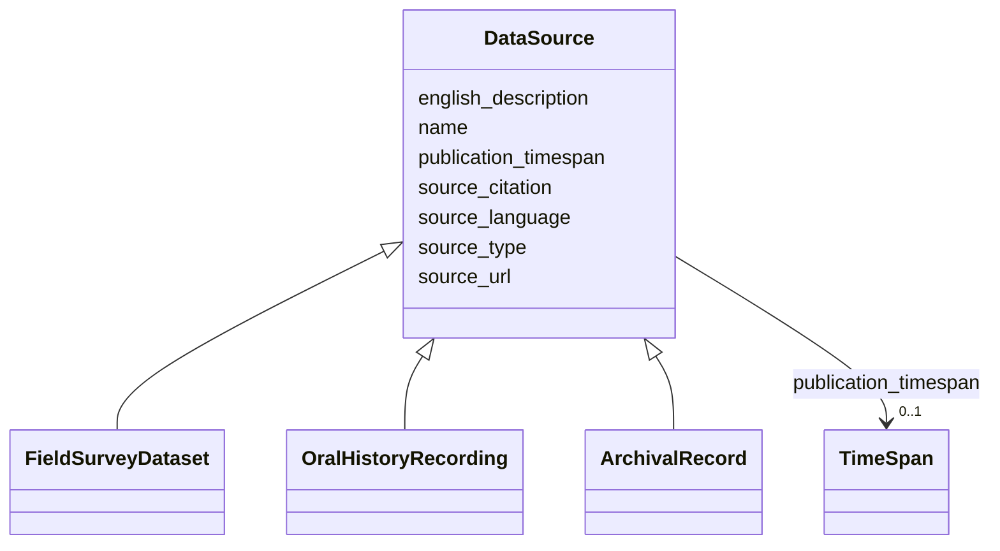

# Class: DataSource 


_Original source from which heritage information was derived_


URI: [crm:E73_Information_Object](http://www.cidoc-crm.org/cidoc-crm/E73_Information_Object)





## Inheritance
* **DataSource**
    * [FieldSurveyDataset](FieldSurveyDataset.md)
    * [OralHistoryRecording](OralHistoryRecording.md)
    * [ArchivalRecord](ArchivalRecord.md)


## Slots

| Name | Cardinality and Range | Description | Inheritance |
| ---  | --- | --- | --- |
| [name](name.md) | 0..1 <br/> [String](String.md) | Primary name or label | direct |
| [source_type](source_type.md) | 0..1 <br/> [String](String.md) | Type of source (manuscript, inscription, survey, oral) | direct |
| [source_citation](source_citation.md) | 0..1 <br/> [String](String.md) | Formal citation of source | direct |
| [source_url](source_url.md) | 0..1 <br/> [String](String.md) | URL or digital identifier for source | direct |
| [source_language](source_language.md) | 0..1 <br/> [String](String.md) | Language of the source material | direct |
| [publication_timespan](publication_timespan.md) | 0..1 <br/> [TimeSpan](TimeSpan.md) | When source was published | direct |
| [english_description](english_description.md) | 0..1 <br/> [String](String.md) | Descriptive text in English | direct |


## Usages

| used by | used in | type | used |
| ---  | --- | --- | --- |
| [ProvenanceAssertion](ProvenanceAssertion.md) | [was_derived_from_source](was_derived_from_source.md) | range | [DataSource](DataSource.md) |
| [Container](Container.md) | [data_sources](data_sources.md) | range | [DataSource](DataSource.md) |


## Identifier and Mapping Information


### Schema Source


* from schema: CulturalHeritageOntology


## Mappings

| Mapping Type | Mapped Value |
| ---  | ---  |
| self | crm:E73_Information_Object |
| native | heritageGraph:DataSource |


## LinkML Source

<!-- TODO: investigate https://stackoverflow.com/questions/37606292/how-to-create-tabbed-code-blocks-in-mkdocs-or-sphinx -->

### Direct

<details>
```yaml
name: DataSource
description: Original source from which heritage information was derived
from_schema: CulturalHeritageOntology
slots:
- name
- source_type
- source_citation
- source_url
- source_language
- publication_timespan
- english_description
class_uri: crm:E73_Information_Object

```
</details>

### Induced

<details>
```yaml
name: DataSource
description: Original source from which heritage information was derived
from_schema: CulturalHeritageOntology
attributes:
  name:
    name: name
    description: Primary name or label
    from_schema: CulturalHeritageOntology
    rank: 1000
    slot_uri: crm:P1_is_identified_by
    alias: name
    owner: DataSource
    domain_of:
    - ArchitecturalStructure
    - IconographicObject
    - ArchitecturalElement
    - Deity
    - ReligiousTradition
    - TraditionOrPractice
    - ArchitecturalStyle
    - CalendarSystem
    - Production
    - RitualEvent
    - Consecration
    - Enshrinement
    - TransferOfCustody
    - ConditionAssessment
    - Guthi
    - CasteGroup
    - Person
    - Actor
    - Place
    - DataSource
    - DocumentationActivity
    - DataCustodian
    - Technique
    - Material
    range: string
  source_type:
    name: source_type
    description: Type of source (manuscript, inscription, survey, oral)
    from_schema: CulturalHeritageOntology
    rank: 1000
    slot_uri: crm:P2_has_type
    alias: source_type
    owner: DataSource
    domain_of:
    - DataSource
    range: string
  source_citation:
    name: source_citation
    description: Formal citation of source
    from_schema: CulturalHeritageOntology
    rank: 1000
    slot_uri: crm:P3_has_note
    alias: source_citation
    owner: DataSource
    domain_of:
    - DataSource
    range: string
  source_url:
    name: source_url
    description: URL or digital identifier for source
    from_schema: CulturalHeritageOntology
    rank: 1000
    slot_uri: heritageGraph:source_url
    alias: source_url
    owner: DataSource
    domain_of:
    - DataSource
    range: string
  source_language:
    name: source_language
    description: Language of the source material
    from_schema: CulturalHeritageOntology
    rank: 1000
    slot_uri: crm:P72_has_language
    alias: source_language
    owner: DataSource
    domain_of:
    - DataSource
    range: string
  publication_timespan:
    name: publication_timespan
    description: When source was published
    from_schema: CulturalHeritageOntology
    rank: 1000
    slot_uri: crm:P4_has_time-span
    alias: publication_timespan
    owner: DataSource
    domain_of:
    - DataSource
    range: TimeSpan
  english_description:
    name: english_description
    description: Descriptive text in English
    from_schema: CulturalHeritageOntology
    rank: 1000
    slot_uri: crm:P3_has_note
    alias: english_description
    owner: DataSource
    domain_of:
    - ArchitecturalStructure
    - IconographicObject
    - ArchitecturalElement
    - Deity
    - ReligiousTradition
    - TraditionOrPractice
    - ArchitecturalStyle
    - RitualEvent
    - Guthi
    - CasteGroup
    - Person
    - Actor
    - DataSource
    - DataCustodian
    - Technique
    - Material
    range: string
class_uri: crm:E73_Information_Object

```
</details>