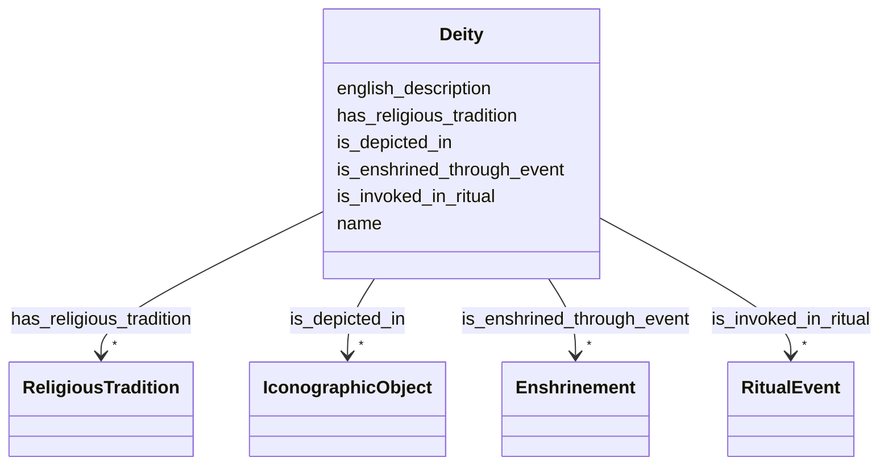

# Class: Deity 


_Divine conceptual entity in Hindu, Buddhist, or syncretic traditions. Distinct from physical representations (Murti) and ritual presences._


URI: [crm:E28_Conceptual_Object](http://www.cidoc-crm.org/cidoc-crm/E28_Conceptual_Object)





<!-- no inheritance hierarchy -->


## Slots

| Name | Cardinality and Range | Description | Inheritance |
| ---  | --- | --- | --- |
| [name](name.md) | 0..1 <br/> [String](String.md) | Primary name or label | direct |
| [english_description](english_description.md) | 0..1 <br/> [String](String.md) | Descriptive text in English | direct |
| [has_religious_tradition](has_religious_tradition.md) | * <br/> [ReligiousTradition](ReligiousTradition.md) | Religious tradition(s) within which this deity is venerated | direct |
| [is_depicted_in](is_depicted_in.md) | * <br/> [IconographicObject](IconographicObject.md) |  | direct |
| [is_invoked_in_ritual](is_invoked_in_ritual.md) | * <br/> [RitualEvent](RitualEvent.md) | Rituals where this deity is invoked | direct |
| [is_enshrined_through_event](is_enshrined_through_event.md) | * <br/> [Enshrinement](Enshrinement.md) | Events where this deity was enshrined | direct |


## Usages

| used by | used in | type | used |
| ---  | --- | --- | --- |
| [IconographicObject](IconographicObject.md) | [depicts_deity](depicts_deity.md) | range | [Deity](Deity.md) |
| [Paubha](Paubha.md) | [depicts_deity](depicts_deity.md) | range | [Deity](Deity.md) |
| [Murti](Murti.md) | [houses_deity_presence](houses_deity_presence.md) | range | [Deity](Deity.md) |
| [Murti](Murti.md) | [depicts_deity](depicts_deity.md) | range | [Deity](Deity.md) |
| [RitualEvent](RitualEvent.md) | [invokes_deity](invokes_deity.md) | range | [Deity](Deity.md) |
| [Puja](Puja.md) | [invokes_deity](invokes_deity.md) | range | [Deity](Deity.md) |
| [NityaPuja](NityaPuja.md) | [invokes_deity](invokes_deity.md) | range | [Deity](Deity.md) |
| [NaimittikaPuja](NaimittikaPuja.md) | [invokes_deity](invokes_deity.md) | range | [Deity](Deity.md) |
| [Festival](Festival.md) | [invokes_deity](invokes_deity.md) | range | [Deity](Deity.md) |
| [ChariotFestival](ChariotFestival.md) | [invokes_deity](invokes_deity.md) | range | [Deity](Deity.md) |
| [MaskedDance](MaskedDance.md) | [invokes_deity](invokes_deity.md) | range | [Deity](Deity.md) |
| [Consecration](Consecration.md) | [makes_deity_present](makes_deity_present.md) | range | [Deity](Deity.md) |
| [Enshrinement](Enshrinement.md) | [enshrined_deity](enshrined_deity.md) | range | [Deity](Deity.md) |
| [Container](Container.md) | [deities](deities.md) | range | [Deity](Deity.md) |


## Identifier and Mapping Information


### Schema Source


* from schema: CulturalHeritageOntology


## Mappings

| Mapping Type | Mapped Value |
| ---  | ---  |
| self | crm:E28_Conceptual_Object |
| native | heritageGraph:Deity |


## LinkML Source

<!-- TODO: investigate https://stackoverflow.com/questions/37606292/how-to-create-tabbed-code-blocks-in-mkdocs-or-sphinx -->

### Direct

<details>
```yaml
name: Deity
description: Divine conceptual entity in Hindu, Buddhist, or syncretic traditions.
  Distinct from physical representations (Murti) and ritual presences.
from_schema: CulturalHeritageOntology
slots:
- name
- english_description
- has_religious_tradition
- is_depicted_in
- is_invoked_in_ritual
- is_enshrined_through_event
class_uri: crm:E28_Conceptual_Object

```
</details>

### Induced

<details>
```yaml
name: Deity
description: Divine conceptual entity in Hindu, Buddhist, or syncretic traditions.
  Distinct from physical representations (Murti) and ritual presences.
from_schema: CulturalHeritageOntology
attributes:
  name:
    name: name
    description: Primary name or label
    from_schema: CulturalHeritageOntology
    rank: 1000
    slot_uri: crm:P1_is_identified_by
    alias: name
    owner: Deity
    domain_of:
    - ArchitecturalStructure
    - IconographicObject
    - ArchitecturalElement
    - Deity
    - ReligiousTradition
    - TraditionOrPractice
    - ArchitecturalStyle
    - CalendarSystem
    - Production
    - RitualEvent
    - Consecration
    - Enshrinement
    - TransferOfCustody
    - ConditionAssessment
    - Guthi
    - CasteGroup
    - Person
    - Actor
    - Place
    - DataSource
    - DocumentationActivity
    - DataCustodian
    - Technique
    - Material
    range: string
  english_description:
    name: english_description
    description: Descriptive text in English
    from_schema: CulturalHeritageOntology
    rank: 1000
    slot_uri: crm:P3_has_note
    alias: english_description
    owner: Deity
    domain_of:
    - ArchitecturalStructure
    - IconographicObject
    - ArchitecturalElement
    - Deity
    - ReligiousTradition
    - TraditionOrPractice
    - ArchitecturalStyle
    - RitualEvent
    - Guthi
    - CasteGroup
    - Person
    - Actor
    - DataSource
    - DataCustodian
    - Technique
    - Material
    range: string
  has_religious_tradition:
    name: has_religious_tradition
    description: Religious tradition(s) within which this deity is venerated
    from_schema: CulturalHeritageOntology
    rank: 1000
    slot_uri: crm:P2_has_type
    alias: has_religious_tradition
    owner: Deity
    domain_of:
    - Deity
    range: ReligiousTradition
    multivalued: true
  is_depicted_in:
    name: is_depicted_in
    from_schema: CulturalHeritageOntology
    rank: 1000
    slot_uri: crm:P62i_is_depicted_by
    alias: is_depicted_in
    owner: Deity
    domain_of:
    - Deity
    range: IconographicObject
    multivalued: true
  is_invoked_in_ritual:
    name: is_invoked_in_ritual
    description: Rituals where this deity is invoked
    from_schema: CulturalHeritageOntology
    rank: 1000
    slot_uri: crm:P12i_was_present_at
    alias: is_invoked_in_ritual
    owner: Deity
    domain_of:
    - Deity
    range: RitualEvent
    multivalued: true
  is_enshrined_through_event:
    name: is_enshrined_through_event
    description: Events where this deity was enshrined
    from_schema: CulturalHeritageOntology
    rank: 1000
    slot_uri: heritageGraph:is_enshrined_through_event
    alias: is_enshrined_through_event
    owner: Deity
    domain_of:
    - Deity
    range: Enshrinement
    multivalued: true
class_uri: crm:E28_Conceptual_Object

```
</details>