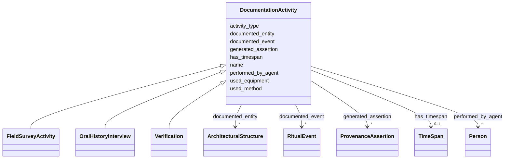

# Class: DocumentationActivity 


_The intellectual or technical process of recording information about a heritage entity, aligning CIDOC E13 (Attribute Assignment) with PROV-O Activity._


URI: [crm:E13_Attribute_Assignment](http://www.cidoc-crm.org/cidoc-crm/E13_Attribute_Assignment)





## Inheritance
* **DocumentationActivity**
    * [FieldSurveyActivity](FieldSurveyActivity.md)
    * [OralHistoryInterview](OralHistoryInterview.md)
    * [Verification](Verification.md)


## Slots

| Name | Cardinality and Range | Description | Inheritance |
| ---  | --- | --- | --- |
| [name](name.md) | 0..1 <br/> [String](String.md) | Primary name or label | direct |
| [activity_type](activity_type.md) | 0..1 <br/> [String](String.md) | Type of documentation activity | direct |
| [documented_entity](documented_entity.md) | * <br/> [ArchitecturalStructure](ArchitecturalStructure.md) | Heritage entity documented by this activity | direct |
| [documented_event](documented_event.md) | * <br/> [RitualEvent](RitualEvent.md) | Event documented by this activity | direct |
| [performed_by_agent](performed_by_agent.md) | * <br/> [Person](Person.md) | Agent who performed documentation | direct |
| [used_method](used_method.md) | 0..1 <br/> [String](String.md) | Documentation method used | direct |
| [used_equipment](used_equipment.md) | * <br/> [String](String.md) | Equipment used in documentation | direct |
| [generated_assertion](generated_assertion.md) | * <br/> [ProvenanceAssertion](ProvenanceAssertion.md) | Assertions generated by documentation activity | direct |
| [has_timespan](has_timespan.md) | 0..1 <br/> [TimeSpan](TimeSpan.md) | Links event to its temporal extent | direct |


## Usages

| used by | used in | type | used |
| ---  | --- | --- | --- |
| [ArchitecturalStructure](ArchitecturalStructure.md) | [was_documented_by](was_documented_by.md) | range | [DocumentationActivity](DocumentationActivity.md) |
| [Temple](Temple.md) | [was_documented_by](was_documented_by.md) | range | [DocumentationActivity](DocumentationActivity.md) |
| [BuddhistMonument](BuddhistMonument.md) | [was_documented_by](was_documented_by.md) | range | [DocumentationActivity](DocumentationActivity.md) |
| [Stupa](Stupa.md) | [was_documented_by](was_documented_by.md) | range | [DocumentationActivity](DocumentationActivity.md) |
| [Chaitya](Chaitya.md) | [was_documented_by](was_documented_by.md) | range | [DocumentationActivity](DocumentationActivity.md) |
| [RestHouse](RestHouse.md) | [was_documented_by](was_documented_by.md) | range | [DocumentationActivity](DocumentationActivity.md) |
| [Pati](Pati.md) | [was_documented_by](was_documented_by.md) | range | [DocumentationActivity](DocumentationActivity.md) |
| [Sattal](Sattal.md) | [was_documented_by](was_documented_by.md) | range | [DocumentationActivity](DocumentationActivity.md) |
| [Dharmashala](Dharmashala.md) | [was_documented_by](was_documented_by.md) | range | [DocumentationActivity](DocumentationActivity.md) |
| [WaterStructure](WaterStructure.md) | [was_documented_by](was_documented_by.md) | range | [DocumentationActivity](DocumentationActivity.md) |
| [DhungeDhara](DhungeDhara.md) | [was_documented_by](was_documented_by.md) | range | [DocumentationActivity](DocumentationActivity.md) |
| [Pokhari](Pokhari.md) | [was_documented_by](was_documented_by.md) | range | [DocumentationActivity](DocumentationActivity.md) |
| [Production](Production.md) | [was_documented_by](was_documented_by.md) | range | [DocumentationActivity](DocumentationActivity.md) |
| [RitualEvent](RitualEvent.md) | [was_documented_by](was_documented_by.md) | range | [DocumentationActivity](DocumentationActivity.md) |
| [Puja](Puja.md) | [was_documented_by](was_documented_by.md) | range | [DocumentationActivity](DocumentationActivity.md) |
| [NityaPuja](NityaPuja.md) | [was_documented_by](was_documented_by.md) | range | [DocumentationActivity](DocumentationActivity.md) |
| [NaimittikaPuja](NaimittikaPuja.md) | [was_documented_by](was_documented_by.md) | range | [DocumentationActivity](DocumentationActivity.md) |
| [Festival](Festival.md) | [was_documented_by](was_documented_by.md) | range | [DocumentationActivity](DocumentationActivity.md) |
| [ChariotFestival](ChariotFestival.md) | [was_documented_by](was_documented_by.md) | range | [DocumentationActivity](DocumentationActivity.md) |
| [MaskedDance](MaskedDance.md) | [was_documented_by](was_documented_by.md) | range | [DocumentationActivity](DocumentationActivity.md) |
| [Container](Container.md) | [documentation_activities](documentation_activities.md) | range | [DocumentationActivity](DocumentationActivity.md) |


## Identifier and Mapping Information


### Schema Source


* from schema: CulturalHeritageOntology


## Mappings

| Mapping Type | Mapped Value |
| ---  | ---  |
| self | crm:E13_Attribute_Assignment |
| native | heritageGraph:DocumentationActivity |
| broad | prov:Activity |


## LinkML Source

<!-- TODO: investigate https://stackoverflow.com/questions/37606292/how-to-create-tabbed-code-blocks-in-mkdocs-or-sphinx -->

### Direct

<details>
```yaml
name: DocumentationActivity
description: The intellectual or technical process of recording information about
  a heritage entity, aligning CIDOC E13 (Attribute Assignment) with PROV-O Activity.
from_schema: CulturalHeritageOntology
broad_mappings:
- prov:Activity
slots:
- name
- activity_type
- documented_entity
- documented_event
- performed_by_agent
- used_method
- used_equipment
- generated_assertion
- has_timespan
class_uri: crm:E13_Attribute_Assignment

```
</details>

### Induced

<details>
```yaml
name: DocumentationActivity
description: The intellectual or technical process of recording information about
  a heritage entity, aligning CIDOC E13 (Attribute Assignment) with PROV-O Activity.
from_schema: CulturalHeritageOntology
broad_mappings:
- prov:Activity
attributes:
  name:
    name: name
    description: Primary name or label
    from_schema: CulturalHeritageOntology
    rank: 1000
    slot_uri: crm:P1_is_identified_by
    alias: name
    owner: DocumentationActivity
    domain_of:
    - ArchitecturalStructure
    - IconographicObject
    - ArchitecturalElement
    - Deity
    - ReligiousTradition
    - TraditionOrPractice
    - ArchitecturalStyle
    - CalendarSystem
    - Production
    - RitualEvent
    - Consecration
    - Enshrinement
    - TransferOfCustody
    - ConditionAssessment
    - Guthi
    - CasteGroup
    - Person
    - Actor
    - Place
    - DataSource
    - DocumentationActivity
    - DataCustodian
    - Technique
    - Material
    range: string
  activity_type:
    name: activity_type
    description: Type of documentation activity
    from_schema: CulturalHeritageOntology
    rank: 1000
    slot_uri: crm:P2_has_type
    alias: activity_type
    owner: DocumentationActivity
    domain_of:
    - DocumentationActivity
    range: string
  documented_entity:
    name: documented_entity
    description: Heritage entity documented by this activity
    from_schema: CulturalHeritageOntology
    rank: 1000
    slot_uri: prov:generated
    alias: documented_entity
    owner: DocumentationActivity
    domain_of:
    - DocumentationActivity
    range: ArchitecturalStructure
    multivalued: true
  documented_event:
    name: documented_event
    description: Event documented by this activity
    from_schema: CulturalHeritageOntology
    rank: 1000
    slot_uri: prov:generated
    alias: documented_event
    owner: DocumentationActivity
    domain_of:
    - DocumentationActivity
    range: RitualEvent
    multivalued: true
  performed_by_agent:
    name: performed_by_agent
    description: Agent who performed documentation
    from_schema: CulturalHeritageOntology
    rank: 1000
    slot_uri: prov:wasAssociatedWith
    alias: performed_by_agent
    owner: DocumentationActivity
    domain_of:
    - DocumentationActivity
    range: Person
    multivalued: true
  used_method:
    name: used_method
    description: Documentation method used
    from_schema: CulturalHeritageOntology
    rank: 1000
    slot_uri: crm:P33_used_specific_technique
    alias: used_method
    owner: DocumentationActivity
    domain_of:
    - DocumentationActivity
    range: string
  used_equipment:
    name: used_equipment
    description: Equipment used in documentation
    from_schema: CulturalHeritageOntology
    rank: 1000
    slot_uri: crm:P16_used_specific_object
    alias: used_equipment
    owner: DocumentationActivity
    domain_of:
    - DocumentationActivity
    range: string
    multivalued: true
  generated_assertion:
    name: generated_assertion
    description: Assertions generated by documentation activity
    from_schema: CulturalHeritageOntology
    rank: 1000
    slot_uri: prov:generated
    alias: generated_assertion
    owner: DocumentationActivity
    domain_of:
    - DocumentationActivity
    range: ProvenanceAssertion
    multivalued: true
  has_timespan:
    name: has_timespan
    description: Links event to its temporal extent
    from_schema: CulturalHeritageOntology
    rank: 1000
    slot_uri: crm:P4_has_time-span
    alias: has_timespan
    owner: DocumentationActivity
    domain_of:
    - Production
    - RitualEvent
    - Consecration
    - Enshrinement
    - TransferOfCustody
    - ConditionAssessment
    - DocumentationActivity
    range: TimeSpan
class_uri: crm:E13_Attribute_Assignment

```
</details>