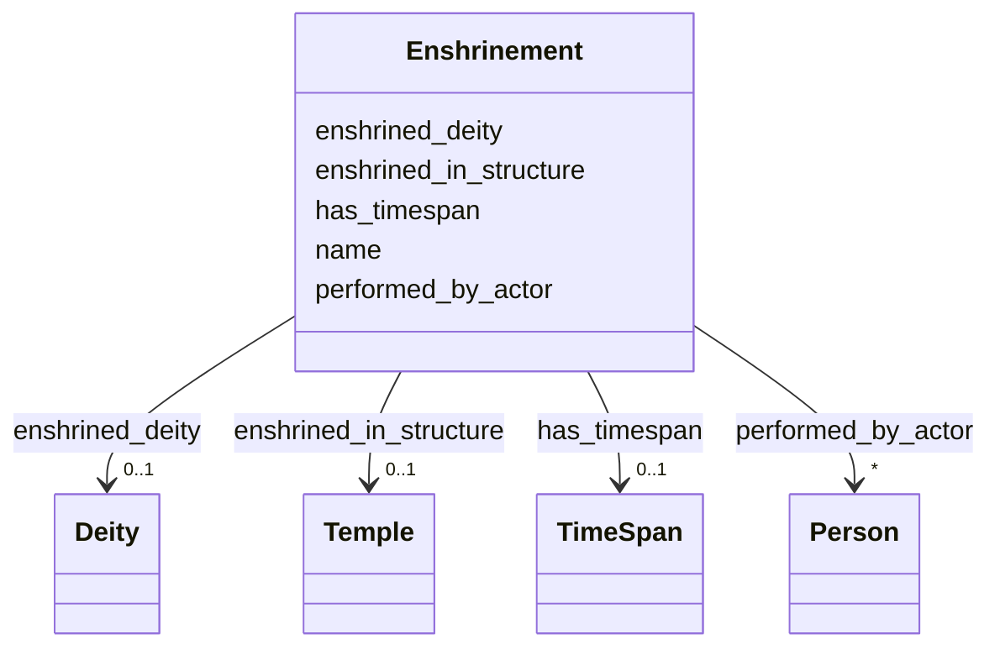

# Class: Enshrinement 


_Event of installing a deity's murti or symbol within a temple sanctum_


URI: [crm:E7_Activity](http://www.cidoc-crm.org/cidoc-crm/E7_Activity)





<!-- no inheritance hierarchy -->


## Slots

| Name | Cardinality and Range | Description | Inheritance |
| ---  | --- | --- | --- |
| [name](name.md) | 0..1 <br/> [String](String.md) | Primary name or label | direct |
| [enshrined_deity](enshrined_deity.md) | 0..1 <br/> [Deity](Deity.md) | Deity installed through enshrinement | direct |
| [enshrined_in_structure](enshrined_in_structure.md) | 0..1 <br/> [Temple](Temple.md) | Temple where deity was enshrined | direct |
| [performed_by_actor](performed_by_actor.md) | * <br/> [Person](Person.md) | Individual who performed ritual | direct |
| [has_timespan](has_timespan.md) | 0..1 <br/> [TimeSpan](TimeSpan.md) | Links event to its temporal extent | direct |


## Usages

| used by | used in | type | used |
| ---  | --- | --- | --- |
| [Temple](Temple.md) | [enshrines_deity_through_event](enshrines_deity_through_event.md) | range | [Enshrinement](Enshrinement.md) |
| [Deity](Deity.md) | [is_enshrined_through_event](is_enshrined_through_event.md) | range | [Enshrinement](Enshrinement.md) |
| [Container](Container.md) | [enshrinement_events](enshrinement_events.md) | range | [Enshrinement](Enshrinement.md) |


## Identifier and Mapping Information


### Schema Source


* from schema: CulturalHeritageOntology


## Mappings

| Mapping Type | Mapped Value |
| ---  | ---  |
| self | crm:E7_Activity |
| native | heritageGraph:Enshrinement |


## LinkML Source

<!-- TODO: investigate https://stackoverflow.com/questions/37606292/how-to-create-tabbed-code-blocks-in-mkdocs-or-sphinx -->

### Direct

<details>
```yaml
name: Enshrinement
description: Event of installing a deity's murti or symbol within a temple sanctum
from_schema: CulturalHeritageOntology
slots:
- name
- enshrined_deity
- enshrined_in_structure
- performed_by_actor
- has_timespan
class_uri: crm:E7_Activity

```
</details>

### Induced

<details>
```yaml
name: Enshrinement
description: Event of installing a deity's murti or symbol within a temple sanctum
from_schema: CulturalHeritageOntology
attributes:
  name:
    name: name
    description: Primary name or label
    from_schema: CulturalHeritageOntology
    rank: 1000
    slot_uri: crm:P1_is_identified_by
    alias: name
    owner: Enshrinement
    domain_of:
    - ArchitecturalStructure
    - IconographicObject
    - ArchitecturalElement
    - Deity
    - ReligiousTradition
    - TraditionOrPractice
    - ArchitecturalStyle
    - CalendarSystem
    - Production
    - RitualEvent
    - Consecration
    - Enshrinement
    - TransferOfCustody
    - ConditionAssessment
    - Guthi
    - CasteGroup
    - Person
    - Actor
    - Place
    - DataSource
    - DocumentationActivity
    - DataCustodian
    - Technique
    - Material
    range: string
  enshrined_deity:
    name: enshrined_deity
    description: Deity installed through enshrinement
    from_schema: CulturalHeritageOntology
    rank: 1000
    slot_uri: crm:P12_occurred_in_the_presence_of
    alias: enshrined_deity
    owner: Enshrinement
    domain_of:
    - Enshrinement
    range: Deity
  enshrined_in_structure:
    name: enshrined_in_structure
    description: Temple where deity was enshrined
    from_schema: CulturalHeritageOntology
    rank: 1000
    slot_uri: crm:P8_took_place_on_or_within
    alias: enshrined_in_structure
    owner: Enshrinement
    domain_of:
    - Enshrinement
    range: Temple
  performed_by_actor:
    name: performed_by_actor
    description: Individual who performed ritual
    from_schema: CulturalHeritageOntology
    rank: 1000
    slot_uri: crm:P14_carried_out_by
    alias: performed_by_actor
    owner: Enshrinement
    domain_of:
    - RitualEvent
    - Consecration
    - Enshrinement
    range: Person
    multivalued: true
  has_timespan:
    name: has_timespan
    description: Links event to its temporal extent
    from_schema: CulturalHeritageOntology
    rank: 1000
    slot_uri: crm:P4_has_time-span
    alias: has_timespan
    owner: Enshrinement
    domain_of:
    - Production
    - RitualEvent
    - Consecration
    - Enshrinement
    - TransferOfCustody
    - ConditionAssessment
    - DocumentationActivity
    range: TimeSpan
class_uri: crm:E7_Activity

```
</details>