# Class: Festival 


_Large-scale community ritual event (Jatra) involving processions, music, and collective participation_


URI: [heritageGraph:Festival](https://cair-nepal.org/heritageGraph/Festival)

```mermaid
 classDiagram
    class Festival
    click Festival href "../Festival/"
      RitualEvent <|-- Festival
        click RitualEvent href "../RitualEvent/"
      

      Festival <|-- ChariotFestival
        click ChariotFestival href "../ChariotFestival/"
      Festival <|-- MaskedDance
        click MaskedDance href "../MaskedDance/"
      

      Festival : english_description
        
      Festival : follows_tradition
        
          
    
        
        
        Festival --> "0..1" TraditionOrPractice : follows_tradition
        click TraditionOrPractice href "../TraditionOrPractice/"
    

        
      Festival : has_provenance_assertion
        
          
    
        
        
        Festival --> "*" ProvenanceAssertion : has_provenance_assertion
        click ProvenanceAssertion href "../ProvenanceAssertion/"
    

        
      Festival : has_timespan
        
          
    
        
        
        Festival --> "0..1" TimeSpan : has_timespan
        click TimeSpan href "../TimeSpan/"
    

        
      Festival : includes_ritual_event
        
          
    
        
        
        Festival --> "*" RitualEvent : includes_ritual_event
        click RitualEvent href "../RitualEvent/"
    

        
      Festival : invokes_deity
        
          
    
        
        
        Festival --> "*" Deity : invokes_deity
        click Deity href "../Deity/"
    

        
      Festival : is_part_of_festival
        
          
    
        
        
        Festival --> "0..1" Festival : is_part_of_festival
        click Festival href "../Festival/"
    

        
      Festival : lunar_date_tithi
        
      Festival : managed_by_guthi
        
          
    
        
        
        Festival --> "*" Guthi : managed_by_guthi
        click Guthi href "../Guthi/"
    

        
      Festival : name
        
      Festival : occurs_after
        
          
    
        
        
        Festival --> "0..1" RitualEvent : occurs_after
        click RitualEvent href "../RitualEvent/"
    

        
      Festival : occurs_before
        
          
    
        
        
        Festival --> "0..1" RitualEvent : occurs_before
        click RitualEvent href "../RitualEvent/"
    

        
      Festival : performed_by_actor
        
          
    
        
        
        Festival --> "*" Person : performed_by_actor
        click Person href "../Person/"
    

        
      Festival : performed_by_group
        
          
    
        
        
        Festival --> "*" Guthi : performed_by_group
        click Guthi href "../Guthi/"
    

        
      Festival : recurrence_pattern
        
      Festival : ritual_on_structure
        
          
    
        
        
        Festival --> "0..1" ArchitecturalStructure : ritual_on_structure
        click ArchitecturalStructure href "../ArchitecturalStructure/"
    

        
      Festival : ritual_type
        
          
    
        
        
        Festival --> "0..1" RitualTypeEnum : ritual_type
        click RitualTypeEnum href "../RitualTypeEnum/"
    

        
      Festival : used_materials
        
          
    
        
        
        Festival --> "*" Material : used_materials
        click Material href "../Material/"
    

        
      Festival : was_documented_by
        
          
    
        
        
        Festival --> "*" DocumentationActivity : was_documented_by
        click DocumentationActivity href "../DocumentationActivity/"
    

        
      
```





## Inheritance
* [RitualEvent](RitualEvent.md)
    * **Festival**
        * [ChariotFestival](ChariotFestival.md)
        * [MaskedDance](MaskedDance.md)


## Slots

| Name | Cardinality and Range | Description | Inheritance |
| ---  | --- | --- | --- |
| [includes_ritual_event](includes_ritual_event.md) | * <br/> [RitualEvent](RitualEvent.md) | Component rituals of festival | direct |
| [name](name.md) | 0..1 <br/> [String](String.md) | Primary name or label | [RitualEvent](RitualEvent.md) |
| [english_description](english_description.md) | 0..1 <br/> [String](String.md) | Descriptive text in English | [RitualEvent](RitualEvent.md) |
| [ritual_type](ritual_type.md) | 0..1 <br/> [RitualTypeEnum](RitualTypeEnum.md) | Classification of ritual (puja, jatra, consecration) | [RitualEvent](RitualEvent.md) |
| [ritual_on_structure](ritual_on_structure.md) | 0..1 <br/> [ArchitecturalStructure](ArchitecturalStructure.md) | Ritual occurs at specific temple or monument | [RitualEvent](RitualEvent.md) |
| [has_timespan](has_timespan.md) | 0..1 <br/> [TimeSpan](TimeSpan.md) | Links event to its temporal extent | [RitualEvent](RitualEvent.md) |
| [lunar_date_tithi](lunar_date_tithi.md) | 0..1 <br/> [String](String.md) | Lunar day (Tithi) for ritual timing | [RitualEvent](RitualEvent.md) |
| [recurrence_pattern](recurrence_pattern.md) | 0..1 <br/> [String](String.md) | Frequency of recurring ritual (e | [RitualEvent](RitualEvent.md) |
| [invokes_deity](invokes_deity.md) | * <br/> [Deity](Deity.md) | Deity invoked or made present through ritual | [RitualEvent](RitualEvent.md) |
| [performed_by_actor](performed_by_actor.md) | * <br/> [Person](Person.md) | Individual who performed ritual | [RitualEvent](RitualEvent.md) |
| [performed_by_group](performed_by_group.md) | * <br/> [Guthi](Guthi.md) | Group (Guthi, caste) responsible for ritual | [RitualEvent](RitualEvent.md) |
| [is_part_of_festival](is_part_of_festival.md) | 0..1 <br/> [Festival](Festival.md) | Larger festival this ritual is part of | [RitualEvent](RitualEvent.md) |
| [managed_by_guthi](managed_by_guthi.md) | * <br/> [Guthi](Guthi.md) | Guthi organization managing this structure or ritual | [RitualEvent](RitualEvent.md) |
| [follows_tradition](follows_tradition.md) | 0..1 <br/> [TraditionOrPractice](TraditionOrPractice.md) | Transmitted ritual protocol followed | [RitualEvent](RitualEvent.md) |
| [was_documented_by](was_documented_by.md) | * <br/> [DocumentationActivity](DocumentationActivity.md) | Documentation event that recorded this entity or event | [RitualEvent](RitualEvent.md) |
| [has_provenance_assertion](has_provenance_assertion.md) | * <br/> [ProvenanceAssertion](ProvenanceAssertion.md) | Provenance assertions about this entity or event | [RitualEvent](RitualEvent.md) |
| [occurs_before](occurs_before.md) | 0..1 <br/> [RitualEvent](RitualEvent.md) | Points to the next ritual in the canonical sequence | [RitualEvent](RitualEvent.md) |
| [occurs_after](occurs_after.md) | 0..1 <br/> [RitualEvent](RitualEvent.md) | Points to the prerequisite ritual | [RitualEvent](RitualEvent.md) |
| [used_materials](used_materials.md) | * <br/> [Material](Material.md) | Ephemeral materials consumed during the ritual (e | [RitualEvent](RitualEvent.md) |


## Usages

| used by | used in | type | used |
| ---  | --- | --- | --- |
| [RitualEvent](RitualEvent.md) | [is_part_of_festival](is_part_of_festival.md) | range | [Festival](Festival.md) |
| [Puja](Puja.md) | [is_part_of_festival](is_part_of_festival.md) | range | [Festival](Festival.md) |
| [NityaPuja](NityaPuja.md) | [is_part_of_festival](is_part_of_festival.md) | range | [Festival](Festival.md) |
| [NaimittikaPuja](NaimittikaPuja.md) | [is_part_of_festival](is_part_of_festival.md) | range | [Festival](Festival.md) |
| [Festival](Festival.md) | [is_part_of_festival](is_part_of_festival.md) | range | [Festival](Festival.md) |
| [ChariotFestival](ChariotFestival.md) | [is_part_of_festival](is_part_of_festival.md) | range | [Festival](Festival.md) |
| [MaskedDance](MaskedDance.md) | [is_part_of_festival](is_part_of_festival.md) | range | [Festival](Festival.md) |
| [Container](Container.md) | [festivals](festivals.md) | range | [Festival](Festival.md) |


## Identifier and Mapping Information


### Schema Source


* from schema: CulturalHeritageOntology


## Mappings

| Mapping Type | Mapped Value |
| ---  | ---  |
| self | heritageGraph:Festival |
| native | heritageGraph:Festival |


## LinkML Source

<!-- TODO: investigate https://stackoverflow.com/questions/37606292/how-to-create-tabbed-code-blocks-in-mkdocs-or-sphinx -->

### Direct

<details>
```yaml
name: Festival
description: Large-scale community ritual event (Jatra) involving processions, music,
  and collective participation
from_schema: CulturalHeritageOntology
is_a: RitualEvent
slots:
- includes_ritual_event
class_uri: heritageGraph:Festival

```
</details>

### Induced

<details>
```yaml
name: Festival
description: Large-scale community ritual event (Jatra) involving processions, music,
  and collective participation
from_schema: CulturalHeritageOntology
is_a: RitualEvent
attributes:
  includes_ritual_event:
    name: includes_ritual_event
    description: Component rituals of festival
    from_schema: CulturalHeritageOntology
    rank: 1000
    slot_uri: crm:P9i_forms_part_of
    alias: includes_ritual_event
    owner: Festival
    domain_of:
    - Festival
    range: RitualEvent
    multivalued: true
  name:
    name: name
    description: Primary name or label
    from_schema: CulturalHeritageOntology
    rank: 1000
    slot_uri: crm:P1_is_identified_by
    alias: name
    owner: Festival
    domain_of:
    - ArchitecturalStructure
    - IconographicObject
    - ArchitecturalElement
    - Deity
    - ReligiousTradition
    - TraditionOrPractice
    - ArchitecturalStyle
    - CalendarSystem
    - Production
    - RitualEvent
    - Consecration
    - Enshrinement
    - TransferOfCustody
    - ConditionAssessment
    - Guthi
    - CasteGroup
    - Person
    - Actor
    - Place
    - DataSource
    - DocumentationActivity
    - DataCustodian
    - Technique
    - Material
    range: string
  english_description:
    name: english_description
    description: Descriptive text in English
    from_schema: CulturalHeritageOntology
    rank: 1000
    slot_uri: crm:P3_has_note
    alias: english_description
    owner: Festival
    domain_of:
    - ArchitecturalStructure
    - IconographicObject
    - ArchitecturalElement
    - Deity
    - ReligiousTradition
    - TraditionOrPractice
    - ArchitecturalStyle
    - RitualEvent
    - Guthi
    - CasteGroup
    - Person
    - Actor
    - DataSource
    - DataCustodian
    - Technique
    - Material
    range: string
  ritual_type:
    name: ritual_type
    description: Classification of ritual (puja, jatra, consecration)
    from_schema: CulturalHeritageOntology
    rank: 1000
    slot_uri: crm:P2_has_type
    alias: ritual_type
    owner: Festival
    domain_of:
    - RitualEvent
    range: RitualTypeEnum
  ritual_on_structure:
    name: ritual_on_structure
    description: Ritual occurs at specific temple or monument
    from_schema: CulturalHeritageOntology
    rank: 1000
    slot_uri: crm:P8_took_place_on_or_within
    alias: ritual_on_structure
    owner: Festival
    domain_of:
    - RitualEvent
    range: ArchitecturalStructure
  has_timespan:
    name: has_timespan
    description: Links event to its temporal extent
    from_schema: CulturalHeritageOntology
    rank: 1000
    slot_uri: crm:P4_has_time-span
    alias: has_timespan
    owner: Festival
    domain_of:
    - Production
    - RitualEvent
    - Consecration
    - Enshrinement
    - TransferOfCustody
    - ConditionAssessment
    - DocumentationActivity
    range: TimeSpan
  lunar_date_tithi:
    name: lunar_date_tithi
    description: Lunar day (Tithi) for ritual timing
    from_schema: CulturalHeritageOntology
    rank: 1000
    slot_uri: heritageGraph:lunar_date_tithi
    alias: lunar_date_tithi
    owner: Festival
    domain_of:
    - RitualEvent
    range: string
  recurrence_pattern:
    name: recurrence_pattern
    description: Frequency of recurring ritual (e.g., annual, monthly)
    from_schema: CulturalHeritageOntology
    rank: 1000
    slot_uri: heritageGraph:recurrence_pattern
    alias: recurrence_pattern
    owner: Festival
    domain_of:
    - RitualEvent
    range: string
  invokes_deity:
    name: invokes_deity
    description: Deity invoked or made present through ritual
    from_schema: CulturalHeritageOntology
    rank: 1000
    slot_uri: crm:P12_occurred_in_the_presence_of
    alias: invokes_deity
    owner: Festival
    domain_of:
    - RitualEvent
    range: Deity
    multivalued: true
  performed_by_actor:
    name: performed_by_actor
    description: Individual who performed ritual
    from_schema: CulturalHeritageOntology
    rank: 1000
    slot_uri: crm:P14_carried_out_by
    alias: performed_by_actor
    owner: Festival
    domain_of:
    - RitualEvent
    - Consecration
    - Enshrinement
    range: Person
    multivalued: true
  performed_by_group:
    name: performed_by_group
    description: Group (Guthi, caste) responsible for ritual
    from_schema: CulturalHeritageOntology
    rank: 1000
    slot_uri: crm:P14_carried_out_by
    alias: performed_by_group
    owner: Festival
    domain_of:
    - RitualEvent
    range: Guthi
    multivalued: true
  is_part_of_festival:
    name: is_part_of_festival
    description: Larger festival this ritual is part of
    from_schema: CulturalHeritageOntology
    rank: 1000
    slot_uri: crm:P9_consists_of
    alias: is_part_of_festival
    owner: Festival
    domain_of:
    - RitualEvent
    range: Festival
  managed_by_guthi:
    name: managed_by_guthi
    description: Guthi organization managing this structure or ritual
    from_schema: CulturalHeritageOntology
    rank: 1000
    slot_uri: heritageGraph:managed_by_guthi
    alias: managed_by_guthi
    owner: Festival
    domain_of:
    - RitualEvent
    range: Guthi
    multivalued: true
  follows_tradition:
    name: follows_tradition
    description: Transmitted ritual protocol followed
    from_schema: CulturalHeritageOntology
    rank: 1000
    slot_uri: crm:P33_used_specific_technique
    alias: follows_tradition
    owner: Festival
    domain_of:
    - RitualEvent
    range: TraditionOrPractice
  was_documented_by:
    name: was_documented_by
    description: Documentation event that recorded this entity or event
    from_schema: CulturalHeritageOntology
    rank: 1000
    slot_uri: prov:wasGeneratedBy
    alias: was_documented_by
    owner: Festival
    domain_of:
    - ArchitecturalStructure
    - Production
    - RitualEvent
    range: DocumentationActivity
    multivalued: true
  has_provenance_assertion:
    name: has_provenance_assertion
    description: Provenance assertions about this entity or event
    from_schema: CulturalHeritageOntology
    rank: 1000
    slot_uri: heritageGraph:has_provenance_assertion
    alias: has_provenance_assertion
    owner: Festival
    domain_of:
    - Production
    - RitualEvent
    range: ProvenanceAssertion
    multivalued: true
  occurs_before:
    name: occurs_before
    description: Points to the next ritual in the canonical sequence.
    from_schema: CulturalHeritageOntology
    rank: 1000
    slot_uri: crm:P120_occurs_before
    alias: occurs_before
    owner: Festival
    domain_of:
    - RitualEvent
    range: RitualEvent
  occurs_after:
    name: occurs_after
    description: Points to the prerequisite ritual.
    from_schema: CulturalHeritageOntology
    rank: 1000
    slot_uri: crm:P120i_is_occurred_before_by
    alias: occurs_after
    owner: Festival
    domain_of:
    - RitualEvent
    range: RitualEvent
  used_materials:
    name: used_materials
    description: Ephemeral materials consumed during the ritual (e.g., oil, rice).
    from_schema: CulturalHeritageOntology
    rank: 1000
    slot_uri: crm:P125_used_object_of_type
    alias: used_materials
    owner: Festival
    domain_of:
    - RitualEvent
    range: Material
    multivalued: true
class_uri: heritageGraph:Festival

```
</details>