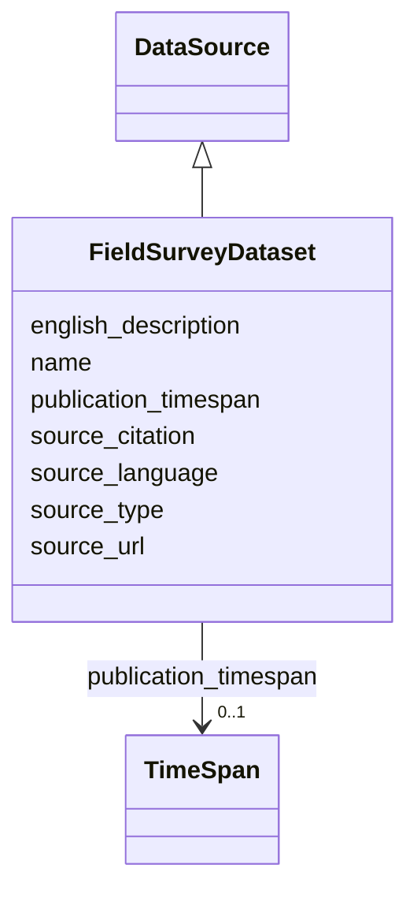

# Class: FieldSurveyDataset 


_The structured data or report resulting from a field survey._


URI: [crm:E31_Document](http://www.cidoc-crm.org/cidoc-crm/E31_Document)





## Inheritance
* [DataSource](DataSource.md)
    * **FieldSurveyDataset**


## Slots

| Name | Cardinality and Range | Description | Inheritance |
| ---  | --- | --- | --- |
| [name](name.md) | 0..1 <br/> [String](String.md) | Primary name or label | [DataSource](DataSource.md) |
| [source_type](source_type.md) | 0..1 <br/> [String](String.md) | Type of source (manuscript, inscription, survey, oral) | [DataSource](DataSource.md) |
| [source_citation](source_citation.md) | 0..1 <br/> [String](String.md) | Formal citation of source | [DataSource](DataSource.md) |
| [source_url](source_url.md) | 0..1 <br/> [String](String.md) | URL or digital identifier for source | [DataSource](DataSource.md) |
| [source_language](source_language.md) | 0..1 <br/> [String](String.md) | Language of the source material | [DataSource](DataSource.md) |
| [publication_timespan](publication_timespan.md) | 0..1 <br/> [TimeSpan](TimeSpan.md) | When source was published | [DataSource](DataSource.md) |
| [english_description](english_description.md) | 0..1 <br/> [String](String.md) | Descriptive text in English | [DataSource](DataSource.md) |


## Identifier and Mapping Information


### Schema Source


* from schema: CulturalHeritageOntology


## Mappings

| Mapping Type | Mapped Value |
| ---  | ---  |
| self | crm:E31_Document |
| native | heritageGraph:FieldSurveyDataset |


## LinkML Source

<!-- TODO: investigate https://stackoverflow.com/questions/37606292/how-to-create-tabbed-code-blocks-in-mkdocs-or-sphinx -->

### Direct

<details>
```yaml
name: FieldSurveyDataset
description: The structured data or report resulting from a field survey.
from_schema: CulturalHeritageOntology
is_a: DataSource
class_uri: crm:E31_Document

```
</details>

### Induced

<details>
```yaml
name: FieldSurveyDataset
description: The structured data or report resulting from a field survey.
from_schema: CulturalHeritageOntology
is_a: DataSource
attributes:
  name:
    name: name
    description: Primary name or label
    from_schema: CulturalHeritageOntology
    rank: 1000
    slot_uri: crm:P1_is_identified_by
    alias: name
    owner: FieldSurveyDataset
    domain_of:
    - ArchitecturalStructure
    - IconographicObject
    - ArchitecturalElement
    - Deity
    - ReligiousTradition
    - TraditionOrPractice
    - ArchitecturalStyle
    - CalendarSystem
    - Production
    - RitualEvent
    - Consecration
    - Enshrinement
    - TransferOfCustody
    - ConditionAssessment
    - Guthi
    - CasteGroup
    - Person
    - Actor
    - Place
    - DataSource
    - DocumentationActivity
    - DataCustodian
    - Technique
    - Material
    range: string
  source_type:
    name: source_type
    description: Type of source (manuscript, inscription, survey, oral)
    from_schema: CulturalHeritageOntology
    rank: 1000
    slot_uri: crm:P2_has_type
    alias: source_type
    owner: FieldSurveyDataset
    domain_of:
    - DataSource
    range: string
  source_citation:
    name: source_citation
    description: Formal citation of source
    from_schema: CulturalHeritageOntology
    rank: 1000
    slot_uri: crm:P3_has_note
    alias: source_citation
    owner: FieldSurveyDataset
    domain_of:
    - DataSource
    range: string
  source_url:
    name: source_url
    description: URL or digital identifier for source
    from_schema: CulturalHeritageOntology
    rank: 1000
    slot_uri: heritageGraph:source_url
    alias: source_url
    owner: FieldSurveyDataset
    domain_of:
    - DataSource
    range: string
  source_language:
    name: source_language
    description: Language of the source material
    from_schema: CulturalHeritageOntology
    rank: 1000
    slot_uri: crm:P72_has_language
    alias: source_language
    owner: FieldSurveyDataset
    domain_of:
    - DataSource
    range: string
  publication_timespan:
    name: publication_timespan
    description: When source was published
    from_schema: CulturalHeritageOntology
    rank: 1000
    slot_uri: crm:P4_has_time-span
    alias: publication_timespan
    owner: FieldSurveyDataset
    domain_of:
    - DataSource
    range: TimeSpan
  english_description:
    name: english_description
    description: Descriptive text in English
    from_schema: CulturalHeritageOntology
    rank: 1000
    slot_uri: crm:P3_has_note
    alias: english_description
    owner: FieldSurveyDataset
    domain_of:
    - ArchitecturalStructure
    - IconographicObject
    - ArchitecturalElement
    - Deity
    - ReligiousTradition
    - TraditionOrPractice
    - ArchitecturalStyle
    - RitualEvent
    - Guthi
    - CasteGroup
    - Person
    - Actor
    - DataSource
    - DataCustodian
    - Technique
    - Material
    range: string
class_uri: crm:E31_Document

```
</details>