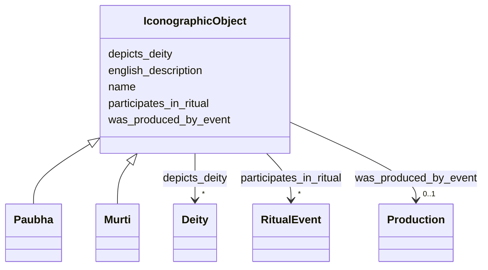

# Class: IconographicObject 


_Sacred visual art objects that depict or embody deities through iconographic conventions_


URI: [crm:E22_Human-Made_Object](http://www.cidoc-crm.org/cidoc-crm/E22_Human-Made_Object)





## Inheritance
* **IconographicObject**
    * [Paubha](Paubha.md)
    * [Murti](Murti.md)


## Slots

| Name | Cardinality and Range | Description | Inheritance |
| ---  | --- | --- | --- |
| [name](name.md) | 0..1 <br/> [String](String.md) | Primary name or label | direct |
| [english_description](english_description.md) | 0..1 <br/> [String](String.md) | Descriptive text in English | direct |
| [depicts_deity](depicts_deity.md) | * <br/> [Deity](Deity.md) | Deity depicted iconographically (not cultic presence) | direct |
| [was_produced_by_event](was_produced_by_event.md) | 0..1 <br/> [Production](Production.md) | Event that created this object or structure | direct |
| [participates_in_ritual](participates_in_ritual.md) | * <br/> [RitualEvent](RitualEvent.md) | Rituals in which this structure participates | direct |


## Usages

| used by | used in | type | used |
| ---  | --- | --- | --- |
| [Deity](Deity.md) | [is_depicted_in](is_depicted_in.md) | range | [IconographicObject](IconographicObject.md) |


## Identifier and Mapping Information


### Schema Source


* from schema: CulturalHeritageOntology


## Mappings

| Mapping Type | Mapped Value |
| ---  | ---  |
| self | crm:E22_Human-Made_Object |
| native | heritageGraph:IconographicObject |


## LinkML Source

<!-- TODO: investigate https://stackoverflow.com/questions/37606292/how-to-create-tabbed-code-blocks-in-mkdocs-or-sphinx -->

### Direct

<details>
```yaml
name: IconographicObject
description: Sacred visual art objects that depict or embody deities through iconographic
  conventions
from_schema: CulturalHeritageOntology
slots:
- name
- english_description
- depicts_deity
- was_produced_by_event
- participates_in_ritual
class_uri: crm:E22_Human-Made_Object

```
</details>

### Induced

<details>
```yaml
name: IconographicObject
description: Sacred visual art objects that depict or embody deities through iconographic
  conventions
from_schema: CulturalHeritageOntology
attributes:
  name:
    name: name
    description: Primary name or label
    from_schema: CulturalHeritageOntology
    rank: 1000
    slot_uri: crm:P1_is_identified_by
    alias: name
    owner: IconographicObject
    domain_of:
    - ArchitecturalStructure
    - IconographicObject
    - ArchitecturalElement
    - Deity
    - ReligiousTradition
    - TraditionOrPractice
    - ArchitecturalStyle
    - CalendarSystem
    - Production
    - RitualEvent
    - Consecration
    - Enshrinement
    - TransferOfCustody
    - ConditionAssessment
    - Guthi
    - CasteGroup
    - Person
    - Actor
    - Place
    - DataSource
    - DocumentationActivity
    - DataCustodian
    - Technique
    - Material
    range: string
  english_description:
    name: english_description
    description: Descriptive text in English
    from_schema: CulturalHeritageOntology
    rank: 1000
    slot_uri: crm:P3_has_note
    alias: english_description
    owner: IconographicObject
    domain_of:
    - ArchitecturalStructure
    - IconographicObject
    - ArchitecturalElement
    - Deity
    - ReligiousTradition
    - TraditionOrPractice
    - ArchitecturalStyle
    - RitualEvent
    - Guthi
    - CasteGroup
    - Person
    - Actor
    - DataSource
    - DataCustodian
    - Technique
    - Material
    range: string
  depicts_deity:
    name: depicts_deity
    description: Deity depicted iconographically (not cultic presence)
    from_schema: CulturalHeritageOntology
    rank: 1000
    slot_uri: crm:P62_depicts
    alias: depicts_deity
    owner: IconographicObject
    domain_of:
    - IconographicObject
    range: Deity
    multivalued: true
  was_produced_by_event:
    name: was_produced_by_event
    description: Event that created this object or structure
    from_schema: CulturalHeritageOntology
    rank: 1000
    slot_uri: crm:P108i_was_produced_by
    alias: was_produced_by_event
    owner: IconographicObject
    domain_of:
    - ArchitecturalStructure
    - IconographicObject
    range: Production
  participates_in_ritual:
    name: participates_in_ritual
    description: Rituals in which this structure participates
    from_schema: CulturalHeritageOntology
    rank: 1000
    slot_uri: crm:P12i_was_present_at
    alias: participates_in_ritual
    owner: IconographicObject
    domain_of:
    - ArchitecturalStructure
    - IconographicObject
    range: RitualEvent
    multivalued: true
class_uri: crm:E22_Human-Made_Object

```
</details>