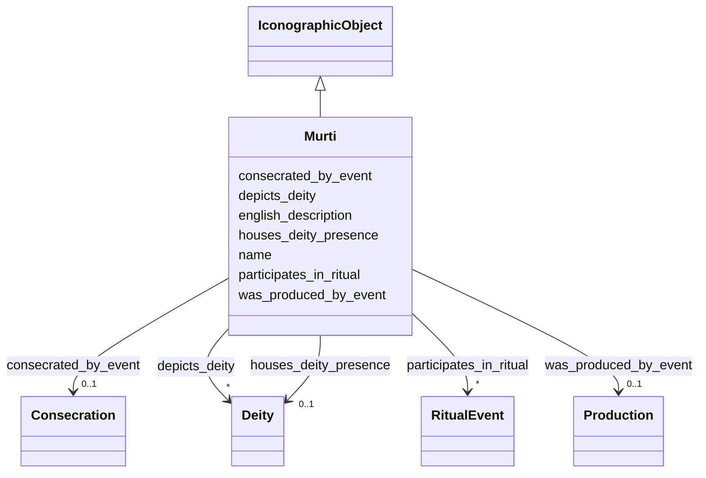

# Class: Murti 


_Consecrated statue of a deity, ritually activated to serve as divine presence (not merely depiction)_


URI: [heritageGraph:Murti](https://cair-nepal.org/heritageGraph/Murti)





## Inheritance
* [IconographicObject](IconographicObject.md)
    * **Murti**


## Slots

| Name | Cardinality and Range | Description | Inheritance |
| ---  | --- | --- | --- |
| [consecrated_by_event](consecrated_by_event.md) | 0..1 <br/> [Consecration](Consecration.md) | Consecration event that activated this murti | direct |
| [houses_deity_presence](houses_deity_presence.md) | 0..1 <br/> [Deity](Deity.md) | Deity made present through consecration (not mere depiction) | direct |
| [name](name.md) | 0..1 <br/> [String](String.md) | Primary name or label | [IconographicObject](IconographicObject.md) |
| [english_description](english_description.md) | 0..1 <br/> [String](String.md) | Descriptive text in English | [IconographicObject](IconographicObject.md) |
| [depicts_deity](depicts_deity.md) | * <br/> [Deity](Deity.md) | Deity depicted iconographically (not cultic presence) | [IconographicObject](IconographicObject.md) |
| [was_produced_by_event](was_produced_by_event.md) | 0..1 <br/> [Production](Production.md) | Event that created this object or structure | [IconographicObject](IconographicObject.md) |
| [participates_in_ritual](participates_in_ritual.md) | * <br/> [RitualEvent](RitualEvent.md) | Rituals in which this structure participates | [IconographicObject](IconographicObject.md) |


## Usages

| used by | used in | type | used |
| ---  | --- | --- | --- |
| [Consecration](Consecration.md) | [consecrated_object](consecrated_object.md) | range | [Murti](Murti.md) |


## Identifier and Mapping Information


### Schema Source


* from schema: CulturalHeritageOntology


## Mappings

| Mapping Type | Mapped Value |
| ---  | ---  |
| self | heritageGraph:Murti |
| native | heritageGraph:Murti |


## LinkML Source

<!-- TODO: investigate https://stackoverflow.com/questions/37606292/how-to-create-tabbed-code-blocks-in-mkdocs-or-sphinx -->

### Direct

<details>
```yaml
name: Murti
description: Consecrated statue of a deity, ritually activated to serve as divine
  presence (not merely depiction)
from_schema: CulturalHeritageOntology
is_a: IconographicObject
slots:
- consecrated_by_event
- houses_deity_presence
class_uri: heritageGraph:Murti

```
</details>

### Induced

<details>
```yaml
name: Murti
description: Consecrated statue of a deity, ritually activated to serve as divine
  presence (not merely depiction)
from_schema: CulturalHeritageOntology
is_a: IconographicObject
attributes:
  consecrated_by_event:
    name: consecrated_by_event
    description: Consecration event that activated this murti
    from_schema: CulturalHeritageOntology
    rank: 1000
    slot_uri: heritageGraph:consecrated_by_event
    alias: consecrated_by_event
    owner: Murti
    domain_of:
    - Murti
    range: Consecration
  houses_deity_presence:
    name: houses_deity_presence
    description: Deity made present through consecration (not mere depiction)
    from_schema: CulturalHeritageOntology
    rank: 1000
    slot_uri: heritageGraph:houses_deity_presence
    alias: houses_deity_presence
    owner: Murti
    domain_of:
    - Murti
    range: Deity
  name:
    name: name
    description: Primary name or label
    from_schema: CulturalHeritageOntology
    rank: 1000
    slot_uri: crm:P1_is_identified_by
    alias: name
    owner: Murti
    domain_of:
    - ArchitecturalStructure
    - IconographicObject
    - ArchitecturalElement
    - Deity
    - ReligiousTradition
    - TraditionOrPractice
    - ArchitecturalStyle
    - CalendarSystem
    - Production
    - RitualEvent
    - Consecration
    - Enshrinement
    - TransferOfCustody
    - ConditionAssessment
    - Guthi
    - CasteGroup
    - Person
    - Actor
    - Place
    - DataSource
    - DocumentationActivity
    - DataCustodian
    - Technique
    - Material
    range: string
  english_description:
    name: english_description
    description: Descriptive text in English
    from_schema: CulturalHeritageOntology
    rank: 1000
    slot_uri: crm:P3_has_note
    alias: english_description
    owner: Murti
    domain_of:
    - ArchitecturalStructure
    - IconographicObject
    - ArchitecturalElement
    - Deity
    - ReligiousTradition
    - TraditionOrPractice
    - ArchitecturalStyle
    - RitualEvent
    - Guthi
    - CasteGroup
    - Person
    - Actor
    - DataSource
    - DataCustodian
    - Technique
    - Material
    range: string
  depicts_deity:
    name: depicts_deity
    description: Deity depicted iconographically (not cultic presence)
    from_schema: CulturalHeritageOntology
    rank: 1000
    slot_uri: crm:P62_depicts
    alias: depicts_deity
    owner: Murti
    domain_of:
    - IconographicObject
    range: Deity
    multivalued: true
  was_produced_by_event:
    name: was_produced_by_event
    description: Event that created this object or structure
    from_schema: CulturalHeritageOntology
    rank: 1000
    slot_uri: crm:P108i_was_produced_by
    alias: was_produced_by_event
    owner: Murti
    domain_of:
    - ArchitecturalStructure
    - IconographicObject
    range: Production
  participates_in_ritual:
    name: participates_in_ritual
    description: Rituals in which this structure participates
    from_schema: CulturalHeritageOntology
    rank: 1000
    slot_uri: crm:P12i_was_present_at
    alias: participates_in_ritual
    owner: Murti
    domain_of:
    - ArchitecturalStructure
    - IconographicObject
    range: RitualEvent
    multivalued: true
class_uri: heritageGraph:Murti

```
</details>