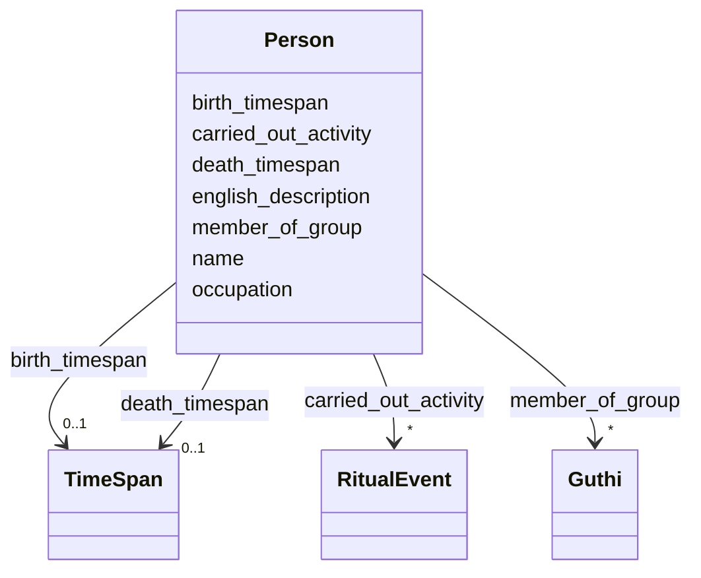

# Class: Person 


_Individual person who performs, commissions, documents, or verifies heritage activities_


URI: [crm:E21_Person](http://www.cidoc-crm.org/cidoc-crm/E21_Person)





<!-- no inheritance hierarchy -->


## Slots

| Name | Cardinality and Range | Description | Inheritance |
| ---  | --- | --- | --- |
| [name](name.md) | 0..1 <br/> [String](String.md) | Primary name or label | direct |
| [english_description](english_description.md) | 0..1 <br/> [String](String.md) | Descriptive text in English | direct |
| [birth_timespan](birth_timespan.md) | 0..1 <br/> [TimeSpan](TimeSpan.md) | Person's birth timespan | direct |
| [death_timespan](death_timespan.md) | 0..1 <br/> [TimeSpan](TimeSpan.md) | Person's death timespan | direct |
| [occupation](occupation.md) | * <br/> [String](String.md) | Person's occupation or role | direct |
| [member_of_group](member_of_group.md) | * <br/> [Guthi](Guthi.md) | Groups this person belongs to | direct |
| [carried_out_activity](carried_out_activity.md) | * <br/> [RitualEvent](RitualEvent.md) | Activities performed by this actor | direct |


## Usages

| used by | used in | type | used |
| ---  | --- | --- | --- |
| [RitualEvent](RitualEvent.md) | [performed_by_actor](performed_by_actor.md) | range | [Person](Person.md) |
| [Puja](Puja.md) | [performed_by_actor](performed_by_actor.md) | range | [Person](Person.md) |
| [NityaPuja](NityaPuja.md) | [performed_by_actor](performed_by_actor.md) | range | [Person](Person.md) |
| [NaimittikaPuja](NaimittikaPuja.md) | [performed_by_actor](performed_by_actor.md) | range | [Person](Person.md) |
| [Festival](Festival.md) | [performed_by_actor](performed_by_actor.md) | range | [Person](Person.md) |
| [ChariotFestival](ChariotFestival.md) | [performed_by_actor](performed_by_actor.md) | range | [Person](Person.md) |
| [MaskedDance](MaskedDance.md) | [performed_by_actor](performed_by_actor.md) | range | [Person](Person.md) |
| [Consecration](Consecration.md) | [performed_by_actor](performed_by_actor.md) | range | [Person](Person.md) |
| [Enshrinement](Enshrinement.md) | [performed_by_actor](performed_by_actor.md) | range | [Person](Person.md) |
| [Guthi](Guthi.md) | [has_membership](has_membership.md) | range | [Person](Person.md) |
| [SiGuthi](SiGuthi.md) | [has_membership](has_membership.md) | range | [Person](Person.md) |
| [JatraGuthi](JatraGuthi.md) | [has_membership](has_membership.md) | range | [Person](Person.md) |
| [PujaGuthi](PujaGuthi.md) | [has_membership](has_membership.md) | range | [Person](Person.md) |
| [TempleGuthi](TempleGuthi.md) | [has_membership](has_membership.md) | range | [Person](Person.md) |
| [NashaGuthi](NashaGuthi.md) | [has_membership](has_membership.md) | range | [Person](Person.md) |
| [SanaGuthi](SanaGuthi.md) | [has_membership](has_membership.md) | range | [Person](Person.md) |
| [SanGuthi](SanGuthi.md) | [has_membership](has_membership.md) | range | [Person](Person.md) |
| [RajGuthi](RajGuthi.md) | [has_membership](has_membership.md) | range | [Person](Person.md) |
| [ProvenanceAssertion](ProvenanceAssertion.md) | [was_attributed_to_agent](was_attributed_to_agent.md) | range | [Person](Person.md) |
| [FieldSurveyActivity](FieldSurveyActivity.md) | [performed_by_agent](performed_by_agent.md) | range | [Person](Person.md) |
| [OralHistoryInterview](OralHistoryInterview.md) | [performed_by_agent](performed_by_agent.md) | range | [Person](Person.md) |
| [DocumentationActivity](DocumentationActivity.md) | [performed_by_agent](performed_by_agent.md) | range | [Person](Person.md) |
| [Verification](Verification.md) | [verified_by_expert](verified_by_expert.md) | range | [Person](Person.md) |
| [Verification](Verification.md) | [performed_by_agent](performed_by_agent.md) | range | [Person](Person.md) |
| [Container](Container.md) | [persons](persons.md) | range | [Person](Person.md) |


## Identifier and Mapping Information


### Schema Source


* from schema: CulturalHeritageOntology


## Mappings

| Mapping Type | Mapped Value |
| ---  | ---  |
| self | crm:E21_Person |
| native | heritageGraph:Person |


## LinkML Source

<!-- TODO: investigate https://stackoverflow.com/questions/37606292/how-to-create-tabbed-code-blocks-in-mkdocs-or-sphinx -->

### Direct

<details>
```yaml
name: Person
description: Individual person who performs, commissions, documents, or verifies heritage
  activities
from_schema: CulturalHeritageOntology
slots:
- name
- english_description
- birth_timespan
- death_timespan
- occupation
- member_of_group
- carried_out_activity
class_uri: crm:E21_Person

```
</details>

### Induced

<details>
```yaml
name: Person
description: Individual person who performs, commissions, documents, or verifies heritage
  activities
from_schema: CulturalHeritageOntology
attributes:
  name:
    name: name
    description: Primary name or label
    from_schema: CulturalHeritageOntology
    rank: 1000
    slot_uri: crm:P1_is_identified_by
    alias: name
    owner: Person
    domain_of:
    - ArchitecturalStructure
    - IconographicObject
    - ArchitecturalElement
    - Deity
    - ReligiousTradition
    - TraditionOrPractice
    - ArchitecturalStyle
    - CalendarSystem
    - Production
    - RitualEvent
    - Consecration
    - Enshrinement
    - TransferOfCustody
    - ConditionAssessment
    - Guthi
    - CasteGroup
    - Person
    - Actor
    - Place
    - DataSource
    - DocumentationActivity
    - DataCustodian
    - Technique
    - Material
    range: string
  english_description:
    name: english_description
    description: Descriptive text in English
    from_schema: CulturalHeritageOntology
    rank: 1000
    slot_uri: crm:P3_has_note
    alias: english_description
    owner: Person
    domain_of:
    - ArchitecturalStructure
    - IconographicObject
    - ArchitecturalElement
    - Deity
    - ReligiousTradition
    - TraditionOrPractice
    - ArchitecturalStyle
    - RitualEvent
    - Guthi
    - CasteGroup
    - Person
    - Actor
    - DataSource
    - DataCustodian
    - Technique
    - Material
    range: string
  birth_timespan:
    name: birth_timespan
    description: Person's birth timespan
    from_schema: CulturalHeritageOntology
    rank: 1000
    slot_uri: crm:P98_brought_into_life
    alias: birth_timespan
    owner: Person
    domain_of:
    - Person
    range: TimeSpan
  death_timespan:
    name: death_timespan
    description: Person's death timespan
    from_schema: CulturalHeritageOntology
    rank: 1000
    slot_uri: crm:P100_was_death_of
    alias: death_timespan
    owner: Person
    domain_of:
    - Person
    range: TimeSpan
  occupation:
    name: occupation
    description: Person's occupation or role
    from_schema: CulturalHeritageOntology
    rank: 1000
    slot_uri: crm:P2_has_type
    alias: occupation
    owner: Person
    domain_of:
    - Person
    range: string
    multivalued: true
  member_of_group:
    name: member_of_group
    description: Groups this person belongs to
    from_schema: CulturalHeritageOntology
    rank: 1000
    slot_uri: crm:P107i_is_current_or_former_member_of
    alias: member_of_group
    owner: Person
    domain_of:
    - Person
    range: Guthi
    multivalued: true
  carried_out_activity:
    name: carried_out_activity
    description: Activities performed by this actor
    from_schema: CulturalHeritageOntology
    rank: 1000
    slot_uri: crm:P14i_performed
    alias: carried_out_activity
    owner: Person
    domain_of:
    - Person
    range: RitualEvent
    multivalued: true
class_uri: crm:E21_Person

```
</details>