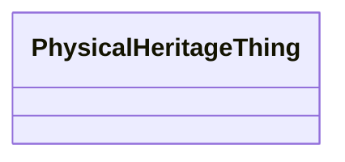

# Class: PhysicalHeritageThing 


URI: [heritageGraph:PhysicalHeritageThing](https://cair-nepal.org/heritageGraph/PhysicalHeritageThing)





<!-- no inheritance hierarchy -->


## Slots

| Name | Cardinality and Range | Description | Inheritance |
| ---  | --- | --- | --- |


## Usages

| used by | used in | type | used |
| ---  | --- | --- | --- |
| [Production](Production.md) | [produced_object](produced_object.md) | range | [PhysicalHeritageThing](PhysicalHeritageThing.md) |


## Identifier and Mapping Information


### Schema Source


* from schema: CulturalHeritageOntology


## Mappings

| Mapping Type | Mapped Value |
| ---  | ---  |
| self | heritageGraph:PhysicalHeritageThing |
| native | heritageGraph:PhysicalHeritageThing |


## LinkML Source

<!-- TODO: investigate https://stackoverflow.com/questions/37606292/how-to-create-tabbed-code-blocks-in-mkdocs-or-sphinx -->

### Direct

<details>
```yaml
name: PhysicalHeritageThing
from_schema: CulturalHeritageOntology
union_of:
- ArchitecturalStructure
- IconographicObject
- ArchitecturalElement

```
</details>

### Induced

<details>
```yaml
name: PhysicalHeritageThing
from_schema: CulturalHeritageOntology
union_of:
- ArchitecturalStructure
- IconographicObject
- ArchitecturalElement

```
</details>