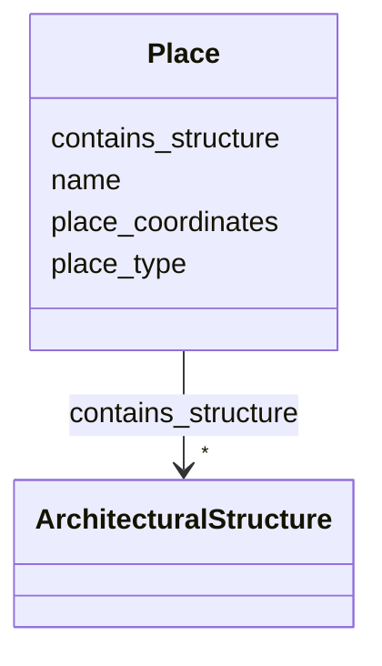

# Class: Place 


_Defined geographic location where events occur and structures exist_


URI: [crm:E53_Place](http://www.cidoc-crm.org/cidoc-crm/E53_Place)





<!-- no inheritance hierarchy -->


## Slots

| Name | Cardinality and Range | Description | Inheritance |
| ---  | --- | --- | --- |
| [name](name.md) | 0..1 <br/> [String](String.md) | Primary name or label | direct |
| [place_coordinates](place_coordinates.md) | 0..1 <br/> [String](String.md) | Geographic coordinates (WGS84: lat,lon) | direct |
| [place_type](place_type.md) | 0..1 <br/> [String](String.md) | Type of place (city, village, region) | direct |
| [contains_structure](contains_structure.md) | * <br/> [ArchitecturalStructure](ArchitecturalStructure.md) | Structures located in this place | direct |


## Usages

| used by | used in | type | used |
| ---  | --- | --- | --- |
| [ArchitecturalStructure](ArchitecturalStructure.md) | [has_current_location](has_current_location.md) | range | [Place](Place.md) |
| [Temple](Temple.md) | [has_current_location](has_current_location.md) | range | [Place](Place.md) |
| [BuddhistMonument](BuddhistMonument.md) | [has_current_location](has_current_location.md) | range | [Place](Place.md) |
| [Stupa](Stupa.md) | [has_current_location](has_current_location.md) | range | [Place](Place.md) |
| [Chaitya](Chaitya.md) | [has_current_location](has_current_location.md) | range | [Place](Place.md) |
| [RestHouse](RestHouse.md) | [has_current_location](has_current_location.md) | range | [Place](Place.md) |
| [Pati](Pati.md) | [has_current_location](has_current_location.md) | range | [Place](Place.md) |
| [Sattal](Sattal.md) | [has_current_location](has_current_location.md) | range | [Place](Place.md) |
| [Dharmashala](Dharmashala.md) | [has_current_location](has_current_location.md) | range | [Place](Place.md) |
| [WaterStructure](WaterStructure.md) | [has_current_location](has_current_location.md) | range | [Place](Place.md) |
| [DhungeDhara](DhungeDhara.md) | [has_current_location](has_current_location.md) | range | [Place](Place.md) |
| [Pokhari](Pokhari.md) | [has_current_location](has_current_location.md) | range | [Place](Place.md) |
| [Production](Production.md) | [took_place_at](took_place_at.md) | range | [Place](Place.md) |
| [Consecration](Consecration.md) | [took_place_at](took_place_at.md) | range | [Place](Place.md) |
| [TransferOfCustody](TransferOfCustody.md) | [took_place_at](took_place_at.md) | range | [Place](Place.md) |
| [Container](Container.md) | [places](places.md) | range | [Place](Place.md) |


## Identifier and Mapping Information


### Schema Source


* from schema: CulturalHeritageOntology


## Mappings

| Mapping Type | Mapped Value |
| ---  | ---  |
| self | crm:E53_Place |
| native | heritageGraph:Place |


## LinkML Source

<!-- TODO: investigate https://stackoverflow.com/questions/37606292/how-to-create-tabbed-code-blocks-in-mkdocs-or-sphinx -->

### Direct

<details>
```yaml
name: Place
description: Defined geographic location where events occur and structures exist
from_schema: CulturalHeritageOntology
slots:
- name
- place_coordinates
- place_type
- contains_structure
class_uri: crm:E53_Place

```
</details>

### Induced

<details>
```yaml
name: Place
description: Defined geographic location where events occur and structures exist
from_schema: CulturalHeritageOntology
attributes:
  name:
    name: name
    description: Primary name or label
    from_schema: CulturalHeritageOntology
    rank: 1000
    slot_uri: crm:P1_is_identified_by
    alias: name
    owner: Place
    domain_of:
    - ArchitecturalStructure
    - IconographicObject
    - ArchitecturalElement
    - Deity
    - ReligiousTradition
    - TraditionOrPractice
    - ArchitecturalStyle
    - CalendarSystem
    - Production
    - RitualEvent
    - Consecration
    - Enshrinement
    - TransferOfCustody
    - ConditionAssessment
    - Guthi
    - CasteGroup
    - Person
    - Actor
    - Place
    - DataSource
    - DocumentationActivity
    - DataCustodian
    - Technique
    - Material
    range: string
  place_coordinates:
    name: place_coordinates
    description: 'Geographic coordinates (WGS84: lat,lon)'
    from_schema: CulturalHeritageOntology
    rank: 1000
    slot_uri: crm:P168_place_is_defined_by
    alias: place_coordinates
    owner: Place
    domain_of:
    - Place
    range: string
  place_type:
    name: place_type
    description: Type of place (city, village, region)
    from_schema: CulturalHeritageOntology
    rank: 1000
    slot_uri: crm:P2_has_type
    alias: place_type
    owner: Place
    domain_of:
    - Place
    range: string
  contains_structure:
    name: contains_structure
    description: Structures located in this place
    from_schema: CulturalHeritageOntology
    rank: 1000
    slot_uri: crm:P53_has_former_or_current_location
    alias: contains_structure
    owner: Place
    domain_of:
    - Place
    range: ArchitecturalStructure
    multivalued: true
class_uri: crm:E53_Place

```
</details>