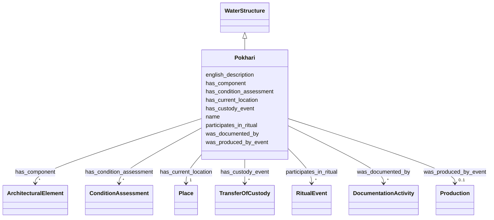

# Class: Pokhari 


_Pond or tank for water storage, ritual bathing, and ecological management_


URI: [heritageGraph:Pokhari](https://cair-nepal.org/heritageGraph/Pokhari)





## Inheritance
* [ArchitecturalStructure](ArchitecturalStructure.md)
    * [WaterStructure](WaterStructure.md)
        * **Pokhari**


## Slots

| Name | Cardinality and Range | Description | Inheritance |
| ---  | --- | --- | --- |
| [name](name.md) | 1 <br/> [String](String.md) | Primary name or label | [ArchitecturalStructure](ArchitecturalStructure.md) |
| [english_description](english_description.md) | 0..1 <br/> [String](String.md) | Descriptive text in English | [ArchitecturalStructure](ArchitecturalStructure.md) |
| [was_produced_by_event](was_produced_by_event.md) | 0..1 <br/> [Production](Production.md) | Event that created this object or structure | [ArchitecturalStructure](ArchitecturalStructure.md) |
| [has_current_location](has_current_location.md) | 1 <br/> [Place](Place.md) | Current location of object or structure | [ArchitecturalStructure](ArchitecturalStructure.md) |
| [participates_in_ritual](participates_in_ritual.md) | * <br/> [RitualEvent](RitualEvent.md) | Rituals in which this structure participates | [ArchitecturalStructure](ArchitecturalStructure.md) |
| [has_custody_event](has_custody_event.md) | * <br/> [TransferOfCustody](TransferOfCustody.md) | Custody transfer events for this structure | [ArchitecturalStructure](ArchitecturalStructure.md) |
| [was_documented_by](was_documented_by.md) | * <br/> [DocumentationActivity](DocumentationActivity.md) | Documentation event that recorded this entity or event | [ArchitecturalStructure](ArchitecturalStructure.md) |
| [has_condition_assessment](has_condition_assessment.md) | * <br/> [ConditionAssessment](ConditionAssessment.md) | Condition assessment events for this structure | [ArchitecturalStructure](ArchitecturalStructure.md) |
| [has_component](has_component.md) | * <br/> [ArchitecturalElement](ArchitecturalElement.md) | Architectural elements composing structure | [ArchitecturalStructure](ArchitecturalStructure.md) |


## Identifier and Mapping Information


### Schema Source


* from schema: CulturalHeritageOntology


## Mappings

| Mapping Type | Mapped Value |
| ---  | ---  |
| self | heritageGraph:Pokhari |
| native | heritageGraph:Pokhari |


## LinkML Source

<!-- TODO: investigate https://stackoverflow.com/questions/37606292/how-to-create-tabbed-code-blocks-in-mkdocs-or-sphinx -->

### Direct

<details>
```yaml
name: Pokhari
description: Pond or tank for water storage, ritual bathing, and ecological management
from_schema: CulturalHeritageOntology
is_a: WaterStructure
class_uri: heritageGraph:Pokhari

```
</details>

### Induced

<details>
```yaml
name: Pokhari
description: Pond or tank for water storage, ritual bathing, and ecological management
from_schema: CulturalHeritageOntology
is_a: WaterStructure
attributes:
  name:
    name: name
    description: Primary name or label
    from_schema: CulturalHeritageOntology
    rank: 1000
    slot_uri: crm:P1_is_identified_by
    alias: name
    owner: Pokhari
    domain_of:
    - ArchitecturalStructure
    - IconographicObject
    - ArchitecturalElement
    - Deity
    - ReligiousTradition
    - TraditionOrPractice
    - ArchitecturalStyle
    - CalendarSystem
    - Production
    - RitualEvent
    - Consecration
    - Enshrinement
    - TransferOfCustody
    - ConditionAssessment
    - Guthi
    - CasteGroup
    - Person
    - Actor
    - Place
    - DataSource
    - DocumentationActivity
    - DataCustodian
    - Technique
    - Material
    range: string
    required: true
  english_description:
    name: english_description
    description: Descriptive text in English
    from_schema: CulturalHeritageOntology
    rank: 1000
    slot_uri: crm:P3_has_note
    alias: english_description
    owner: Pokhari
    domain_of:
    - ArchitecturalStructure
    - IconographicObject
    - ArchitecturalElement
    - Deity
    - ReligiousTradition
    - TraditionOrPractice
    - ArchitecturalStyle
    - RitualEvent
    - Guthi
    - CasteGroup
    - Person
    - Actor
    - DataSource
    - DataCustodian
    - Technique
    - Material
    range: string
  was_produced_by_event:
    name: was_produced_by_event
    description: Event that created this object or structure
    from_schema: CulturalHeritageOntology
    rank: 1000
    slot_uri: crm:P108i_was_produced_by
    alias: was_produced_by_event
    owner: Pokhari
    domain_of:
    - ArchitecturalStructure
    - IconographicObject
    range: Production
  has_current_location:
    name: has_current_location
    description: Current location of object or structure
    from_schema: CulturalHeritageOntology
    rank: 1000
    slot_uri: crm:P55_has_current_location
    alias: has_current_location
    owner: Pokhari
    domain_of:
    - ArchitecturalStructure
    range: Place
    required: true
    minimum_cardinality: 1
    maximum_cardinality: 1
  participates_in_ritual:
    name: participates_in_ritual
    description: Rituals in which this structure participates
    from_schema: CulturalHeritageOntology
    rank: 1000
    slot_uri: crm:P12i_was_present_at
    alias: participates_in_ritual
    owner: Pokhari
    domain_of:
    - ArchitecturalStructure
    - IconographicObject
    range: RitualEvent
    multivalued: true
  has_custody_event:
    name: has_custody_event
    description: Custody transfer events for this structure
    from_schema: CulturalHeritageOntology
    rank: 1000
    slot_uri: crm:E10_Transfer_of_Custody
    alias: has_custody_event
    owner: Pokhari
    domain_of:
    - ArchitecturalStructure
    range: TransferOfCustody
    multivalued: true
  was_documented_by:
    name: was_documented_by
    description: Documentation event that recorded this entity or event
    from_schema: CulturalHeritageOntology
    rank: 1000
    slot_uri: prov:wasGeneratedBy
    alias: was_documented_by
    owner: Pokhari
    domain_of:
    - ArchitecturalStructure
    - Production
    - RitualEvent
    range: DocumentationActivity
    multivalued: true
  has_condition_assessment:
    name: has_condition_assessment
    description: Condition assessment events for this structure
    from_schema: CulturalHeritageOntology
    rank: 1000
    slot_uri: crm:P44_has_condition
    alias: has_condition_assessment
    owner: Pokhari
    domain_of:
    - ArchitecturalStructure
    range: ConditionAssessment
    multivalued: true
  has_component:
    name: has_component
    description: Architectural elements composing structure
    from_schema: CulturalHeritageOntology
    rank: 1000
    slot_uri: crm:P46_is_composed_of
    alias: has_component
    owner: Pokhari
    domain_of:
    - ArchitecturalStructure
    range: ArchitecturalElement
    multivalued: true
class_uri: heritageGraph:Pokhari

```
</details>