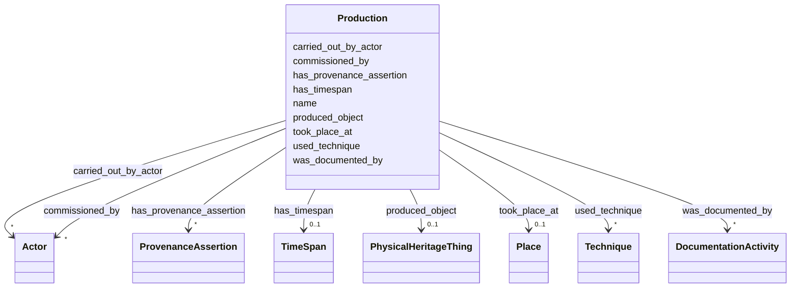

# Class: Production 


_Event of creating an architectural structure, murti, or paubha_


URI: [crm:E12_Production](http://www.cidoc-crm.org/cidoc-crm/E12_Production)





<!-- no inheritance hierarchy -->


## Slots

| Name | Cardinality and Range | Description | Inheritance |
| ---  | --- | --- | --- |
| [name](name.md) | 0..1 <br/> [String](String.md) | Primary name or label | direct |
| [produced_object](produced_object.md) | 0..1 <br/> [PhysicalHeritageThing](PhysicalHeritageThing.md) | Object produced by this production event | direct |
| [carried_out_by_actor](carried_out_by_actor.md) | * <br/> [Actor](Actor.md) | Actor(s) who performed this event | direct |
| [used_technique](used_technique.md) | * <br/> [Technique](Technique.md) | Craft technique used in production | direct |
| [took_place_at](took_place_at.md) | 0..1 <br/> [Place](Place.md) | Place Where event occurred | direct |
| [has_timespan](has_timespan.md) | 0..1 <br/> [TimeSpan](TimeSpan.md) | Links event to its temporal extent | direct |
| [commissioned_by](commissioned_by.md) | * <br/> [Actor](Actor.md) | Person or group who commissioned production | direct |
| [was_documented_by](was_documented_by.md) | * <br/> [DocumentationActivity](DocumentationActivity.md) | Documentation event that recorded this entity or event | direct |
| [has_provenance_assertion](has_provenance_assertion.md) | * <br/> [ProvenanceAssertion](ProvenanceAssertion.md) | Provenance assertions about this entity or event | direct |


## Usages

| used by | used in | type | used |
| ---  | --- | --- | --- |
| [ArchitecturalStructure](ArchitecturalStructure.md) | [was_produced_by_event](was_produced_by_event.md) | range | [Production](Production.md) |
| [Temple](Temple.md) | [was_produced_by_event](was_produced_by_event.md) | range | [Production](Production.md) |
| [BuddhistMonument](BuddhistMonument.md) | [was_produced_by_event](was_produced_by_event.md) | range | [Production](Production.md) |
| [Stupa](Stupa.md) | [was_produced_by_event](was_produced_by_event.md) | range | [Production](Production.md) |
| [Chaitya](Chaitya.md) | [was_produced_by_event](was_produced_by_event.md) | range | [Production](Production.md) |
| [RestHouse](RestHouse.md) | [was_produced_by_event](was_produced_by_event.md) | range | [Production](Production.md) |
| [Pati](Pati.md) | [was_produced_by_event](was_produced_by_event.md) | range | [Production](Production.md) |
| [Sattal](Sattal.md) | [was_produced_by_event](was_produced_by_event.md) | range | [Production](Production.md) |
| [Dharmashala](Dharmashala.md) | [was_produced_by_event](was_produced_by_event.md) | range | [Production](Production.md) |
| [WaterStructure](WaterStructure.md) | [was_produced_by_event](was_produced_by_event.md) | range | [Production](Production.md) |
| [DhungeDhara](DhungeDhara.md) | [was_produced_by_event](was_produced_by_event.md) | range | [Production](Production.md) |
| [Pokhari](Pokhari.md) | [was_produced_by_event](was_produced_by_event.md) | range | [Production](Production.md) |
| [IconographicObject](IconographicObject.md) | [was_produced_by_event](was_produced_by_event.md) | range | [Production](Production.md) |
| [Paubha](Paubha.md) | [was_produced_by_event](was_produced_by_event.md) | range | [Production](Production.md) |
| [Murti](Murti.md) | [was_produced_by_event](was_produced_by_event.md) | range | [Production](Production.md) |
| [Guthi](Guthi.md) | [founded_by_event](founded_by_event.md) | range | [Production](Production.md) |
| [SiGuthi](SiGuthi.md) | [founded_by_event](founded_by_event.md) | range | [Production](Production.md) |
| [JatraGuthi](JatraGuthi.md) | [founded_by_event](founded_by_event.md) | range | [Production](Production.md) |
| [PujaGuthi](PujaGuthi.md) | [founded_by_event](founded_by_event.md) | range | [Production](Production.md) |
| [TempleGuthi](TempleGuthi.md) | [founded_by_event](founded_by_event.md) | range | [Production](Production.md) |
| [NashaGuthi](NashaGuthi.md) | [founded_by_event](founded_by_event.md) | range | [Production](Production.md) |
| [SanaGuthi](SanaGuthi.md) | [founded_by_event](founded_by_event.md) | range | [Production](Production.md) |
| [SanGuthi](SanGuthi.md) | [founded_by_event](founded_by_event.md) | range | [Production](Production.md) |
| [RajGuthi](RajGuthi.md) | [founded_by_event](founded_by_event.md) | range | [Production](Production.md) |
| [Container](Container.md) | [production_events](production_events.md) | range | [Production](Production.md) |


## Identifier and Mapping Information


### Schema Source


* from schema: CulturalHeritageOntology


## Mappings

| Mapping Type | Mapped Value |
| ---  | ---  |
| self | crm:E12_Production |
| native | heritageGraph:Production |


## LinkML Source

<!-- TODO: investigate https://stackoverflow.com/questions/37606292/how-to-create-tabbed-code-blocks-in-mkdocs-or-sphinx -->

### Direct

<details>
```yaml
name: Production
description: Event of creating an architectural structure, murti, or paubha
from_schema: CulturalHeritageOntology
slots:
- name
- produced_object
- carried_out_by_actor
- used_technique
- took_place_at
- has_timespan
- commissioned_by
- was_documented_by
- has_provenance_assertion
class_uri: crm:E12_Production

```
</details>

### Induced

<details>
```yaml
name: Production
description: Event of creating an architectural structure, murti, or paubha
from_schema: CulturalHeritageOntology
attributes:
  name:
    name: name
    description: Primary name or label
    from_schema: CulturalHeritageOntology
    rank: 1000
    slot_uri: crm:P1_is_identified_by
    alias: name
    owner: Production
    domain_of:
    - ArchitecturalStructure
    - IconographicObject
    - ArchitecturalElement
    - Deity
    - ReligiousTradition
    - TraditionOrPractice
    - ArchitecturalStyle
    - CalendarSystem
    - Production
    - RitualEvent
    - Consecration
    - Enshrinement
    - TransferOfCustody
    - ConditionAssessment
    - Guthi
    - CasteGroup
    - Person
    - Actor
    - Place
    - DataSource
    - DocumentationActivity
    - DataCustodian
    - Technique
    - Material
    range: string
  produced_object:
    name: produced_object
    description: Object produced by this production event
    from_schema: CulturalHeritageOntology
    rank: 1000
    slot_uri: crm:P108i_was_produced_by
    alias: produced_object
    owner: Production
    domain_of:
    - Production
    range: PhysicalHeritageThing
  carried_out_by_actor:
    name: carried_out_by_actor
    description: Actor(s) who performed this event
    from_schema: CulturalHeritageOntology
    rank: 1000
    slot_uri: crm:P14_carried_out_by
    alias: carried_out_by_actor
    owner: Production
    domain_of:
    - Production
    - ConditionAssessment
    range: Actor
    multivalued: true
  used_technique:
    name: used_technique
    description: Craft technique used in production
    from_schema: CulturalHeritageOntology
    rank: 1000
    slot_uri: crm:P32_used_general_technique
    alias: used_technique
    owner: Production
    domain_of:
    - Production
    range: Technique
    multivalued: true
  took_place_at:
    name: took_place_at
    description: Place Where event occurred
    from_schema: CulturalHeritageOntology
    rank: 1000
    slot_uri: crm:P7_took_place_at
    alias: took_place_at
    owner: Production
    domain_of:
    - Production
    - Consecration
    - TransferOfCustody
    range: Place
  has_timespan:
    name: has_timespan
    description: Links event to its temporal extent
    from_schema: CulturalHeritageOntology
    rank: 1000
    slot_uri: crm:P4_has_time-span
    alias: has_timespan
    owner: Production
    domain_of:
    - Production
    - RitualEvent
    - Consecration
    - Enshrinement
    - TransferOfCustody
    - ConditionAssessment
    - DocumentationActivity
    range: TimeSpan
  commissioned_by:
    name: commissioned_by
    description: Person or group who commissioned production
    from_schema: CulturalHeritageOntology
    rank: 1000
    slot_uri: crm:P17_was_motivated_by
    alias: commissioned_by
    owner: Production
    domain_of:
    - Production
    range: Actor
    multivalued: true
  was_documented_by:
    name: was_documented_by
    description: Documentation event that recorded this entity or event
    from_schema: CulturalHeritageOntology
    rank: 1000
    slot_uri: prov:wasGeneratedBy
    alias: was_documented_by
    owner: Production
    domain_of:
    - ArchitecturalStructure
    - Production
    - RitualEvent
    range: DocumentationActivity
    multivalued: true
  has_provenance_assertion:
    name: has_provenance_assertion
    description: Provenance assertions about this entity or event
    from_schema: CulturalHeritageOntology
    rank: 1000
    slot_uri: heritageGraph:has_provenance_assertion
    alias: has_provenance_assertion
    owner: Production
    domain_of:
    - Production
    - RitualEvent
    range: ProvenanceAssertion
    multivalued: true
class_uri: crm:E12_Production

```
</details>