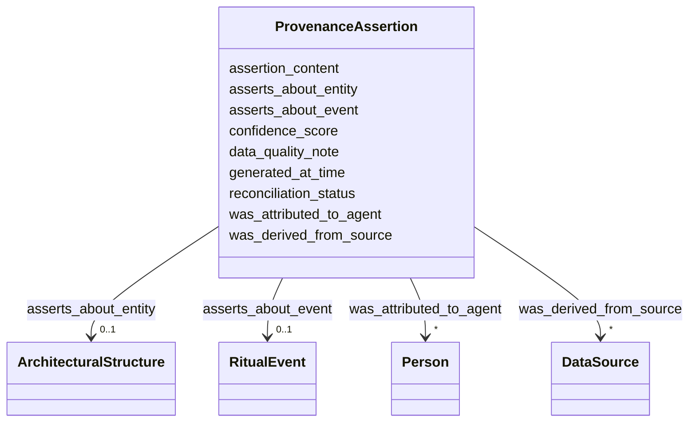

# Class: ProvenanceAssertion 


_A single factual claim about a heritage entity, with explicit source, author, date, and confidence_


URI: [prov:Entity](https://www.w3.org/ns/prov/Entity)





<!-- no inheritance hierarchy -->


## Slots

| Name | Cardinality and Range | Description | Inheritance |
| ---  | --- | --- | --- |
| [assertion_content](assertion_content.md) | 0..1 <br/> [String](String.md) | The factual claim being asserted | direct |
| [asserts_about_entity](asserts_about_entity.md) | 0..1 <br/> [ArchitecturalStructure](ArchitecturalStructure.md) |  | direct |
| [asserts_about_event](asserts_about_event.md) | 0..1 <br/> [RitualEvent](RitualEvent.md) |  | direct |
| [was_derived_from_source](was_derived_from_source.md) | * <br/> [DataSource](DataSource.md) | Source(s) from which this assertion was derived | direct |
| [was_attributed_to_agent](was_attributed_to_agent.md) | * <br/> [Person](Person.md) | Person who made this assertion | direct |
| [generated_at_time](generated_at_time.md) | 0..1 <br/> [String](String.md) | When this assertion was recorded (ISO 8601) | direct |
| [confidence_score](confidence_score.md) | 0..1 <br/> [Float](Float.md) | Reliability score for assertion (0 | direct |
| [data_quality_note](data_quality_note.md) | 0..1 <br/> [String](String.md) | Notes on data quality, completeness, or uncertainty | direct |
| [reconciliation_status](reconciliation_status.md) | 0..1 <br/> [String](String.md) | Status of multi-source reconciliation (confirmed, conflicting, unverified) | direct |


## Usages

| used by | used in | type | used |
| ---  | --- | --- | --- |
| [Production](Production.md) | [has_provenance_assertion](has_provenance_assertion.md) | range | [ProvenanceAssertion](ProvenanceAssertion.md) |
| [RitualEvent](RitualEvent.md) | [has_provenance_assertion](has_provenance_assertion.md) | range | [ProvenanceAssertion](ProvenanceAssertion.md) |
| [Puja](Puja.md) | [has_provenance_assertion](has_provenance_assertion.md) | range | [ProvenanceAssertion](ProvenanceAssertion.md) |
| [NityaPuja](NityaPuja.md) | [has_provenance_assertion](has_provenance_assertion.md) | range | [ProvenanceAssertion](ProvenanceAssertion.md) |
| [NaimittikaPuja](NaimittikaPuja.md) | [has_provenance_assertion](has_provenance_assertion.md) | range | [ProvenanceAssertion](ProvenanceAssertion.md) |
| [Festival](Festival.md) | [has_provenance_assertion](has_provenance_assertion.md) | range | [ProvenanceAssertion](ProvenanceAssertion.md) |
| [ChariotFestival](ChariotFestival.md) | [has_provenance_assertion](has_provenance_assertion.md) | range | [ProvenanceAssertion](ProvenanceAssertion.md) |
| [MaskedDance](MaskedDance.md) | [has_provenance_assertion](has_provenance_assertion.md) | range | [ProvenanceAssertion](ProvenanceAssertion.md) |
| [FieldSurveyActivity](FieldSurveyActivity.md) | [generated_assertion](generated_assertion.md) | range | [ProvenanceAssertion](ProvenanceAssertion.md) |
| [OralHistoryInterview](OralHistoryInterview.md) | [generated_assertion](generated_assertion.md) | range | [ProvenanceAssertion](ProvenanceAssertion.md) |
| [DocumentationActivity](DocumentationActivity.md) | [generated_assertion](generated_assertion.md) | range | [ProvenanceAssertion](ProvenanceAssertion.md) |
| [Verification](Verification.md) | [verified_assertion](verified_assertion.md) | range | [ProvenanceAssertion](ProvenanceAssertion.md) |
| [Verification](Verification.md) | [generated_assertion](generated_assertion.md) | range | [ProvenanceAssertion](ProvenanceAssertion.md) |
| [Container](Container.md) | [provenance_assertions](provenance_assertions.md) | range | [ProvenanceAssertion](ProvenanceAssertion.md) |


## Identifier and Mapping Information


### Schema Source


* from schema: CulturalHeritageOntology


## Mappings

| Mapping Type | Mapped Value |
| ---  | ---  |
| self | prov:Entity |
| native | heritageGraph:ProvenanceAssertion |


## LinkML Source

<!-- TODO: investigate https://stackoverflow.com/questions/37606292/how-to-create-tabbed-code-blocks-in-mkdocs-or-sphinx -->

### Direct

<details>
```yaml
name: ProvenanceAssertion
description: A single factual claim about a heritage entity, with explicit source,
  author, date, and confidence
from_schema: CulturalHeritageOntology
slots:
- assertion_content
- asserts_about_entity
- asserts_about_event
- was_derived_from_source
- was_attributed_to_agent
- generated_at_time
- confidence_score
- data_quality_note
- reconciliation_status
class_uri: prov:Entity

```
</details>

### Induced

<details>
```yaml
name: ProvenanceAssertion
description: A single factual claim about a heritage entity, with explicit source,
  author, date, and confidence
from_schema: CulturalHeritageOntology
attributes:
  assertion_content:
    name: assertion_content
    description: The factual claim being asserted
    from_schema: CulturalHeritageOntology
    rank: 1000
    slot_uri: prov:value
    alias: assertion_content
    owner: ProvenanceAssertion
    domain_of:
    - ProvenanceAssertion
    range: string
  asserts_about_entity:
    name: asserts_about_entity
    from_schema: CulturalHeritageOntology
    rank: 1000
    slot_uri: crm:P140_assigned_attribute_to
    alias: asserts_about_entity
    owner: ProvenanceAssertion
    domain_of:
    - ProvenanceAssertion
    range: ArchitecturalStructure
  asserts_about_event:
    name: asserts_about_event
    from_schema: CulturalHeritageOntology
    rank: 1000
    slot_uri: crm:P141_assigned
    alias: asserts_about_event
    owner: ProvenanceAssertion
    domain_of:
    - ProvenanceAssertion
    range: RitualEvent
  was_derived_from_source:
    name: was_derived_from_source
    description: Source(s) from which this assertion was derived
    from_schema: CulturalHeritageOntology
    rank: 1000
    slot_uri: prov:wasDerivedFrom
    alias: was_derived_from_source
    owner: ProvenanceAssertion
    domain_of:
    - ProvenanceAssertion
    range: DataSource
    multivalued: true
  was_attributed_to_agent:
    name: was_attributed_to_agent
    description: Person who made this assertion
    from_schema: CulturalHeritageOntology
    rank: 1000
    slot_uri: prov:wasAttributedTo
    alias: was_attributed_to_agent
    owner: ProvenanceAssertion
    domain_of:
    - ProvenanceAssertion
    range: Person
    multivalued: true
  generated_at_time:
    name: generated_at_time
    description: When this assertion was recorded (ISO 8601)
    from_schema: CulturalHeritageOntology
    rank: 1000
    slot_uri: prov:generatedAtTime
    alias: generated_at_time
    owner: ProvenanceAssertion
    domain_of:
    - ProvenanceAssertion
    range: string
  confidence_score:
    name: confidence_score
    description: Reliability score for assertion (0.0-1.0)
    from_schema: CulturalHeritageOntology
    rank: 1000
    slot_uri: heritageGraph:confidence_score
    alias: confidence_score
    owner: ProvenanceAssertion
    domain_of:
    - ProvenanceAssertion
    range: float
  data_quality_note:
    name: data_quality_note
    description: Notes on data quality, completeness, or uncertainty
    from_schema: CulturalHeritageOntology
    rank: 1000
    slot_uri: heritageGraph:data_quality_note
    alias: data_quality_note
    owner: ProvenanceAssertion
    domain_of:
    - ProvenanceAssertion
    range: string
  reconciliation_status:
    name: reconciliation_status
    description: Status of multi-source reconciliation (confirmed, conflicting, unverified)
    from_schema: CulturalHeritageOntology
    rank: 1000
    slot_uri: heritageGraph:reconciliation_status
    alias: reconciliation_status
    owner: ProvenanceAssertion
    domain_of:
    - ProvenanceAssertion
    range: string
class_uri: prov:Entity

```
</details>