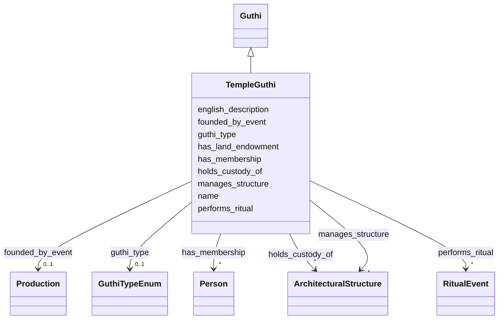

# Class: TempleGuthi 


_Trust managing temple maintenance, daily puja, and priest salaries_


URI: [heritageGraph:TempleGuthi](https://cair-nepal.org/heritageGraph/TempleGuthi)





## Inheritance
* [Guthi](Guthi.md)
    * **TempleGuthi**


## Slots

| Name | Cardinality and Range | Description | Inheritance |
| ---  | --- | --- | --- |
| [name](name.md) | 0..1 <br/> [String](String.md) | Primary name or label | [Guthi](Guthi.md) |
| [english_description](english_description.md) | 0..1 <br/> [String](String.md) | Descriptive text in English | [Guthi](Guthi.md) |
| [guthi_type](guthi_type.md) | 0..1 <br/> [GuthiTypeEnum](GuthiTypeEnum.md) | Type of Guthi (Si, Jatra, Temple) | [Guthi](Guthi.md) |
| [manages_structure](manages_structure.md) | * <br/> [ArchitecturalStructure](ArchitecturalStructure.md) | Structures managed by this Guthi | [Guthi](Guthi.md) |
| [performs_ritual](performs_ritual.md) | * <br/> [RitualEvent](RitualEvent.md) | Rituals performed by this Guthi | [Guthi](Guthi.md) |
| [holds_custody_of](holds_custody_of.md) | * <br/> [ArchitecturalStructure](ArchitecturalStructure.md) | Structures under Guthi custodianship | [Guthi](Guthi.md) |
| [has_membership](has_membership.md) | * <br/> [Person](Person.md) | Members of Guthi organization | [Guthi](Guthi.md) |
| [founded_by_event](founded_by_event.md) | 0..1 <br/> [Production](Production.md) | Event that established the Guthi | [Guthi](Guthi.md) |
| [has_land_endowment](has_land_endowment.md) | 0..1 <br/> [String](String.md) | Description of land holdings supporting Guthi | [Guthi](Guthi.md) |


## Identifier and Mapping Information


### Schema Source


* from schema: CulturalHeritageOntology


## Mappings

| Mapping Type | Mapped Value |
| ---  | ---  |
| self | heritageGraph:TempleGuthi |
| native | heritageGraph:TempleGuthi |


## LinkML Source

<!-- TODO: investigate https://stackoverflow.com/questions/37606292/how-to-create-tabbed-code-blocks-in-mkdocs-or-sphinx -->

### Direct

<details>
```yaml
name: TempleGuthi
description: Trust managing temple maintenance, daily puja, and priest salaries
from_schema: CulturalHeritageOntology
is_a: Guthi
class_uri: heritageGraph:TempleGuthi

```
</details>

### Induced

<details>
```yaml
name: TempleGuthi
description: Trust managing temple maintenance, daily puja, and priest salaries
from_schema: CulturalHeritageOntology
is_a: Guthi
attributes:
  name:
    name: name
    description: Primary name or label
    from_schema: CulturalHeritageOntology
    rank: 1000
    slot_uri: crm:P1_is_identified_by
    alias: name
    owner: TempleGuthi
    domain_of:
    - ArchitecturalStructure
    - IconographicObject
    - ArchitecturalElement
    - Deity
    - ReligiousTradition
    - TraditionOrPractice
    - ArchitecturalStyle
    - CalendarSystem
    - Production
    - RitualEvent
    - Consecration
    - Enshrinement
    - TransferOfCustody
    - ConditionAssessment
    - Guthi
    - CasteGroup
    - Person
    - Actor
    - Place
    - DataSource
    - DocumentationActivity
    - DataCustodian
    - Technique
    - Material
    range: string
  english_description:
    name: english_description
    description: Descriptive text in English
    from_schema: CulturalHeritageOntology
    rank: 1000
    slot_uri: crm:P3_has_note
    alias: english_description
    owner: TempleGuthi
    domain_of:
    - ArchitecturalStructure
    - IconographicObject
    - ArchitecturalElement
    - Deity
    - ReligiousTradition
    - TraditionOrPractice
    - ArchitecturalStyle
    - RitualEvent
    - Guthi
    - CasteGroup
    - Person
    - Actor
    - DataSource
    - DataCustodian
    - Technique
    - Material
    range: string
  guthi_type:
    name: guthi_type
    description: Type of Guthi (Si, Jatra, Temple)
    from_schema: CulturalHeritageOntology
    rank: 1000
    slot_uri: crm:P2_has_type
    alias: guthi_type
    owner: TempleGuthi
    domain_of:
    - Guthi
    range: GuthiTypeEnum
  manages_structure:
    name: manages_structure
    description: Structures managed by this Guthi
    from_schema: CulturalHeritageOntology
    rank: 1000
    slot_uri: heritageGraph:manages_structure
    alias: manages_structure
    owner: TempleGuthi
    domain_of:
    - Guthi
    range: ArchitecturalStructure
    multivalued: true
  performs_ritual:
    name: performs_ritual
    description: Rituals performed by this Guthi
    from_schema: CulturalHeritageOntology
    rank: 1000
    slot_uri: crm:P14i_performed
    alias: performs_ritual
    owner: TempleGuthi
    domain_of:
    - Guthi
    range: RitualEvent
    multivalued: true
  holds_custody_of:
    name: holds_custody_of
    description: Structures under Guthi custodianship
    from_schema: CulturalHeritageOntology
    rank: 1000
    slot_uri: crm:P52_has_current_owner
    alias: holds_custody_of
    owner: TempleGuthi
    domain_of:
    - Guthi
    range: ArchitecturalStructure
    multivalued: true
  has_membership:
    name: has_membership
    description: Members of Guthi organization
    from_schema: CulturalHeritageOntology
    rank: 1000
    slot_uri: crm:P107_has_current_or_former_member
    alias: has_membership
    owner: TempleGuthi
    domain_of:
    - Guthi
    range: Person
    multivalued: true
  founded_by_event:
    name: founded_by_event
    description: Event that established the Guthi
    from_schema: CulturalHeritageOntology
    rank: 1000
    slot_uri: crm:P95i_was_formed_by
    alias: founded_by_event
    owner: TempleGuthi
    domain_of:
    - Guthi
    range: Production
  has_land_endowment:
    name: has_land_endowment
    description: Description of land holdings supporting Guthi
    from_schema: CulturalHeritageOntology
    rank: 1000
    slot_uri: heritageGraph:has_land_endowment
    alias: has_land_endowment
    owner: TempleGuthi
    domain_of:
    - Guthi
    range: string
class_uri: heritageGraph:TempleGuthi

```
</details>