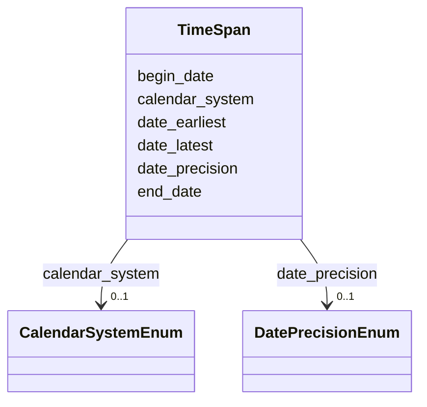

# Class: TimeSpan 


_Temporal extent of an event or period_


URI: [crm:E52_Time-Span](http://www.cidoc-crm.org/cidoc-crm/E52_Time-Span)





<!-- no inheritance hierarchy -->


## Slots

| Name | Cardinality and Range | Description | Inheritance |
| ---  | --- | --- | --- |
| [begin_date](begin_date.md) | 0..1 <br/> [String](String.md) | Start date like ISO 8601  | direct |
| [end_date](end_date.md) | 0..1 <br/> [String](String.md) | End date like ISO 8601 | direct |
| [date_earliest](date_earliest.md) | 0..1 <br/> [String](String.md) | Earliest possible date (for uncertain dates) | direct |
| [date_latest](date_latest.md) | 0..1 <br/> [String](String.md) | Latest possible date (for uncertain dates) | direct |
| [calendar_system](calendar_system.md) | 0..1 <br/> [CalendarSystemEnum](CalendarSystemEnum.md) | Calendar system used for date representation | direct |
| [date_precision](date_precision.md) | 0..1 <br/> [DatePrecisionEnum](DatePrecisionEnum.md) | The level of precision for a recorded date | direct |


## Usages

| used by | used in | type | used |
| ---  | --- | --- | --- |
| [Production](Production.md) | [has_timespan](has_timespan.md) | range | [TimeSpan](TimeSpan.md) |
| [RitualEvent](RitualEvent.md) | [has_timespan](has_timespan.md) | range | [TimeSpan](TimeSpan.md) |
| [Puja](Puja.md) | [has_timespan](has_timespan.md) | range | [TimeSpan](TimeSpan.md) |
| [NityaPuja](NityaPuja.md) | [has_timespan](has_timespan.md) | range | [TimeSpan](TimeSpan.md) |
| [NaimittikaPuja](NaimittikaPuja.md) | [has_timespan](has_timespan.md) | range | [TimeSpan](TimeSpan.md) |
| [Festival](Festival.md) | [has_timespan](has_timespan.md) | range | [TimeSpan](TimeSpan.md) |
| [ChariotFestival](ChariotFestival.md) | [has_timespan](has_timespan.md) | range | [TimeSpan](TimeSpan.md) |
| [MaskedDance](MaskedDance.md) | [has_timespan](has_timespan.md) | range | [TimeSpan](TimeSpan.md) |
| [Consecration](Consecration.md) | [has_timespan](has_timespan.md) | range | [TimeSpan](TimeSpan.md) |
| [Enshrinement](Enshrinement.md) | [has_timespan](has_timespan.md) | range | [TimeSpan](TimeSpan.md) |
| [TransferOfCustody](TransferOfCustody.md) | [has_timespan](has_timespan.md) | range | [TimeSpan](TimeSpan.md) |
| [ConditionAssessment](ConditionAssessment.md) | [has_timespan](has_timespan.md) | range | [TimeSpan](TimeSpan.md) |
| [Person](Person.md) | [birth_timespan](birth_timespan.md) | range | [TimeSpan](TimeSpan.md) |
| [Person](Person.md) | [death_timespan](death_timespan.md) | range | [TimeSpan](TimeSpan.md) |
| [DataSource](DataSource.md) | [publication_timespan](publication_timespan.md) | range | [TimeSpan](TimeSpan.md) |
| [FieldSurveyActivity](FieldSurveyActivity.md) | [has_timespan](has_timespan.md) | range | [TimeSpan](TimeSpan.md) |
| [OralHistoryInterview](OralHistoryInterview.md) | [has_timespan](has_timespan.md) | range | [TimeSpan](TimeSpan.md) |
| [FieldSurveyDataset](FieldSurveyDataset.md) | [publication_timespan](publication_timespan.md) | range | [TimeSpan](TimeSpan.md) |
| [OralHistoryRecording](OralHistoryRecording.md) | [publication_timespan](publication_timespan.md) | range | [TimeSpan](TimeSpan.md) |
| [ArchivalRecord](ArchivalRecord.md) | [publication_timespan](publication_timespan.md) | range | [TimeSpan](TimeSpan.md) |
| [DocumentationActivity](DocumentationActivity.md) | [has_timespan](has_timespan.md) | range | [TimeSpan](TimeSpan.md) |
| [Verification](Verification.md) | [has_timespan](has_timespan.md) | range | [TimeSpan](TimeSpan.md) |


## Identifier and Mapping Information


### Schema Source


* from schema: CulturalHeritageOntology


## Mappings

| Mapping Type | Mapped Value |
| ---  | ---  |
| self | crm:E52_Time-Span |
| native | heritageGraph:TimeSpan |


## LinkML Source

<!-- TODO: investigate https://stackoverflow.com/questions/37606292/how-to-create-tabbed-code-blocks-in-mkdocs-or-sphinx -->

### Direct

<details>
```yaml
name: TimeSpan
description: Temporal extent of an event or period
from_schema: CulturalHeritageOntology
slots:
- begin_date
- end_date
- date_earliest
- date_latest
- calendar_system
- date_precision
slot_usage:
  calendar_system:
    name: calendar_system
    range: CalendarSystemEnum
  date_precision:
    name: date_precision
    range: DatePrecisionEnum
class_uri: crm:E52_Time-Span

```
</details>

### Induced

<details>
```yaml
name: TimeSpan
description: Temporal extent of an event or period
from_schema: CulturalHeritageOntology
slot_usage:
  calendar_system:
    name: calendar_system
    range: CalendarSystemEnum
  date_precision:
    name: date_precision
    range: DatePrecisionEnum
attributes:
  begin_date:
    name: begin_date
    description: 'Start date like ISO 8601 '
    from_schema: CulturalHeritageOntology
    rank: 1000
    slot_uri: crm:P82a_begin_of_the_begin
    alias: begin_date
    owner: TimeSpan
    domain_of:
    - TimeSpan
    range: string
  end_date:
    name: end_date
    description: End date like ISO 8601
    from_schema: CulturalHeritageOntology
    rank: 1000
    slot_uri: crm:P82b_end_of_the_end
    alias: end_date
    owner: TimeSpan
    domain_of:
    - TimeSpan
    range: string
  date_earliest:
    name: date_earliest
    description: Earliest possible date (for uncertain dates)
    from_schema: CulturalHeritageOntology
    rank: 1000
    slot_uri: crm:P82a_begin_of_the_begin
    alias: date_earliest
    owner: TimeSpan
    domain_of:
    - TimeSpan
    range: string
  date_latest:
    name: date_latest
    description: Latest possible date (for uncertain dates)
    from_schema: CulturalHeritageOntology
    rank: 1000
    slot_uri: crm:P82b_end_of_the_end
    alias: date_latest
    owner: TimeSpan
    domain_of:
    - TimeSpan
    range: string
  calendar_system:
    name: calendar_system
    description: Calendar system used for date representation
    from_schema: CulturalHeritageOntology
    rank: 1000
    slot_uri: heritageGraph:calendar_system
    alias: calendar_system
    owner: TimeSpan
    domain_of:
    - CalendarSystem
    - TimeSpan
    range: CalendarSystemEnum
  date_precision:
    name: date_precision
    description: The level of precision for a recorded date.
    from_schema: CulturalHeritageOntology
    rank: 1000
    slot_uri: heritageGraph:date_precision
    alias: date_precision
    owner: TimeSpan
    domain_of:
    - TimeSpan
    range: DatePrecisionEnum
class_uri: crm:E52_Time-Span

```
</details>