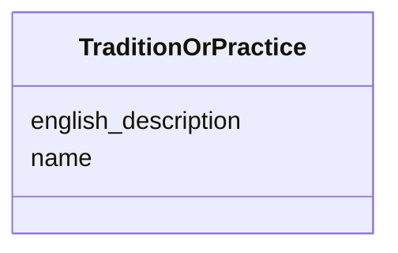

# Class: TraditionOrPractice 


_Transmitted knowledge, belief system, or ritual protocol (e.g., Tantric initiation sequences, festival choreography)_


URI: [crm:E28_Conceptual_Object](http://www.cidoc-crm.org/cidoc-crm/E28_Conceptual_Object)





<!-- no inheritance hierarchy -->


## Slots

| Name | Cardinality and Range | Description | Inheritance |
| ---  | --- | --- | --- |
| [name](name.md) | 0..1 <br/> [String](String.md) | Primary name or label | direct |
| [english_description](english_description.md) | 0..1 <br/> [String](String.md) | Descriptive text in English | direct |


## Usages

| used by | used in | type | used |
| ---  | --- | --- | --- |
| [RitualEvent](RitualEvent.md) | [follows_tradition](follows_tradition.md) | range | [TraditionOrPractice](TraditionOrPractice.md) |
| [Puja](Puja.md) | [follows_tradition](follows_tradition.md) | range | [TraditionOrPractice](TraditionOrPractice.md) |
| [NityaPuja](NityaPuja.md) | [follows_tradition](follows_tradition.md) | range | [TraditionOrPractice](TraditionOrPractice.md) |
| [NaimittikaPuja](NaimittikaPuja.md) | [follows_tradition](follows_tradition.md) | range | [TraditionOrPractice](TraditionOrPractice.md) |
| [Festival](Festival.md) | [follows_tradition](follows_tradition.md) | range | [TraditionOrPractice](TraditionOrPractice.md) |
| [ChariotFestival](ChariotFestival.md) | [follows_tradition](follows_tradition.md) | range | [TraditionOrPractice](TraditionOrPractice.md) |
| [MaskedDance](MaskedDance.md) | [follows_tradition](follows_tradition.md) | range | [TraditionOrPractice](TraditionOrPractice.md) |


## Identifier and Mapping Information


### Schema Source


* from schema: CulturalHeritageOntology


## Mappings

| Mapping Type | Mapped Value |
| ---  | ---  |
| self | crm:E28_Conceptual_Object |
| native | heritageGraph:TraditionOrPractice |


## LinkML Source

<!-- TODO: investigate https://stackoverflow.com/questions/37606292/how-to-create-tabbed-code-blocks-in-mkdocs-or-sphinx -->

### Direct

<details>
```yaml
name: TraditionOrPractice
description: Transmitted knowledge, belief system, or ritual protocol (e.g., Tantric
  initiation sequences, festival choreography)
from_schema: CulturalHeritageOntology
slots:
- name
- english_description
class_uri: crm:E28_Conceptual_Object

```
</details>

### Induced

<details>
```yaml
name: TraditionOrPractice
description: Transmitted knowledge, belief system, or ritual protocol (e.g., Tantric
  initiation sequences, festival choreography)
from_schema: CulturalHeritageOntology
attributes:
  name:
    name: name
    description: Primary name or label
    from_schema: CulturalHeritageOntology
    rank: 1000
    slot_uri: crm:P1_is_identified_by
    alias: name
    owner: TraditionOrPractice
    domain_of:
    - ArchitecturalStructure
    - IconographicObject
    - ArchitecturalElement
    - Deity
    - ReligiousTradition
    - TraditionOrPractice
    - ArchitecturalStyle
    - CalendarSystem
    - Production
    - RitualEvent
    - Consecration
    - Enshrinement
    - TransferOfCustody
    - ConditionAssessment
    - Guthi
    - CasteGroup
    - Person
    - Actor
    - Place
    - DataSource
    - DocumentationActivity
    - DataCustodian
    - Technique
    - Material
    range: string
  english_description:
    name: english_description
    description: Descriptive text in English
    from_schema: CulturalHeritageOntology
    rank: 1000
    slot_uri: crm:P3_has_note
    alias: english_description
    owner: TraditionOrPractice
    domain_of:
    - ArchitecturalStructure
    - IconographicObject
    - ArchitecturalElement
    - Deity
    - ReligiousTradition
    - TraditionOrPractice
    - ArchitecturalStyle
    - RitualEvent
    - Guthi
    - CasteGroup
    - Person
    - Actor
    - DataSource
    - DataCustodian
    - Technique
    - Material
    range: string
class_uri: crm:E28_Conceptual_Object

```
</details>