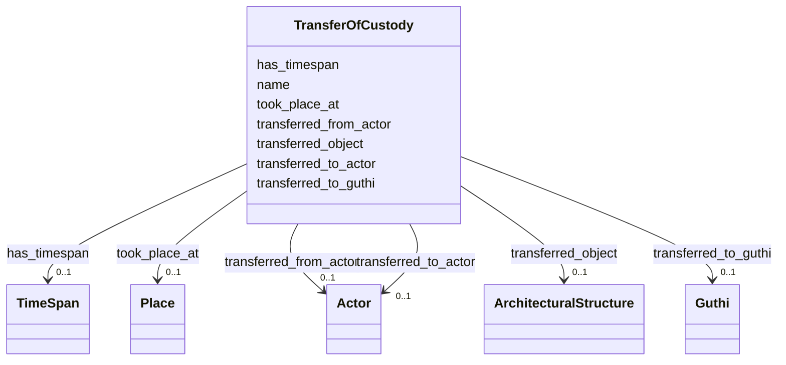

# Class: TransferOfCustody 


_Event of transferring responsibility for temple maintenance, ritual performance, or artifact stewardship_


URI: [crm:E10_Transfer_of_Custody](http://www.cidoc-crm.org/cidoc-crm/E10_Transfer_of_Custody)





<!-- no inheritance hierarchy -->


## Slots

| Name | Cardinality and Range | Description | Inheritance |
| ---  | --- | --- | --- |
| [name](name.md) | 0..1 <br/> [String](String.md) | Primary name or label | direct |
| [transferred_object](transferred_object.md) | 0..1 <br/> [ArchitecturalStructure](ArchitecturalStructure.md) | Object transferred in custody event | direct |
| [transferred_from_actor](transferred_from_actor.md) | 0..1 <br/> [Actor](Actor.md) | Previous custodian | direct |
| [transferred_to_actor](transferred_to_actor.md) | 0..1 <br/> [Actor](Actor.md) | New custodian (person) | direct |
| [transferred_to_guthi](transferred_to_guthi.md) | 0..1 <br/> [Guthi](Guthi.md) | New custodian (Guthi) | direct |
| [took_place_at](took_place_at.md) | 0..1 <br/> [Place](Place.md) | Place Where event occurred | direct |
| [has_timespan](has_timespan.md) | 0..1 <br/> [TimeSpan](TimeSpan.md) | Links event to its temporal extent | direct |


## Usages

| used by | used in | type | used |
| ---  | --- | --- | --- |
| [ArchitecturalStructure](ArchitecturalStructure.md) | [has_custody_event](has_custody_event.md) | range | [TransferOfCustody](TransferOfCustody.md) |
| [Temple](Temple.md) | [has_custody_event](has_custody_event.md) | range | [TransferOfCustody](TransferOfCustody.md) |
| [BuddhistMonument](BuddhistMonument.md) | [has_custody_event](has_custody_event.md) | range | [TransferOfCustody](TransferOfCustody.md) |
| [Stupa](Stupa.md) | [has_custody_event](has_custody_event.md) | range | [TransferOfCustody](TransferOfCustody.md) |
| [Chaitya](Chaitya.md) | [has_custody_event](has_custody_event.md) | range | [TransferOfCustody](TransferOfCustody.md) |
| [RestHouse](RestHouse.md) | [has_custody_event](has_custody_event.md) | range | [TransferOfCustody](TransferOfCustody.md) |
| [Pati](Pati.md) | [has_custody_event](has_custody_event.md) | range | [TransferOfCustody](TransferOfCustody.md) |
| [Sattal](Sattal.md) | [has_custody_event](has_custody_event.md) | range | [TransferOfCustody](TransferOfCustody.md) |
| [Dharmashala](Dharmashala.md) | [has_custody_event](has_custody_event.md) | range | [TransferOfCustody](TransferOfCustody.md) |
| [WaterStructure](WaterStructure.md) | [has_custody_event](has_custody_event.md) | range | [TransferOfCustody](TransferOfCustody.md) |
| [DhungeDhara](DhungeDhara.md) | [has_custody_event](has_custody_event.md) | range | [TransferOfCustody](TransferOfCustody.md) |
| [Pokhari](Pokhari.md) | [has_custody_event](has_custody_event.md) | range | [TransferOfCustody](TransferOfCustody.md) |
| [Container](Container.md) | [custody_events](custody_events.md) | range | [TransferOfCustody](TransferOfCustody.md) |


## Identifier and Mapping Information


### Schema Source


* from schema: CulturalHeritageOntology


## Mappings

| Mapping Type | Mapped Value |
| ---  | ---  |
| self | crm:E10_Transfer_of_Custody |
| native | heritageGraph:TransferOfCustody |


## LinkML Source

<!-- TODO: investigate https://stackoverflow.com/questions/37606292/how-to-create-tabbed-code-blocks-in-mkdocs-or-sphinx -->

### Direct

<details>
```yaml
name: TransferOfCustody
description: Event of transferring responsibility for temple maintenance, ritual performance,
  or artifact stewardship
from_schema: CulturalHeritageOntology
slots:
- name
- transferred_object
- transferred_from_actor
- transferred_to_actor
- transferred_to_guthi
- took_place_at
- has_timespan
class_uri: crm:E10_Transfer_of_Custody

```
</details>

### Induced

<details>
```yaml
name: TransferOfCustody
description: Event of transferring responsibility for temple maintenance, ritual performance,
  or artifact stewardship
from_schema: CulturalHeritageOntology
attributes:
  name:
    name: name
    description: Primary name or label
    from_schema: CulturalHeritageOntology
    rank: 1000
    slot_uri: crm:P1_is_identified_by
    alias: name
    owner: TransferOfCustody
    domain_of:
    - ArchitecturalStructure
    - IconographicObject
    - ArchitecturalElement
    - Deity
    - ReligiousTradition
    - TraditionOrPractice
    - ArchitecturalStyle
    - CalendarSystem
    - Production
    - RitualEvent
    - Consecration
    - Enshrinement
    - TransferOfCustody
    - ConditionAssessment
    - Guthi
    - CasteGroup
    - Person
    - Actor
    - Place
    - DataSource
    - DocumentationActivity
    - DataCustodian
    - Technique
    - Material
    range: string
  transferred_object:
    name: transferred_object
    description: Object transferred in custody event
    from_schema: CulturalHeritageOntology
    rank: 1000
    slot_uri: crm:P30_transferred_custody_of
    alias: transferred_object
    owner: TransferOfCustody
    domain_of:
    - TransferOfCustody
    range: ArchitecturalStructure
  transferred_from_actor:
    name: transferred_from_actor
    description: Previous custodian
    from_schema: CulturalHeritageOntology
    rank: 1000
    slot_uri: crm:P28_custody_surrendered_by
    alias: transferred_from_actor
    owner: TransferOfCustody
    domain_of:
    - TransferOfCustody
    range: Actor
  transferred_to_actor:
    name: transferred_to_actor
    description: New custodian (person)
    from_schema: CulturalHeritageOntology
    rank: 1000
    slot_uri: crm:P29_custody_received_by
    alias: transferred_to_actor
    owner: TransferOfCustody
    domain_of:
    - TransferOfCustody
    range: Actor
  transferred_to_guthi:
    name: transferred_to_guthi
    description: New custodian (Guthi)
    from_schema: CulturalHeritageOntology
    rank: 1000
    slot_uri: crm:P29_custody_received_by
    alias: transferred_to_guthi
    owner: TransferOfCustody
    domain_of:
    - TransferOfCustody
    range: Guthi
  took_place_at:
    name: took_place_at
    description: Place Where event occurred
    from_schema: CulturalHeritageOntology
    rank: 1000
    slot_uri: crm:P7_took_place_at
    alias: took_place_at
    owner: TransferOfCustody
    domain_of:
    - Production
    - Consecration
    - TransferOfCustody
    range: Place
  has_timespan:
    name: has_timespan
    description: Links event to its temporal extent
    from_schema: CulturalHeritageOntology
    rank: 1000
    slot_uri: crm:P4_has_time-span
    alias: has_timespan
    owner: TransferOfCustody
    domain_of:
    - Production
    - RitualEvent
    - Consecration
    - Enshrinement
    - TransferOfCustody
    - ConditionAssessment
    - DocumentationActivity
    range: TimeSpan
class_uri: crm:E10_Transfer_of_Custody

```
</details>