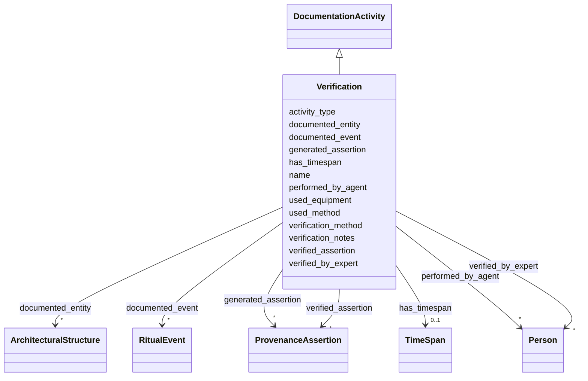

# Class: Verification 


_Process of cross-checking heritage claims against multiple sources_


URI: [heritageGraph:Verification](https://cair-nepal.org/heritageGraph/Verification)





## Inheritance
* [DocumentationActivity](DocumentationActivity.md)
    * **Verification**


## Slots

| Name | Cardinality and Range | Description | Inheritance |
| ---  | --- | --- | --- |
| [verification_method](verification_method.md) | 0..1 <br/> [String](String.md) | Method used for verification (cross-check, expert review, field visit) | direct |
| [verification_notes](verification_notes.md) | 0..1 <br/> [String](String.md) | Notes from verification process | direct |
| [verified_assertion](verified_assertion.md) | * <br/> [ProvenanceAssertion](ProvenanceAssertion.md) | Assertions verified by this activity | direct |
| [verified_by_expert](verified_by_expert.md) | * <br/> [Person](Person.md) | Expert who performed verification | direct |
| [name](name.md) | 0..1 <br/> [String](String.md) | Primary name or label | [DocumentationActivity](DocumentationActivity.md) |
| [activity_type](activity_type.md) | 0..1 <br/> [String](String.md) | Type of documentation activity | [DocumentationActivity](DocumentationActivity.md) |
| [documented_entity](documented_entity.md) | * <br/> [ArchitecturalStructure](ArchitecturalStructure.md) | Heritage entity documented by this activity | [DocumentationActivity](DocumentationActivity.md) |
| [documented_event](documented_event.md) | * <br/> [RitualEvent](RitualEvent.md) | Event documented by this activity | [DocumentationActivity](DocumentationActivity.md) |
| [performed_by_agent](performed_by_agent.md) | * <br/> [Person](Person.md) | Agent who performed documentation | [DocumentationActivity](DocumentationActivity.md) |
| [used_method](used_method.md) | 0..1 <br/> [String](String.md) | Documentation method used | [DocumentationActivity](DocumentationActivity.md) |
| [used_equipment](used_equipment.md) | * <br/> [String](String.md) | Equipment used in documentation | [DocumentationActivity](DocumentationActivity.md) |
| [generated_assertion](generated_assertion.md) | * <br/> [ProvenanceAssertion](ProvenanceAssertion.md) | Assertions generated by documentation activity | [DocumentationActivity](DocumentationActivity.md) |
| [has_timespan](has_timespan.md) | 0..1 <br/> [TimeSpan](TimeSpan.md) | Links event to its temporal extent | [DocumentationActivity](DocumentationActivity.md) |


## Identifier and Mapping Information


### Schema Source


* from schema: CulturalHeritageOntology


## Mappings

| Mapping Type | Mapped Value |
| ---  | ---  |
| self | heritageGraph:Verification |
| native | heritageGraph:Verification |


## LinkML Source

<!-- TODO: investigate https://stackoverflow.com/questions/37606292/how-to-create-tabbed-code-blocks-in-mkdocs-or-sphinx -->

### Direct

<details>
```yaml
name: Verification
description: Process of cross-checking heritage claims against multiple sources
from_schema: CulturalHeritageOntology
is_a: DocumentationActivity
slots:
- verification_method
- verification_notes
- verified_assertion
- verified_by_expert
class_uri: heritageGraph:Verification

```
</details>

### Induced

<details>
```yaml
name: Verification
description: Process of cross-checking heritage claims against multiple sources
from_schema: CulturalHeritageOntology
is_a: DocumentationActivity
attributes:
  verification_method:
    name: verification_method
    description: Method used for verification (cross-check, expert review, field visit)
    from_schema: CulturalHeritageOntology
    rank: 1000
    slot_uri: heritageGraph:verification_method
    alias: verification_method
    owner: Verification
    domain_of:
    - Verification
    range: string
  verification_notes:
    name: verification_notes
    description: Notes from verification process
    from_schema: CulturalHeritageOntology
    rank: 1000
    slot_uri: crm:P3_has_note
    alias: verification_notes
    owner: Verification
    domain_of:
    - Verification
    range: string
  verified_assertion:
    name: verified_assertion
    description: Assertions verified by this activity
    from_schema: CulturalHeritageOntology
    rank: 1000
    slot_uri: heritageGraph:verified_assertion
    alias: verified_assertion
    owner: Verification
    domain_of:
    - Verification
    range: ProvenanceAssertion
    multivalued: true
  verified_by_expert:
    name: verified_by_expert
    description: Expert who performed verification
    from_schema: CulturalHeritageOntology
    rank: 1000
    slot_uri: crm:P14_carried_out_by
    alias: verified_by_expert
    owner: Verification
    domain_of:
    - Verification
    range: Person
    multivalued: true
  name:
    name: name
    description: Primary name or label
    from_schema: CulturalHeritageOntology
    rank: 1000
    slot_uri: crm:P1_is_identified_by
    alias: name
    owner: Verification
    domain_of:
    - ArchitecturalStructure
    - IconographicObject
    - ArchitecturalElement
    - Deity
    - ReligiousTradition
    - TraditionOrPractice
    - ArchitecturalStyle
    - CalendarSystem
    - Production
    - RitualEvent
    - Consecration
    - Enshrinement
    - TransferOfCustody
    - ConditionAssessment
    - Guthi
    - CasteGroup
    - Person
    - Actor
    - Place
    - DataSource
    - DocumentationActivity
    - DataCustodian
    - Technique
    - Material
    range: string
  activity_type:
    name: activity_type
    description: Type of documentation activity
    from_schema: CulturalHeritageOntology
    rank: 1000
    slot_uri: crm:P2_has_type
    alias: activity_type
    owner: Verification
    domain_of:
    - DocumentationActivity
    range: string
  documented_entity:
    name: documented_entity
    description: Heritage entity documented by this activity
    from_schema: CulturalHeritageOntology
    rank: 1000
    slot_uri: prov:generated
    alias: documented_entity
    owner: Verification
    domain_of:
    - DocumentationActivity
    range: ArchitecturalStructure
    multivalued: true
  documented_event:
    name: documented_event
    description: Event documented by this activity
    from_schema: CulturalHeritageOntology
    rank: 1000
    slot_uri: prov:generated
    alias: documented_event
    owner: Verification
    domain_of:
    - DocumentationActivity
    range: RitualEvent
    multivalued: true
  performed_by_agent:
    name: performed_by_agent
    description: Agent who performed documentation
    from_schema: CulturalHeritageOntology
    rank: 1000
    slot_uri: prov:wasAssociatedWith
    alias: performed_by_agent
    owner: Verification
    domain_of:
    - DocumentationActivity
    range: Person
    multivalued: true
  used_method:
    name: used_method
    description: Documentation method used
    from_schema: CulturalHeritageOntology
    rank: 1000
    slot_uri: crm:P33_used_specific_technique
    alias: used_method
    owner: Verification
    domain_of:
    - DocumentationActivity
    range: string
  used_equipment:
    name: used_equipment
    description: Equipment used in documentation
    from_schema: CulturalHeritageOntology
    rank: 1000
    slot_uri: crm:P16_used_specific_object
    alias: used_equipment
    owner: Verification
    domain_of:
    - DocumentationActivity
    range: string
    multivalued: true
  generated_assertion:
    name: generated_assertion
    description: Assertions generated by documentation activity
    from_schema: CulturalHeritageOntology
    rank: 1000
    slot_uri: prov:generated
    alias: generated_assertion
    owner: Verification
    domain_of:
    - DocumentationActivity
    range: ProvenanceAssertion
    multivalued: true
  has_timespan:
    name: has_timespan
    description: Links event to its temporal extent
    from_schema: CulturalHeritageOntology
    rank: 1000
    slot_uri: crm:P4_has_time-span
    alias: has_timespan
    owner: Verification
    domain_of:
    - Production
    - RitualEvent
    - Consecration
    - Enshrinement
    - TransferOfCustody
    - ConditionAssessment
    - DocumentationActivity
    range: TimeSpan
class_uri: heritageGraph:Verification

```
</details>